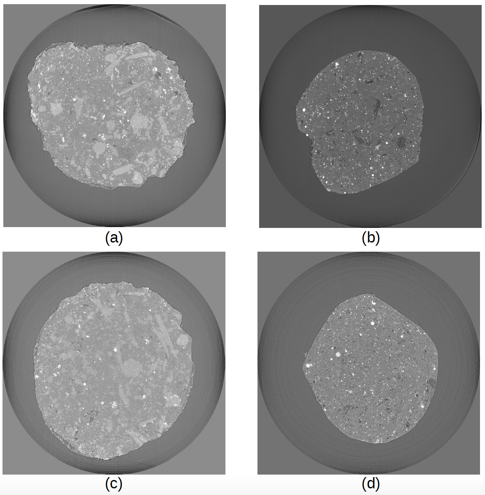

========
TomoBank
========

.. warning:: updated June 30, 2020. The server hosting tomobank (petrel) is currently down. The ALCF operations team has completed restoring the data and several files have been identified as possibly being corrupted. We are currently evaluateing each of these files to determine if they are “ok”
If not, we have 2 backup copies of tomobank data on non-spinning disks and we will be able to recover any damaged file. 
Please check back here for updates.

The X-ray Tomography Data Bank or TomoBank, provides a repository of experimental 
and simulated data sets with the aim to foster collaboration among computational scientists, 
beamline scientists and experimentalists, to accelerate the development of tomographic 
reconstruction and 3D visualization methods and to speed up their implementation in the various 
synchrotron facility data analysis software packages.

If you use the tomoBank Toolbox for your research, we would appreciate it if you would refer to the following papers :cite:`decarlo:01`:

	De Carlo, Francesco, et al. "TomoBank: a tomographic data repository for computational x-ray science." Measurement Science and Technology 29.3 (2018): 034004. http://www.doi.org/10.1088/1361-6501/aa9c19

TomoBank relies on `Petrel <http://petrel.alcf.anl.gov/>`_ :cite:`petrel:19`, a resource of the 
`Argonne Leadership Computing Facility <https://www.alcf.anl.gov>`_, which is a DOE Office of Science User Facility
supported under Contract DE-AC02-06CH11357.

Features
--------

* Tomographic datasets and phantom repository `Globus <https://app.globus.org/file-manager?origin_id=e133a81a-6d04-11e5-ba46-22000b92c6ec&origin_path=%2Ftomobank%2F>`_

* Python scripts to read and reconstruct all data sets (:download:`tomopy_rec.py <../docs/demo/tomopy_rec.py>`)

Usage: ::

    python tomopy_rec.py -h
	usage: tomopy_rec.py [-h] [--axis [AXIS]] [--type [TYPE]] [--nsino [NSINO]]
                     fname

	positional arguments:
  		fname            file name of a tomographic dataset: /data/sample.h5

	optional arguments:
  		-h, --help       show this help message and exit
  		--axis [AXIS]    rotation axis location: 1024.0 (default 1024.0)
  		--type [TYPE]    reconstruction type: full (default slice)
  		--nsino [NSINO]  location of the sinogram used by slice reconstruction (0
                   		 top, 1 bottom): 0.5 (default 0.5)

Example: ::

    python tomopy_rec.py /tomobank/tomo_00001.h5 --axis 1024

Contribute
----------

* Documentation: https://github.com/tomography/tomobank/tree/master/
* Issue Tracker: https://github.com/tomography/tomobank/issues

Content
-------

.. toctree::
   :maxdepth: 1

   source/about
   source/usage
   source/data
   source/phantom
   source/volumes
   source/publish
   source/credits
   source/license
