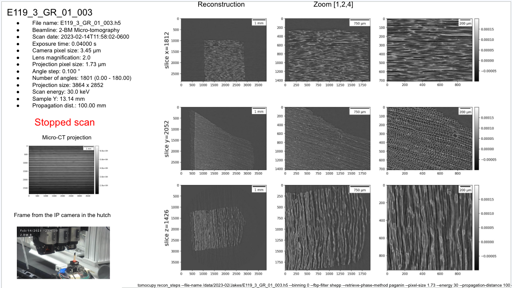
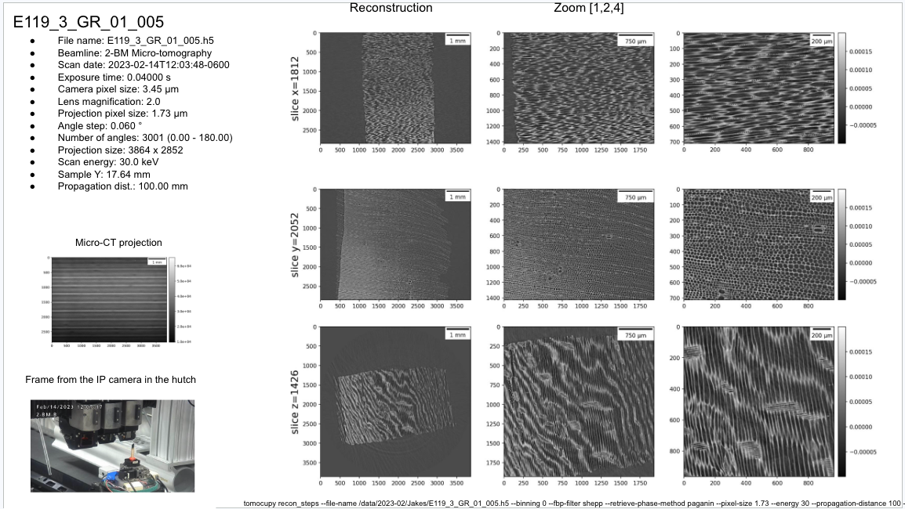
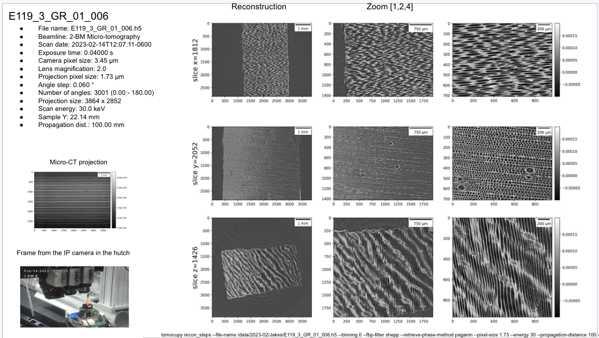
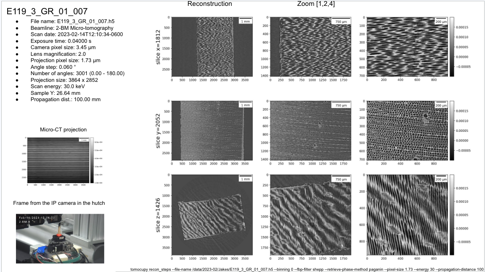

Center
------

Center contains a list of datasets used to train an AI agent to find the center of rotation of tomographic data sets.

tomocupy was run using the **default** parameters selected by user (see table below) with the --reconstruction-type set to try. 
A second try reconstruction was run without user selected parameters.

ai_00001
~~~~~~~~

Static (bone) sample with strong absorption.

For example::

  $ tomocupy recon_steps --file-name /data/2022-07/Stock/WKH_1490U_1_050.h5 --rotation-axis 1214.5  --reconstruction-type try --remove-stripe-method fw --dezinger 3
  $ tomocupy recon --file-name /data/2022-07/Stock/WKH_1490U_1_050.h5 --rotation-axis 1214.5  --reconstruction-type try 

.. _ai_00001: https://app.globus.org/file-manager?origin_id=9f00a780-4aee-42a7-b7f4-6a2773c8da30&origin_path=%2Fai_00001%2F

The data are available at ai_00001_

.. list-table:: 2022-07-Stock
   :header-rows: 1

   * - Sample
     - rotation-axis
     - Recon command
   * - SpFn_T2_288_4_rman_001
     - 1244
     - tomocupy recon --file-name /data/2022-07/Stock/SpFn_T2_288_4_rman_001.h5 --rotation-axis 1244  --reconstruction-type try --remove-stripe-method fw
   * - SpFn_T2_288_4_rman_take_2_002
     - 1241.0
     - tomocupy recon --file-name /data/2022-07/Stock/SpFn_T2_288_4_rman_take_2_002.h5 --rotation-axis 1241.0  --reconstruction-type try --remove-stripe-method fw
   * - e6398_003
     - 1212.50
     - tomocupy recon_steps --file-name /data/2022-07/Stock/e6398_003.h5 --rotation-axis 1212.50  --reconstruction-type try --remove-stripe-method fw
   * - e6398_004
     - 1221.0
     - tomocupy recon_steps --file-name /data/2022-07/Stock/e6398_004.h5 --rotation-axis 1221.0  --reconstruction-type try --remove-stripe-method fw
   * - e6398_005
     - 1224.50
     - tomocupy recon_steps --file-name /data/2022-07/Stock/e6398_005.h5 --rotation-axis 1224.50  --reconstruction-type try --remove-stripe-method fw
   * - e6401_006
     - 1212.50
     - tomocupy recon_steps --file-name /data/2022-07/Stock/e6401_006.h5 --rotation-axis 1212.50  --reconstruction-type try --remove-stripe-method fw
   * - e6401_007
     - 1221.0
     - tomocupy recon_steps --file-name /data/2022-07/Stock/e6401_007.h5 --rotation-axis 1221.0  --reconstruction-type try --remove-stripe-method fw
   * - e6401_008
     - 1224.0
     - tomocupy recon_steps --file-name /data/2022-07/Stock/e6401_008.h5 --rotation-axis 1224.0  --reconstruction-type try --remove-stripe-method fw
   * - e6402_009
     - 1212.0
     - tomocupy recon_steps --file-name /data/2022-07/Stock/e6402_009.h5 --rotation-axis 1212.0  --reconstruction-type try --remove-stripe-method fw
   * - e6402_010
     - 1220.0
     - tomocupy recon_steps --file-name /data/2022-07/Stock/e6402_010.h5 --rotation-axis 1220.0  --reconstruction-type try --remove-stripe-method fw
   * - e6402_011
     - 1224.0
     - tomocupy recon_steps --file-name /data/2022-07/Stock/e6402_011.h5 --rotation-axis 1224.0  --reconstruction-type try --remove-stripe-method fw
   * - f2010_012
     - 1214.0
     - tomocupy recon_steps --file-name /data/2022-07/Stock/f2010_012.h5 --rotation-axis 1214.0  --reconstruction-type try --remove-stripe-method fw
   * - f2010_013
     - 1222.0
     - tomocupy recon_steps --file-name /data/2022-07/Stock/f2010_013.h5 --rotation-axis 1222.0  --reconstruction-type try --remove-stripe-method fw
   * - f2010_014
     - 1224.50
     - tomocupy recon_steps --file-name /data/2022-07/Stock/f2010_014.h5 --rotation-axis 1224.50  --reconstruction-type try --remove-stripe-method fw
   * - e5727_015
     - 1214.5
     - tomocupy recon_steps --file-name /data/2022-07/Stock/e5727_015.h5 --rotation-axis 1214.5  --reconstruction-type try --remove-stripe-method fw
   * - e5727_016
     - 1222.0
     - tomocupy recon_steps --file-name /data/2022-07/Stock/e5727_016.h5 --rotation-axis 1222.0  --reconstruction-type try --remove-stripe-method fw
   * - e5727_017
     - 1226.0
     - tomocupy recon_steps --file-name /data/2022-07/Stock/e5727_017.h5 --rotation-axis 1226.0  --reconstruction-type try --remove-stripe-method fw
   * - f2011_018
     - 1217.50
     - tomocupy recon_steps --file-name /data/2022-07/Stock/f2011_018.h5 --rotation-axis 1217.50  --reconstruction-type try --remove-stripe-method fw
   * - f2011_019
     - 1223.50
     - tomocupy recon_steps --file-name /data/2022-07/Stock/f2011_019.h5 --rotation-axis 1223.50  --reconstruction-type try --remove-stripe-method fw
   * - f2011_020
     - 1226.0
     - tomocupy recon_steps --file-name /data/2022-07/Stock/f2011_020.h5 --rotation-axis 1226.0  --reconstruction-type try --remove-stripe-method fw
   * - e5729_021
     - 1211.0
     - tomocupy recon_steps --file-name /data/2022-07/Stock/e5729_021.h5 --rotation-axis 1211.0  --reconstruction-type try --remove-stripe-method fw
   * - e5729_022
     - 1220.0
     - tomocupy recon_steps --file-name /data/2022-07/Stock/e5729_022.h5 --rotation-axis 1220.0  --reconstruction-type try --remove-stripe-method fw
   * - e5729_023
     - 1223.0
     - tomocupy recon_steps --file-name /data/2022-07/Stock/e5729_023.h5 --rotation-axis 1223.0  --reconstruction-type try --remove-stripe-method fw
   * - f2012_024
     - 1214.0
     - tomocupy recon_steps --file-name /data/2022-07/Stock/f2012_024.h5 --rotation-axis 1214.0  --reconstruction-type try --remove-stripe-method fw
   * - f2012_025
     - 1222.0
     - tomocupy recon_steps --file-name /data/2022-07/Stock/f2012_025.h5 --rotation-axis 1222.0  --reconstruction-type try --remove-stripe-method fw
   * - f2012_026
     - 1224.50
     - tomocupy recon_steps --file-name /data/2022-07/Stock/f2012_026.h5 --rotation-axis 1224.50  --reconstruction-type try --remove-stripe-method fw
   * - e8193_027
     - 1212.0
     - tomocupy recon_steps --file-name /data/2022-07/Stock/e8193_027.h5 --rotation-axis 1212.0  --reconstruction-type try --remove-stripe-method fw
   * - e8193_028
     - 1220.5
     - tomocupy recon_steps --file-name /data/2022-07/Stock/e8193_028.h5 --rotation-axis 1220.5  --reconstruction-type try --remove-stripe-method fw
   * - e8193_029
     - 1224.5
     - tomocupy recon_steps --file-name /data/2022-07/Stock/e8193_029.h5 --rotation-axis 1224.5  --reconstruction-type try --remove-stripe-method fw
   * - WT106F01_030
     - 1214.5
     - tomocupy recon_steps --file-name /data/2022-07/Stock/WT106F01_030.h5 --rotation-axis 1214.5  --reconstruction-type try --remove-stripe-method fw
   * - WT106F01_031
     - 1222.0
     - tomocupy recon_steps --file-name /data/2022-07/Stock/WT106F01_031.h5 --rotation-axis 1222.0  --reconstruction-type try --remove-stripe-method fw
   * - WT106F01_032
     - 1224.50
     - tomocupy recon_steps --file-name /data/2022-07/Stock/WT106F01_032.h5 --rotation-axis 1224.50  --reconstruction-type try --remove-stripe-method fw
   * - e8191_033
     - 1213.0
     - tomocupy recon_steps --file-name /data/2022-07/Stock/e8191_033.h5 --rotation-axis 1213.0  --reconstruction-type try --remove-stripe-method fw
   * - e8191_034
     - 1221.0
     - tomocupy recon_steps --file-name /data/2022-07/Stock/e8191_034.h5 --rotation-axis 1221.0  --reconstruction-type try --remove-stripe-method fw
   * - e8191_035
     - 1224.5
     - tomocupy recon_steps --file-name /data/2022-07/Stock/e8191_035.h5 --rotation-axis 1224.5  --reconstruction-type try --remove-stripe-method fw
   * - e4865_036
     - 1213.0
     - tomocupy recon_steps --file-name /data/2022-07/Stock/e4865_036.h5 --rotation-axis 1213.0  --reconstruction-type try --remove-stripe-method fw
   * - e4865_037
     - 1220.0
     - tomocupy recon_steps --file-name /data/2022-07/Stock/e4865_037.h5 --rotation-axis 1220.0  --reconstruction-type try --remove-stripe-method fw
   * - e4865_038
     - 1223.5
     - tomocupy recon_steps --file-name /data/2022-07/Stock/e4865_038.h5 --rotation-axis 1223.5  --reconstruction-type try --remove-stripe-method fw
   * - e4792_039
     - 1212.0
     - tomocupy recon_steps --file-name /data/2022-07/Stock/e4792_039.h5 --rotation-axis 1212.0  --reconstruction-type try --remove-stripe-method fw
   * - e4792_040
     - 1221.5
     - tomocupy recon_steps --file-name /data/2022-07/Stock/e4792_040.h5 --rotation-axis 1221.5  --reconstruction-type try --remove-stripe-method fw
   * - e4792_041
     - 1224.0
     - tomocupy recon_steps --file-name /data/2022-07/Stock/e4792_041.h5 --rotation-axis 1224.0  --reconstruction-type try --remove-stripe-method fw
   * - e4793_042
     - 1214.5
     - tomocupy recon_steps --file-name /data/2022-07/Stock/e4793_042.h5 --rotation-axis 1214.5  --reconstruction-type try --remove-stripe-method fw
   * - e4793_043
     - 1222.5
     - tomocupy recon_steps --file-name /data/2022-07/Stock/e4793_043.h5 --rotation-axis 1222.5  --reconstruction-type try --remove-stripe-method fw
   * - WT106F02_046
     - 1222.5
     - tomocupy recon_steps --file-name /data/2022-07/Stock/WT106F02_046.h5 --rotation-axis 1222.5  --reconstruction-type try --remove-stripe-method fw
   * - WKH_1490U_1_048
     - 1227.5
     - tomocupy recon_steps --file-name /data/2022-07/Stock/WKH_1490U_1_048.h5 --rotation-axis 1227.5  --reconstruction-type try --remove-stripe-method fw
   * - WKH_1490U_1_049
     - 1222.0
     - tomocupy recon_steps --file-name /data/2022-07/Stock/WKH_1490U_1_049.h5 --rotation-axis 1222.0  --reconstruction-type try --remove-stripe-method fw
   * - WKH_1490U_1_050
     - 1214.5
     - tomocupy recon_steps --file-name /data/2022-07/Stock/WKH_1490U_1_050.h5 --rotation-axis 1214.5  --reconstruction-type try --remove-stripe-method fw --dezinger 3
   * - WKH_1504L_1_060
     - 1222.0
     - tomocupy recon_steps --file-name /data/2022-07/Stock/WKH_1504L_1_060.h5 --rotation-axis 1222.0  --reconstruction-type try --remove-stripe-method fw
   * - WKH_1504L_1_061
     - 1216.0
     - tomocupy recon_steps --file-name /data/2022-07/Stock/WKH_1504L_1_061.h5 --rotation-axis 1216.0  --reconstruction-type try --remove-stripe-method fw
   * - WKH_1504L_1_062
     - 1213.0
     - tomocupy recon_steps --file-name /data/2022-07/Stock/WKH_1504L_1_062.h5 --rotation-axis 1213.0  --reconstruction-type try --remove-stripe-method fw
   * - WKH_1504L_1_063
     - 1206.0
     - tomocupy recon_steps --file-name /data/2022-07/Stock/WKH_1504L_1_063.h5 --rotation-axis 1206.0  --reconstruction-type try --remove-stripe-method fw
   * - WKH_1504L_1_065
     - 1195.0
     - tomocupy recon_steps --file-name /data/2022-07/Stock/WKH_1504L_1_065.h5 --rotation-axis 1195.0  --reconstruction-type try --remove-stripe-method fw
   * - WKH_1504L_1_070
     - 1219.0
     - tomocupy recon_steps --file-name /data/2022-07/Stock/WKH_1504L_1_070.h5 --rotation-axis 1219.0  --reconstruction-type try --remove-stripe-method fw
   * - romie_tibia_22U_L_071
     - 1241.0
     - tomocupy recon_steps --file-name /data/2022-07/Stock/romie_tibia_22U_L_071.h5 --rotation-axis 1241.0  --reconstruction-type try --remove-stripe-method fw
   * - thresher_T3_073
     - 1184.5
     - tomocupy recon_steps --file-name /data/2022-07/Stock/thresher_T3_073.h5 --rotation-axis 1184.5  --reconstruction-type try --remove-stripe-method fw
   * - thresher_T3_074
     - 1187.5
     - tomocupy recon_steps --file-name /data/2022-07/Stock/thresher_T3_074.h5 --rotation-axis 1187.5  --reconstruction-type try --remove-stripe-method fw
   * - thresher_T3_075
     - 1203.0
     - tomocupy recon_steps --file-name /data/2022-07/Stock/thresher_T3_075.h5 --rotation-axis 1203.0  --reconstruction-type try --remove-stripe-method fw
   * - thresher_T3_076
     - 1207.5
     - tomocupy recon_steps --file-name /data/2022-07/Stock/thresher_T3_076.h5 --rotation-axis 1207.5  --reconstruction-type try --remove-stripe-method fw
   * - thresher_T3_077
     - 1213.0
     - tomocupy recon_steps --file-name /data/2022-07/Stock/thresher_T3_077.h5 --rotation-axis 1213.0  --reconstruction-type try --remove-stripe-method fw
   * - thresher_T3_078
     - 1226.0
     - tomocupy recon_steps --file-name /data/2022-07/Stock/thresher_T3_078.h5 --rotation-axis 1226.0  --reconstruction-type try --remove-stripe-method fw
   * - thresher_T3_079
     - 1228.0
     - tomocupy recon_steps --file-name /data/2022-07/Stock/thresher_T3_079.h5 --rotation-axis 1228.0  --reconstruction-type try --remove-stripe-method fw
   * - thresher_T3_080
     - 1236.0
     - tomocupy recon_steps --file-name /data/2022-07/Stock/thresher_T3_080.h5 --rotation-axis 1236.0  --reconstruction-type try --remove-stripe-method fw
   * - thresher_T3_081
     - 1246.5
     - tomocupy recon_steps --file-name /data/2022-07/Stock/thresher_T3_081.h5 --rotation-axis 1246.5  --reconstruction-type try --remove-stripe-method fw
   * - thresher_T3_082
     - 1231.0
     - tomocupy recon_steps --file-name /data/2022-07/Stock/thresher_T3_082.h5 --rotation-axis 1231.0  --reconstruction-type try --remove-stripe-method fw
   * - thresher_T3_083
     - 1234.5
     - tomocupy recon_steps --file-name /data/2022-07/Stock/thresher_T3_083.h5 --rotation-axis 1234.5  --reconstruction-type try --remove-stripe-method fw
   * - thresher_T3_084
     - 1240.0
     - tomocupy recon_steps --file-name /data/2022-07/Stock/thresher_T3_084.h5 --rotation-axis 1240.0  --reconstruction-type try --remove-stripe-method fw
   * - thresher_T3_085
     - 1252.5
     - tomocupy recon_steps --file-name /data/2022-07/Stock/thresher_T3_085.h5 --rotation-axis 1252.5  --reconstruction-type try --remove-stripe-method fw
   * - thresher_T3_086
     - 1260.0
     - tomocupy recon_steps --file-name /data/2022-07/Stock/thresher_T3_086.h5 --rotation-axis 1260.0  --reconstruction-type try --remove-stripe-method fw
   * - thresher_T3_087
     - 1271.5
     - tomocupy recon_steps --file-name /data/2022-07/Stock/thresher_T3_087.h5 --rotation-axis 1271.5  --reconstruction-type try --remove-stripe-method fw
   * - thresher_T3_088
     - 1271.0
     - tomocupy recon_steps --file-name /data/2022-07/Stock/thresher_T3_088.h5 --rotation-axis 1271.0  --reconstruction-type try --remove-stripe-method fw
   * - thresher_T3_089
     - 1288.5
     - tomocupy recon_steps --file-name /data/2022-07/Stock/thresher_T3_089.h5 --rotation-axis 1288.5  --reconstruction-type try --remove-stripe-method fw
   * - D365_42_44_delta2_090
     - 1209.0
     - tomocupy recon_steps --file-name /data/2022-07/Stock/D365_42_44_delta2_090.h5 --rotation-axis 1209.0  --reconstruction-type try --remove-stripe-method fw
   * - D365_42_44_delta2_091
     - 1224.5
     - tomocupy recon_steps --file-name /data/2022-07/Stock/D365_42_44_delta2_091.h5 --rotation-axis 1224.5  --reconstruction-type try --remove-stripe-method fw
   * - D365_42_44_delta2_092
     - 1235.5
     - tomocupy recon_steps --file-name /data/2022-07/Stock/D365_42_44_delta2_092.h5 --rotation-axis 1235.5  --reconstruction-type try --remove-stripe-method fw
   * - D365_42_44_delta2_093
     - 1233.0
     - tomocupy recon_steps --file-name /data/2022-07/Stock/D365_42_44_delta2_093.h5 --rotation-axis 1233.0  --reconstruction-type try --remove-stripe-method fw
   * - D365_42_44_delta2_094
     - 1244.5
     - tomocupy recon_steps --file-name /data/2022-07/Stock/D365_42_44_delta2_094.h5 --rotation-axis 1244.5  --reconstruction-type try --remove-stripe-method fw
   * - D365_42_44_delta2_095
     - 1248.5
     - tomocupy recon_steps --file-name /data/2022-07/Stock/D365_42_44_delta2_095.h5 --rotation-axis 1248.5  --reconstruction-type try --remove-stripe-method fw
   * - D365_42_44_delta2_096
     - 1258.0
     - tomocupy recon_steps --file-name /data/2022-07/Stock/D365_42_44_delta2_096.h5 --rotation-axis 1258.0  --reconstruction-type try --remove-stripe-method fw
   * - D365_42_44_delta2_097
     - 1272.0
     - tomocupy recon_steps --file-name /data/2022-07/Stock/D365_42_44_delta2_097.h5 --rotation-axis 1272.0  --reconstruction-type try --remove-stripe-method fw
   * - D365_42_44_delta2_098
     - 1274.0
     - tomocupy recon_steps --file-name /data/2022-07/Stock/D365_42_44_delta2_098.h5 --rotation-axis 1274.0  --reconstruction-type try --remove-stripe-method fw
   * - D365_42_44_delta2_099
     - 1203.5
     - tomocupy recon_steps --file-name /data/2022-07/Stock/D365_42_44_delta2_099.h5 --rotation-axis 1203.5  --reconstruction-type try --remove-stripe-method fw
   * - D365_42_44_delta2_100
     - 1220.0
     - tomocupy recon_steps --file-name /data/2022-07/Stock/D365_42_44_delta2_100.h5 --rotation-axis 1220.0  --reconstruction-type try --remove-stripe-method fw
   * - D365_42_44_delta2_101
     - 1227.0
     - tomocupy recon_steps --file-name /data/2022-07/Stock/D365_42_44_delta2_101.h5 --rotation-axis 1227.0  --reconstruction-type try --remove-stripe-method fw
   * - D365_42_44_delta2_102
     - 1229.5
     - tomocupy recon_steps --file-name /data/2022-07/Stock/D365_42_44_delta2_102.h5 --rotation-axis 1229.5  --reconstruction-type try --remove-stripe-method fw
   * - D365_42_44_delta2_103
     - 1227.5
     - tomocupy recon_steps --file-name /data/2022-07/Stock/D365_42_44_delta2_103.h5 --rotation-axis 1227.5  --reconstruction-type try --remove-stripe-method fw
   * - D365_42_44_delta2_104
     - 1246.0
     - tomocupy recon_steps --file-name /data/2022-07/Stock/D365_42_44_delta2_104.h5 --rotation-axis 1246.0  --reconstruction-type try --remove-stripe-method fw
   * - D365_42_44_delta2_105
     - 1255.0
     - tomocupy recon_steps --file-name /data/2022-07/Stock/D365_42_44_delta2_105.h5 --rotation-axis 1255.0  --reconstruction-type try --remove-stripe-method fw
   * - D365_42_44_delta2_106
     - 1270.0
     - tomocupy recon_steps --file-name /data/2022-07/Stock/D365_42_44_delta2_106.h5 --rotation-axis 1270.0  --reconstruction-type try --remove-stripe-method fw
   * - D365_42_44_delta2_107
     - 1272.0
     - tomocupy recon_steps --file-name /data/2022-07/Stock/D365_42_44_delta2_107.h5 --rotation-axis 1272.0  --reconstruction-type try --remove-stripe-method fw

ai_00002
~~~~~~~~

Dynamic (wood) sample with water.

For example::

  $ tomocupy recon --file-name /gdata/dm/2BM/2023-02/Jakes-2023-02/data/E119_3_GR_01_003.h5 --rotation-axis 1948 --reconstruction-type try

.. _ai_00002: https://app.globus.org/file-manager?origin_id=9f00a780-4aee-42a7-b7f4-6a2773c8da30&origin_path=%2Fai_00002%2F

The data are available at ai_00002_

.. list-table:: 2023-02-Jakes
   :header-rows: 1

   * - Sample
     - Tomolog
     - rotation-axis
     - Recon command
   * - E119_3_GR_01_003
     - |tomolog_ai_00002_01|
     - 1948
     - tomocupy recon_steps --file-name /gdata/dm/2BM/2023-02/Jakes-2023-02/data/E119_3_GR_01_003.h5 --rotation-axis 1948 --reconstruction-type try --out-path-name /gdata/dm/2BM/2023-02/Jakes-2023-02/data/Jakes_rec/E119_3_GR_01_003_rec/default/try_center
   * - E119_3_GR_01_004
     - |tomolog_ai_00002_02|
     - 1948.5
     - tomocupy recon_steps --file-name /gdata/dm/2BM/2023-02/Jakes-2023-02/data/E119_3_GR_01_004.h5 --rotation-axis 1948.5 --reconstruction-type try --out-path-name /gdata/dm/2BM/2023-02/Jakes-2023-02/data/Jakes_rec/E119_3_GR_01_004_rec/default/try_center
   * - E119_3_GR_01_005
     - |tomolog_ai_00002_03|
     - 1947.5
     - tomocupy recon_steps --file-name /gdata/dm/2BM/2023-02/Jakes-2023-02/data/E119_3_GR_01_005.h5 --rotation-axis 1947.5 --reconstruction-type try --out-path-name /gdata/dm/2BM/2023-02/Jakes-2023-02/data/Jakes_rec/E119_3_GR_01_005_rec/default/try_center
   * - E119_3_GR_01_006
     - |tomolog_ai_00002_04|
     - 1947.5
     - tomocupy recon_steps --file-name /gdata/dm/2BM/2023-02/Jakes-2023-02/data/E119_3_GR_01_006.h5 --rotation-axis 1947.5 --reconstruction-type try --out-path-name /gdata/dm/2BM/2023-02/Jakes-2023-02/data/Jakes_rec/E119_3_GR_01_006_rec/default/try_center
   * - E119_3_GR_01_007
     - |tomolog_ai_00002_05|
     - 1945
     - tomocupy recon_steps --file-name /gdata/dm/2BM/2023-02/Jakes-2023-02/data/E119_3_GR_01_007.h5 --rotation-axis 1945 --reconstruction-type try --out-path-name /gdata/dm/2BM/2023-02/Jakes-2023-02/data/Jakes_rec/E119_3_GR_01_007_rec/default/try_center
   * - E119_3_LW_008
     - 
     - 1625.17
     - tomocupy recon_steps --file-name /gdata/dm/2BM/2023-02/Jakes-2023-02/data/E119_3_LW_008.h5 --rotation-axis 1625.17 --reconstruction-type try --out-path-name /gdata/dm/2BM/2023-02/Jakes-2023-02/data/Jakes_rec/E119_3_LW_008_rec/default/try_center
