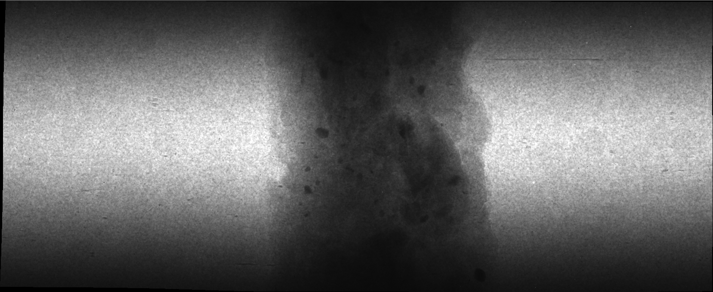
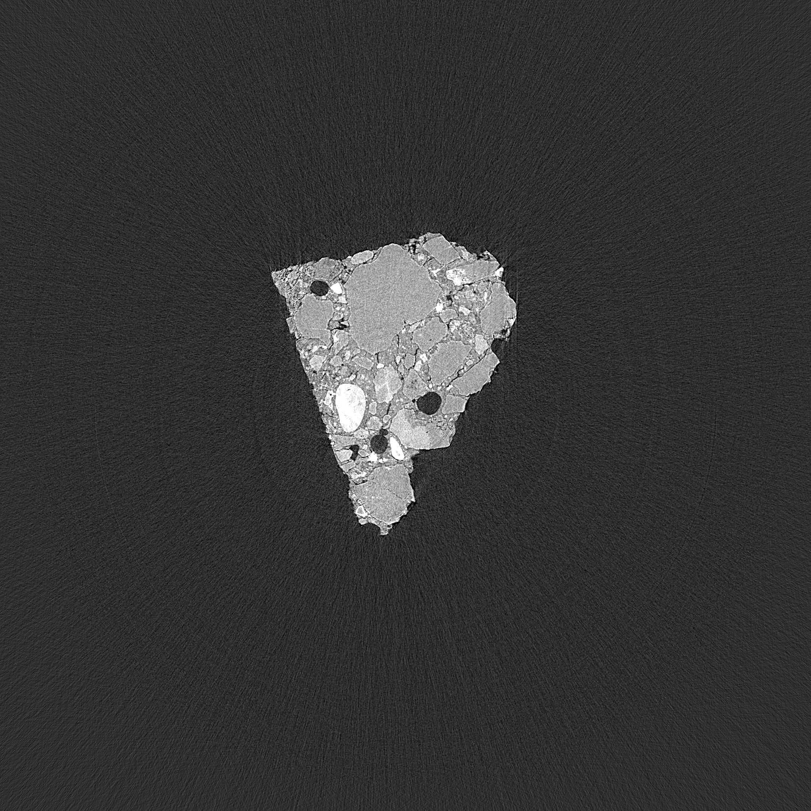
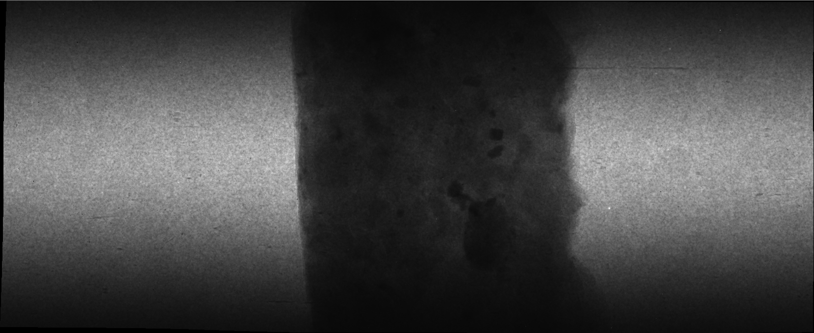
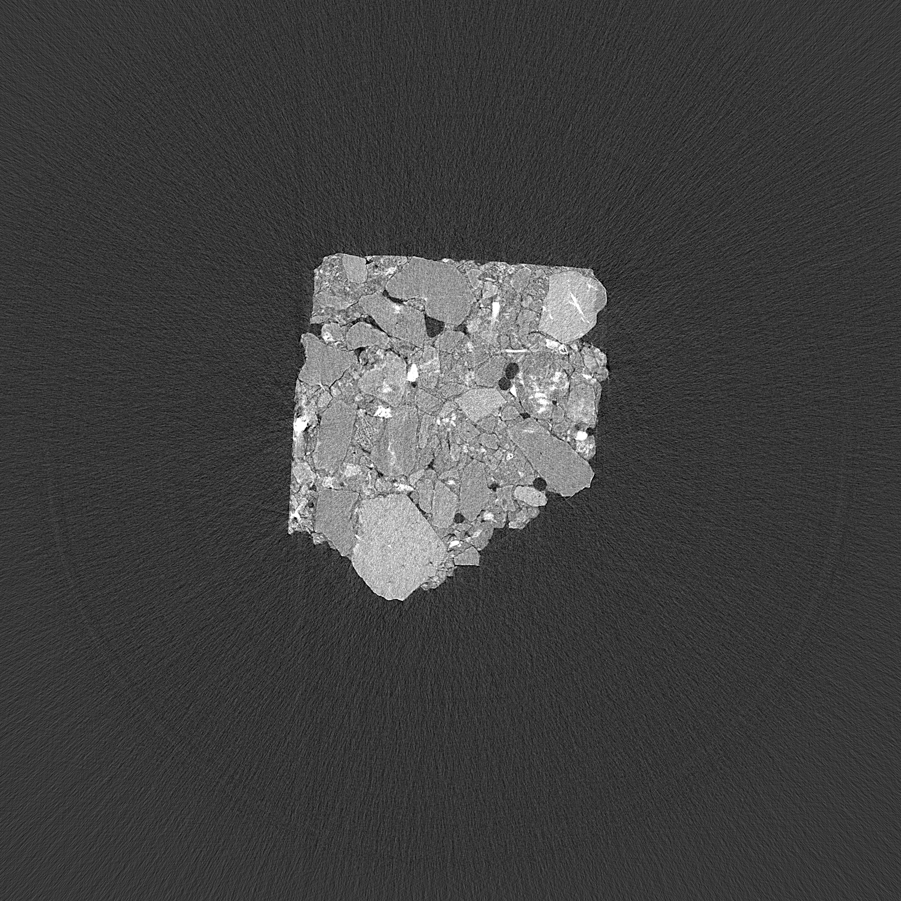

Diffusion Models
----------------

DM4CT (Real-World Synchrotron CT)
~~~~~~~~~~~~~~~~~~~~~~~~~~~~~~~~~

The DM4CT real-world synchrotron CT data sets accompany the manuscript
“DM4CT: Benchmarking Diffusion Models for Computed Tomography Reconstruction” 
:cite:`shi2026dmct`.
They contain synchrotron X-ray CT scans of two rock samples. For each sample,
raw projection data and reconstructed slices are provided. The reconstructions
include flat-field correction (using median dark and flat fields), log
transformation, and ring artifact reduction.

DM4CT was designed as a benchmark for **AI-based CT reconstruction**, with a
focus on **diffusion models** used as learned priors/solvers for inverse problems.
The benchmark evaluates diffusion-based reconstruction methods under realistic
conditions (e.g., sparse-view and noisy measurements) and compares them against
strong non-AI baselines (e.g., filtered backprojection and model-based iterative
reconstruction). The real-world synchrotron data sets provided here enable
evaluation of AI reconstruction methods on experimental data using a consistent
forward model and evaluation protocol described in the DM4CT paper.

If you use these data sets, please cite the DM4CT paper at :cite:`shi2026dmct`.

+---------------------------------+-------------------------------------+
| Instrument                      |        Elettra Sincrotrone Trieste  | 
+---------------------------------+-------------------------------------+
| Energy                          |        24 keV                       |
+---------------------------------+-------------------------------------+
| Filter                          |        None                         |
+---------------------------------+-------------------------------------+
| Scan Range                      |        180 degree                   |
+---------------------------------+-------------------------------------+
| Number of Projections           |        1200                         |
+---------------------------------+-------------------------------------+
| Angular Step                    |        0.15 degree                  |
+---------------------------------+-------------------------------------+
| White Fields                    |        20                           |
+---------------------------------+-------------------------------------+
| Dark Fields                     |        20                           |
+---------------------------------+-------------------------------------+
| Exposure Time                   |        4 s                          |
+---------------------------------+-------------------------------------+
| Sample Detector Distance        |        150 mm                       |
+---------------------------------+-------------------------------------+
| Pixel Size                      |        9 µm                         |
+---------------------------------+-------------------------------------+

To reproduce the preprocessing/postprocessing used for the provided reconstructions
(flat-field correction, log transformation, rotation, ring artifact reduction),
refer to the DM4CT code repository:

https://github.com/DM4CT/DM4CT

Zenodo record hosting the original release:

https://zenodo.org/records/15420527

.. _tomo_00108: https://app.globus.org/file-manager?origin_id=9f00a780-4aee-42a7-b7f4-6a2773c8da30&origin_path=%2Ftomo_00108%2F
.. _tomo_00109: https://app.globus.org/file-manager?origin_id=9f00a780-4aee-42a7-b7f4-6a2773c8da30&origin_path=%2Ftomo_00109%2F

+-------------+--------------------+----------------------------+--------------------------+--------------------------------------------+--------------------------------------------+
| Tomo ID     | Sample             | Contents                   | Rotation axis location   | Projection Preview                         |Reconstruction Preview                      |
+-------------+--------------------+----------------------------+--------------------------+--------------------------------------------+--------------------------------------------+
| tomo_00108_ | F3_1 (rock sample) | projections + recon slices |      -61                 | |tomo_00108_proj|                          | |tomo_00108_recon|                         |
+-------------+--------------------+----------------------------+--------------------------+--------------------------------------------+--------------------------------------------+
| tomo_00109_ | F3_2 (rock sample) | projections + recon slices |      -62                 | |tomo_00109_proj|                          | |tomo_00109_recon|                         |
+-------------+--------------------+----------------------------+--------------------------+--------------------------------------------+--------------------------------------------+

Notes
^^^^^

* Each scan provides 1200 projections plus 20 dark fields and 20 flat fields.
* The provided reconstructions include flat-field correction (median dark/flat),
  log transformation, and ring artifact reduction.
* The DM4CT repository includes scripts that reproduce the cropped reconstructions
  used in the accompanying paper.
