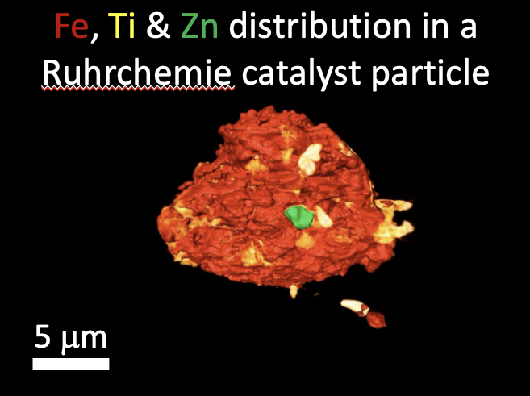

XANES
-----

SSRL XANES tomography
~~~~~~~~~~~~~~~~~~~~~

add here a sample/problem description (including refs)
This dataset contains an ..... sample that is approximately .... mm in diameter. 

.. _tomo_00089: https://app.globus.org/file-manager?origin_id=e133a81a-6d04-11e5-ba46-22000b92c6ec&origin_path=%2Ftomobank%2Ftomo_00089%2F

+-----------------------------------------+----------------------------+
|             tomo_ID                     | 00089                      |  
+=========================================+============================+
|             Image preview               | |00089|                    |  
+-----------------------------------------+----------------------------+
|             Download                    | tomo_00089_                |  
+-----------------------------------------+----------------------------+
|             Instrument                  | SSRL nano-CT               |  
+-----------------------------------------+----------------------------+
|             Sample name                 |                            |  
+-----------------------------------------+----------------------------+
|             X-ray energy                |                            |  
+-----------------------------------------+----------------------------+
|             Sample-to-detector distance |                            |  
+-----------------------------------------+----------------------------+
|             Scan Range                  |                            |
+-----------------------------------------+----------------------------+
|             Number of Projections       |                            |
+-----------------------------------------+----------------------------+
|             White Fields                |                            | 
+-----------------------------------------+----------------------------+
|             Dark Fields                 |                            |  
+-----------------------------------------+----------------------------+
|             Pixel size                  |                            |  
+-----------------------------------------+----------------------------+
|             FOV size                    |                            |
+-----------------------------------------+----------------------------+
|             Rotation axis location      |                            |
+-----------------------------------------+----------------------------+

Add here any information to software to read/analyze the data etc.