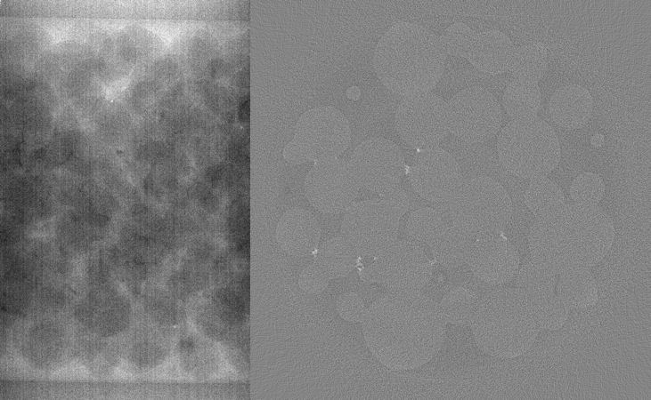
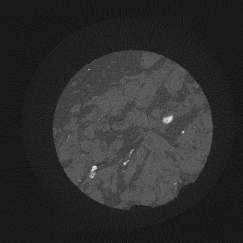
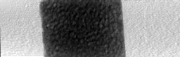
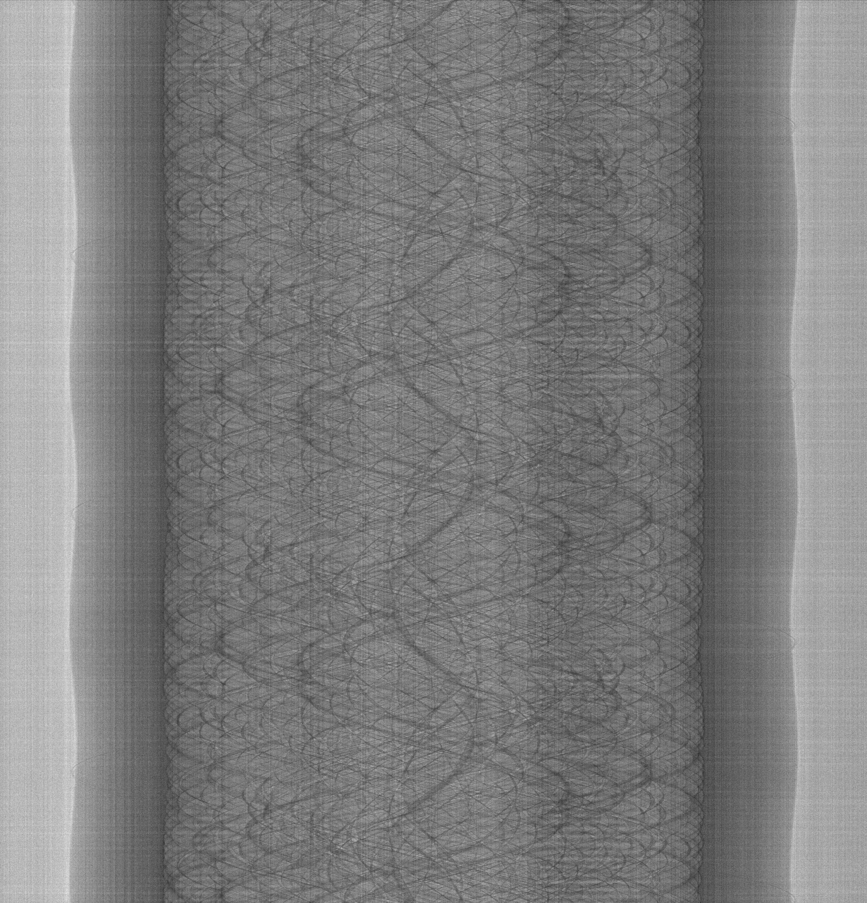
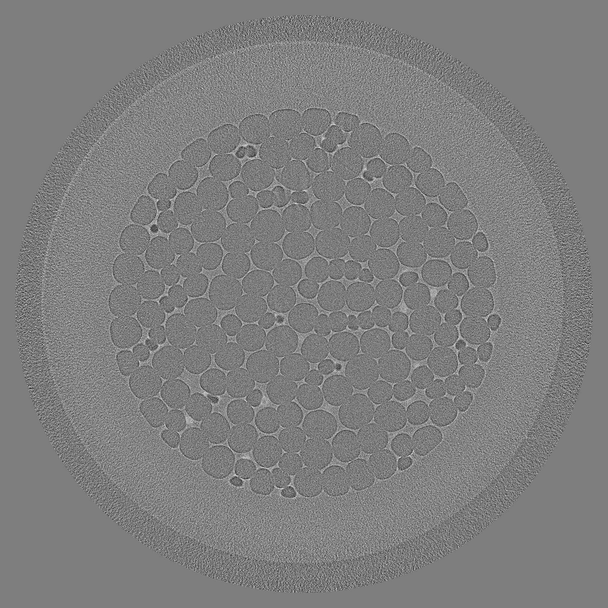
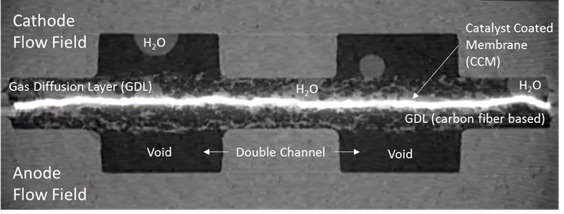

Dynamic
-------

When setting a tomographic experiment several parameters are adjusted by the instrument operator 
including X-ray energy, exposure time, frame rate, rotary stage speed, scanning mode (sequential or 
interlaced angles etc.). Here we include a series of datasets collected at different experimental 
conditions aiming to capture fast evolving samples in 3D.

Noisy Data
~~~~~~~~~~

Sometimes data collection speed requirements, e. g. in evolving samples, impose very short 
exposure times generating noisy data.  Here we include a dataset, Dorthe_F_002, 
in which  the exposure time much shorter than the optimal value. 
The sample description and the experimental conditions are reported in tables below:
and accessible for download under tomo\_00031. 

To load the data sets and perform a basic reconstruction using `tomopy <https://tomopy.readthedocs.io>`_  use the 
:download:`tomopy_rec.py <../../demo/tomopy_rec.py>` python script.

Example: ::

    python tomopy_rec.py tomo_00031.h5 --axis 484.5

.. _tomo_00031: https://app.globus.org/file-manager?origin_id=e133a81a-6d04-11e5-ba46-22000b92c6ec&origin_path=%2Ftomobank%2Ftomo_00031%2F

+------------------------+------------------------------------+
| tomo_ID                |       00031                        | 
+========================+====================================+
| Image preview          |      |00031|                       | 
+------------------------+------------------------------------+
| Downloads              |      tomo_00031_                   |  
+------------------------+------------------------------------+
| Instrument             |      APS 13-BM-D                   | 
+------------------------+------------------------------------+
| Sample name            |      Dorthe_F_002                  | 
+------------------------+------------------------------------+
| Energy                 |      33.269 keV                    | 
+------------------------+------------------------------------+
| Monochromator          |      double crystal Si (1,1,1)     |  
+------------------------+------------------------------------+
| Scan Range             |      180 degree                    | 
+------------------------+------------------------------------+
| Number of Projections  |      900                           | 
+------------------------+------------------------------------+
| White Fields           |      20 before                     | 
+------------------------+------------------------------------+
| Dark Fields            |      none                          |  
+------------------------+------------------------------------+
| Exposure Time          |      0.006 s                       | 
+------------------------+------------------------------------+
| Frame Rate             |      80 frames/s                   | 
+------------------------+------------------------------------+
| Total Collection Time  |      11.25 s                       | 
+------------------------+------------------------------------+
| PixelSize              |      3.18 µm                       | 
+------------------------+------------------------------------+
| Rotation axis location |      484.5                         |
+------------------------+------------------------------------+

Lower Resolution 
~~~~~~~~~~~~~~~~

This study was optimized for temporal resolution and less for spatial resolution. 
The experiment was originally designed to follow the propagation of a Cs solution 
with time in a rock. The spatial resolution could be relaxed at the time of 
the experiment to provide sufficient time resolution. 

In the second phase of the project, the focus moved however towards the smaller reactive 
inclusions and complementary techniques (x-ray microprobe and destructive chemical 
tomography with LA-ICP-MS) have been used to investigate the distribution of different elements
and phases in selected regions, with sometimes higher spatial resolution than in the original
tomographic dataset (see :cite:`gundlach:15`, :cite:`burger:15`).

To load the data sets and perform a basic reconstruction using `tomopy <https://tomopy.readthedocs.io>`_  use the 
:download:`tomopy_rec.py <../../demo/tomopy_rec.py>` python script.

Example: ::

    python tomopy_rec.py tomo_00069.h5 --axis 515.50

.. _tomo_00069: https://app.globus.org/file-manager?origin_id=e133a81a-6d04-11e5-ba46-22000b92c6ec&origin_path=%2Ftomobank%2Ftomo_00069%2F

+-----------------------------+-------------------------------+
| tomo_ID                     |      00069                    | 
+=============================+===============================+
| Image preview               |     |00069|                   | 
+-----------------------------+-------------------------------+
| Downloads                   |     tomo_00069_               |  
+-----------------------------+-------------------------------+
| Instrument                  |     SLS TOMCAT                | 
+-----------------------------+-------------------------------+
| Sample name                 |     SLS_03/Cskin1_36__B1      | 
+-----------------------------+-------------------------------+
| Energy                      |     36.085 keV                | 
+-----------------------------+-------------------------------+
| Sample-to-detector distance |     4 mm                      |  
+-----------------------------+-------------------------------+
| Scan Range                  |     180 degree                | 
+-----------------------------+-------------------------------+
| Number of Projections       |     1001                      | 
+-----------------------------+-------------------------------+
| White Fields                |     20 (10 before - 10 after) | 
+-----------------------------+-------------------------------+
| Dark Fields                 |     5                         |  
+-----------------------------+-------------------------------+
| PixelSize                   |     3.7 µm                    | 
+-----------------------------+-------------------------------+
| Rotation axis location      |     515.500232028             |
+-----------------------------+-------------------------------+

Interlaced Scan
~~~~~~~~~~~~~~~

A technique adopted to capture fast evolving sample includes interlaced data collection.
In this mode multiple series of continuous 0-180 deg datasets are collected with 
equally spaced sparce angles. After each 0-180 deg rotation the next data set is collected 
with angular sampling interlaced to the previous scan.

Below we report the sample description and the experimental conditions for an interlace dataset
(tomo\_00057) :cite:`trabecular-bone:15`  collected at the Elettra Syrmep beamline.

.. _tomo_00057: https://app.globus.org/file-manager?origin_id=e133a81a-6d04-11e5-ba46-22000b92c6ec&origin_path=%2Ftomobank%2Ftomo_00057%2F

+-----------------------------+---------------------------------------------------------+
| tomo_ID                     |       00057                                             | 
+=============================+=========================================================+
| Image preview               |      |00057|                                            | 
+-----------------------------+---------------------------------------------------------+
| Downloads                   |      tomo_00057_                                        |  
+-----------------------------+---------------------------------------------------------+
| Instrument                  |      Elettra Syrmep                                     |
+-----------------------------+---------------------------------------------------------+
| Sample name                 |      Bone MR                                            |
+-----------------------------+---------------------------------------------------------+
| Energy                      |      24 keV                                             |
+-----------------------------+---------------------------------------------------------+
| Filter                      |      1 mm Al                                            | 
+-----------------------------+---------------------------------------------------------+
| Sample-to-detector Distance |      210 mm                                             |
+-----------------------------+---------------------------------------------------------+
| Scan Range                  |      180 degree                                         |
+-----------------------------+---------------------------------------------------------+
| Interlaced Data Collection  |      20 projections x 36 (0-180 deg) iteration          |
+-----------------------------+---------------------------------------------------------+
| Total Projections           |      720                                                |
+-----------------------------+---------------------------------------------------------+
| White Fields                |      20                                                 |
+-----------------------------+---------------------------------------------------------+
| Dark Fields                 |      20                                                 | 
+-----------------------------+---------------------------------------------------------+
| Exposure Time               |      0.8 s                                              |
+-----------------------------+---------------------------------------------------------+

Foam data
~~~~~~~~~

In this study, we investigate the rheology of liquid foams by fast synchrotron X-ray tomographic microscopy :cite:`Raufaste_EPL2015`. Foams are complex cellular systems which require artifact free tomographic reconstruction for a reliable quantification of their time-dependent properties such as deformation fields of bubbles. In our example we acquire X-ray projections of the liquid foam flowing through a constriction and being rotated around the tomographic axis. 
The experiment was performed at the TOMCAT beamline of the Swiss Light Source using the fast acquisition setup :cite:`Mokso_JSR2017`.

To load the data sets and perform reconstruction use the :download:`tomopy_rectv.py <../../demo/tomopy_rectv.py>` python script.

Reconstruction by Gridrec ::

        python tomopy_rectv.py dk_MCFG_1_p_s1_.h5 --type subset --nsino 0.75 --binning 2 --frame 95
        
Reconstruction by the method with suppressing motion artifacts :cite:`Nikitin:2019` requires module `rectv` that can be installed from https://github.com/math-vrn/rectv_gpu. In this case, the algorithm run with option `--tv True` ::

        python tomopy_rectv.py dk_MCFG_1_p_s1_.h5 --type subset --nsino 0.75 --binning 2 --tv True --frame 95

.. _tomo_00080: https://app.globus.org/file-manager?origin_id=e133a81a-6d04-11e5-ba46-22000b92c6ec&origin_path=%2Ftomobank%2Ftomo_00080%2F

+-----------------------------+---------------------------------------------------------+
| tomo_ID                     |      00080                                              | 
+=============================+=========================================================+
| Image preview               |      |00080_0| |00080_1|                                | 
+-----------------------------+---------------------------------------------------------+
| Downloads                   |      tomo_00080_                                        |  
+-----------------------------+---------------------------------------------------------+
| Instrument                  |      SLS TOMCAT                                         |
+-----------------------------+---------------------------------------------------------+
| Sample name                 |      dk_MCFG_1_p_s1                                     |
+-----------------------------+---------------------------------------------------------+
| Energy                      |      16 keV                                             |
+-----------------------------+---------------------------------------------------------+
| Sample-to-detector Distance |      250 mm                                             |
+-----------------------------+---------------------------------------------------------+
| Scan Range                  |      180 degree                                         |
+-----------------------------+---------------------------------------------------------+
| Continuous Data Collection  |      300 projections x 130 (0-180 deg) iteration        |
+-----------------------------+---------------------------------------------------------+
| Total Projections           |      39000                                              |
+-----------------------------+---------------------------------------------------------+
| White Fields                |      512                                                |
+-----------------------------+---------------------------------------------------------+
| Dark Fields                 |      512                                                | 
+-----------------------------+---------------------------------------------------------+
| Exposure Time               |      0.7 ms                                             |
+-----------------------------+---------------------------------------------------------+
| Frame rate                  |      840 deg/s                                          |
+-----------------------------+---------------------------------------------------------+
| PixelSize                   |      3 µm                                               | 
+-----------------------------+---------------------------------------------------------+
| Rotation axis location      |      1008                                               |
+-----------------------------+---------------------------------------------------------+

Fuel cell data
~~~~~~~~~~~~~~

Sub-second X-ray tomographic microscopy was exploited to investigate liquid water dynamics in a fuel cell during operation. 
During the experiment, the cell was rotated continuously around the tomographic axis and three tomographic datasets, each 
consisting of 60 consecutive scans, were acquired. Each of the three datasets (60 scans) were acquired within 6 seconds, 
waiting period between each dataset was approximately 7 seconds. The outer boundaries of the cell were slightly outside of 
the field-of-view, leading to interior tomography. The experiment was performed at the TOMCAT beamline of the Swiss Light 
Source using the fast acquisition setup coupled with high-numerical-aperture macroscope optics :cite:`Buhrer:pp5135`.

At the start of the experiment the cell was completely dry. During operation, water generated on the surface of catalyst 
layer (Pt based, bright area in image preview) started to propagate through the porous fiber layer (carbon based gas diffusion 
layer located between the four channels), emerging in the channels. A large water droplet can be clearly visually detected 
from the reconstructed channel region after 115th time step (e.g. slice 364).

The image preview is an example of a fuel cell slice reconstructed by Gridrec :cite:`dowd:99` from phase retrieved projections. 
Flow field (FF) is carbon based material, gas diffusion layer (GDL) is carbon fiber based and catalyst coated membrane (CCM) 
is polymer, coated with Pt based catalyst.  Image courtesy of Hong Xu (Paul Scherrer Institut).

To load the dataset and perform basic reconstruction use the the :download:`tomopy_rectv_fc.py <../../demo/tomopy_rectv_fc.py>` 
python script ::

    python tomopy_rectv_fc.py fuelcell_i1.h5 --axis 702.00

.. _tomo_00081: https://app.globus.org/file-manager?origin_id=e133a81a-6d04-11e5-ba46-22000b92c6ec&origin_path=%2Ftomobank%2Ftomo_00081%2F

.. |00081| image:: ../img/tomo_00081.png
    :width: 20pt
    :height: 20pt

+-----------------------------+---------------------------------------------------------+
| tomo_ID                     |      00081                                              | 
+=============================+=========================================================+
| Image preview               |      |00081|                                            | 
+-----------------------------+---------------------------------------------------------+
| Downloads                   |      tomo_00081_                                        |  
+-----------------------------+---------------------------------------------------------+
| Instrument                  |      SLS TOMCAT                                         |
+-----------------------------+---------------------------------------------------------+
| Sample name                 |      fuelcell_i1, fuelcell_i2, fuelcell_i3              |
+-----------------------------+---------------------------------------------------------+
| Energy                      |      Polychromatic radiation (filtered, mean ~ 30 keV)  |
+-----------------------------+---------------------------------------------------------+
| Sample-to-detector Distance |      30 mm                                              |
+-----------------------------+---------------------------------------------------------+
| Scan Range                  |      180 degree                                         |
+-----------------------------+---------------------------------------------------------+
| Continuous Data Collection  |      301 projections x 60 (0-180 deg) iteration         |
+-----------------------------+---------------------------------------------------------+
| Total Projections           |      18060                                              |
+-----------------------------+---------------------------------------------------------+
| White Fields                |      100                                                |
+-----------------------------+---------------------------------------------------------+
| Dark Fields                 |      10                                                 | 
+-----------------------------+---------------------------------------------------------+
| Exposure Time               |      0.3 ms                                             |
+-----------------------------+---------------------------------------------------------+
| Frame Time                  |      0.33 ms                                            |
+-----------------------------+---------------------------------------------------------+
| PixelSize                   |      2.75 µm                                            | 
+-----------------------------+---------------------------------------------------------+
| Rotation axis location      |      702                                                |
+-----------------------------+---------------------------------------------------------+

In addition to the dynamic datasets, a high-quality post operando scan of the fuel cell in dry state 
is provided. The scan parameters are specified in the table below.

To load the high-quality dataset and perform basic reconstruction use the :download:`tomopy_rectv_fc.py <../../demo/tomopy_rectv_fc.py>` 
python script::

    python tomopy_rectv_fc.py fuelcell_dryHQ_i1.h5 --axis 702.00 --nproj 1001 --ntframes 1

.. _tomo_00082: https://app.globus.org/file-manager?origin_id=e133a81a-6d04-11e5-ba46-22000b92c6ec&origin_path=%2Ftomobank%2Ftomo_00082%2F

+-----------------------------+---------------------------------------------------------+
| tomo_ID                     |      00082                                              | 
+=============================+=========================================================+
| Image preview               |      |00082|                                            | 
+-----------------------------+---------------------------------------------------------+
| Downloads                   |      tomo_00082_                                        |  
+-----------------------------+---------------------------------------------------------+
| Instrument                  |      SLS TOMCAT                                         |
+-----------------------------+---------------------------------------------------------+
| Sample name                 |      fuelcell_dryHQ_i1                                  |
+-----------------------------+---------------------------------------------------------+
| Energy                      |      Polychromatic radiation (filtered, mean ~ 30 keV)  |
+-----------------------------+---------------------------------------------------------+
| Sample-to-detector Distance |      30 mm                                              |
+-----------------------------+---------------------------------------------------------+
| Scan Range                  |      180 degree                                         |
+-----------------------------+---------------------------------------------------------+
| Total Projections           |      1001                                               |
+-----------------------------+---------------------------------------------------------+
| White Fields                |      100                                                |
+-----------------------------+---------------------------------------------------------+
| Dark Fields                 |      10                                                 | 
+-----------------------------+---------------------------------------------------------+
| Exposure Time               |      1 ms                                               |
+-----------------------------+---------------------------------------------------------+
| PixelSize                   |      2.75 µm                                            | 
+-----------------------------+---------------------------------------------------------+
| Rotation axis location      |      702                                                |
+-----------------------------+---------------------------------------------------------+

