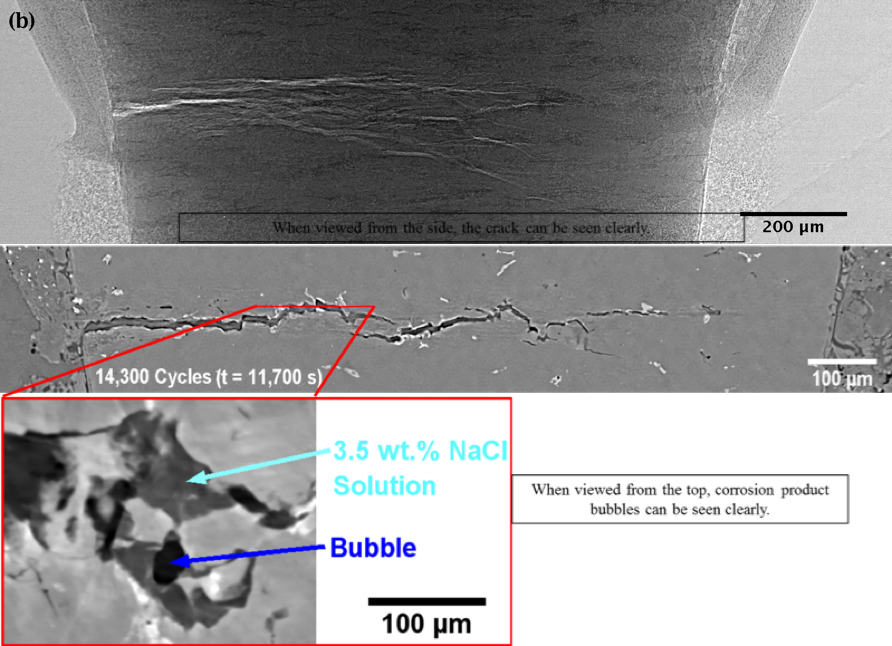
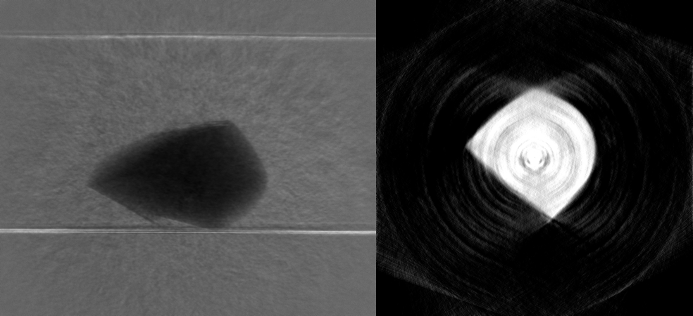
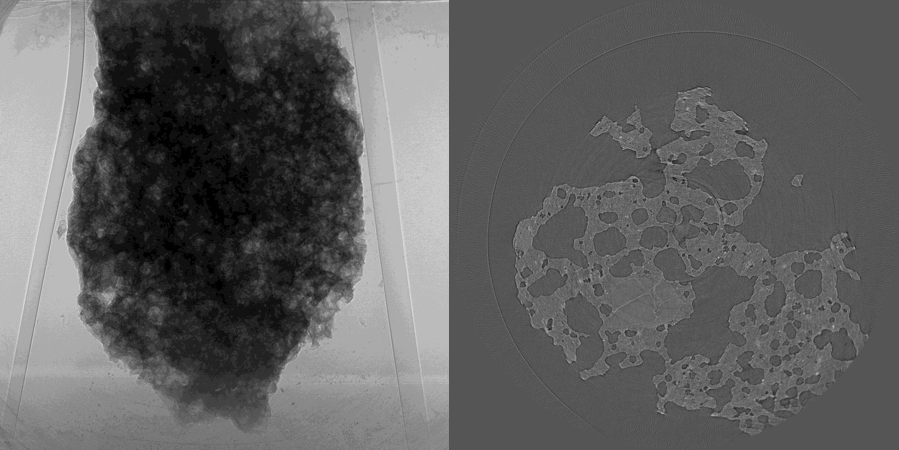
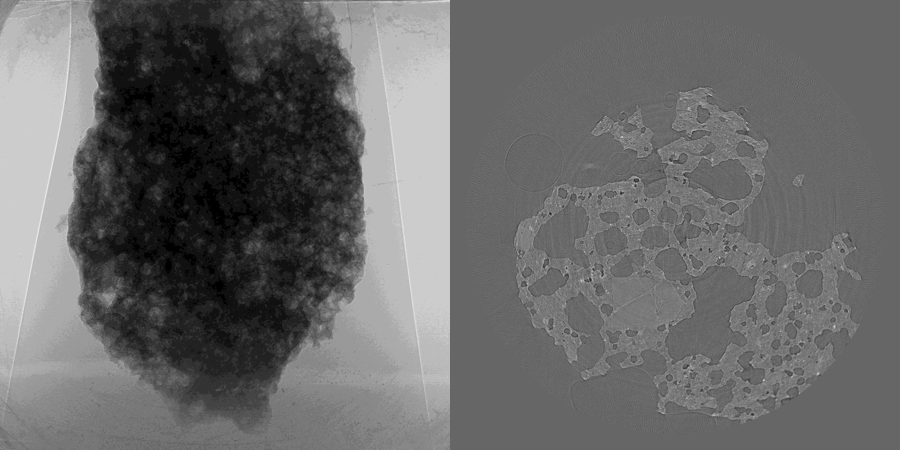

In-situ Studies
---------------

Fatigue-corrosion 
~~~~~~~~~~~~~~~~~

The fatigue-corrosion data sets :cite:`stannard_02:17` contain micro tomography (microCT) data with 
the experimental conditions reported in the table below :cite:`stannard:17`:

+---------------------------------+------------------------------------+
| Instrument                      |        APS 2-BM-A fast tomo        | 
+---------------------------------+------------------------------------+
| Energy                          |        27.4 keV                    | 
+---------------------------------+------------------------------------+
| Monochromator                   |        multi-layer                 | 
+---------------------------------+------------------------------------+
| Scan Range                      |        180 degree                  |
+---------------------------------+------------------------------------+
| Number of Projections           |        1500                        |
+---------------------------------+------------------------------------+
| White Fields                    |        10 before                   |
+---------------------------------+------------------------------------+
| Dark Fields                     |        10 before                   | 
+---------------------------------+------------------------------------+
| Mode                            |        fly-scan                    | 
+---------------------------------+------------------------------------+
| Rotation Speed                  |        0.75 deg/s                  | 
+---------------------------------+------------------------------------+
| Sample Detector Distance        |        60  mm                      | 
+---------------------------------+------------------------------------+
| Attenuator                      |        mm C + 1mm Glass            | 
+---------------------------------+------------------------------------+
| Detector Name                   |        PCO edge                    | 
+---------------------------------+------------------------------------+
| Exposure Time                   |        0.0001 s                    | 
+---------------------------------+------------------------------------+
| Pixel Size                      |        0.65 µm                     | 
+---------------------------------+------------------------------------+
| Detector shutter mode           |        global                      | 
+---------------------------------+------------------------------------+
| Detector Dimension x            |        2560                        | 
+---------------------------------+------------------------------------+
| Detector Dimension y            |        2160                        | 
+---------------------------------+------------------------------------+
| Objective Magnification         |        Mitutoyo 10x                | 
+---------------------------------+------------------------------------+
| Scintillator                    |        LuAG 10 µm                  | 
+---------------------------------+------------------------------------+

The fatigue-corrision data sets includes 25 tomographic data sets collected at different 
fatigue cycle ranging from 750 to 14346 as reported in the table below:

To load the data sets and perform a basic reconstruction using `tomopy <https://tomopy.readthedocs.io>`_  use the 
:download:`tomopy_rec.py <../../demo/tomopy_rec.py>` python script.

Example: ::

    python tomopy_rec.py tomo_00032.h5 --axis 1235

To enable phase retrieval un-comment the appropriate setting in :download:`tomopy_rec.py <../../demo/tomopy_rec.py>` 

.. _tomo_00032: https://www.globus.org/app/transfer?origin_id=e133a81a-6d04-11e5-ba46-22000b92c6ec&origin_path=%2Ftomobank%2F%2Ftomo_00032_to_00056%2F
.. _tomo_00033: https://www.globus.org/app/transfer?origin_id=e133a81a-6d04-11e5-ba46-22000b92c6ec&origin_path=%2Ftomobank%2F%2Ftomo_00032_to_00056%2F
.. _tomo_00034: https://www.globus.org/app/transfer?origin_id=e133a81a-6d04-11e5-ba46-22000b92c6ec&origin_path=%2Ftomobank%2F%2Ftomo_00032_to_00056%2F
.. _tomo_00035: https://www.globus.org/app/transfer?origin_id=e133a81a-6d04-11e5-ba46-22000b92c6ec&origin_path=%2Ftomobank%2F%2Ftomo_00032_to_00056%2F
.. _tomo_00036: https://www.globus.org/app/transfer?origin_id=e133a81a-6d04-11e5-ba46-22000b92c6ec&origin_path=%2Ftomobank%2F%2Ftomo_00032_to_00056%2F
.. _tomo_00037: https://www.globus.org/app/transfer?origin_id=e133a81a-6d04-11e5-ba46-22000b92c6ec&origin_path=%2Ftomobank%2F%2Ftomo_00032_to_00056%2F
.. _tomo_00038: https://www.globus.org/app/transfer?origin_id=e133a81a-6d04-11e5-ba46-22000b92c6ec&origin_path=%2Ftomobank%2F%2Ftomo_00032_to_00056%2F
.. _tomo_00039: https://www.globus.org/app/transfer?origin_id=e133a81a-6d04-11e5-ba46-22000b92c6ec&origin_path=%2Ftomobank%2F%2Ftomo_00032_to_00056%2F
.. _tomo_00040: https://www.globus.org/app/transfer?origin_id=e133a81a-6d04-11e5-ba46-22000b92c6ec&origin_path=%2Ftomobank%2F%2Ftomo_00032_to_00056%2F
.. _tomo_00041: https://www.globus.org/app/transfer?origin_id=e133a81a-6d04-11e5-ba46-22000b92c6ec&origin_path=%2Ftomobank%2F%2Ftomo_00032_to_00056%2F
.. _tomo_00042: https://www.globus.org/app/transfer?origin_id=e133a81a-6d04-11e5-ba46-22000b92c6ec&origin_path=%2Ftomobank%2F%2Ftomo_00032_to_00056%2F
.. _tomo_00043: https://www.globus.org/app/transfer?origin_id=e133a81a-6d04-11e5-ba46-22000b92c6ec&origin_path=%2Ftomobank%2F%2Ftomo_00032_to_00056%2F
.. _tomo_00044: https://www.globus.org/app/transfer?origin_id=e133a81a-6d04-11e5-ba46-22000b92c6ec&origin_path=%2Ftomobank%2F%2Ftomo_00032_to_00056%2F
.. _tomo_00045: https://www.globus.org/app/transfer?origin_id=e133a81a-6d04-11e5-ba46-22000b92c6ec&origin_path=%2Ftomobank%2F%2Ftomo_00032_to_00056%2F
.. _tomo_00046: https://www.globus.org/app/transfer?origin_id=e133a81a-6d04-11e5-ba46-22000b92c6ec&origin_path=%2Ftomobank%2F%2Ftomo_00032_to_00056%2F
.. _tomo_00047: https://www.globus.org/app/transfer?origin_id=e133a81a-6d04-11e5-ba46-22000b92c6ec&origin_path=%2Ftomobank%2F%2Ftomo_00032_to_00056%2F
.. _tomo_00048: https://www.globus.org/app/transfer?origin_id=e133a81a-6d04-11e5-ba46-22000b92c6ec&origin_path=%2Ftomobank%2F%2Ftomo_00032_to_00056%2F
.. _tomo_00049: https://www.globus.org/app/transfer?origin_id=e133a81a-6d04-11e5-ba46-22000b92c6ec&origin_path=%2Ftomobank%2F%2Ftomo_00032_to_00056%2F
.. _tomo_00050: https://www.globus.org/app/transfer?origin_id=e133a81a-6d04-11e5-ba46-22000b92c6ec&origin_path=%2Ftomobank%2F%2Ftomo_00032_to_00056%2F
.. _tomo_00051: https://www.globus.org/app/transfer?origin_id=e133a81a-6d04-11e5-ba46-22000b92c6ec&origin_path=%2Ftomobank%2F%2Ftomo_00032_to_00056%2F
.. _tomo_00052: https://www.globus.org/app/transfer?origin_id=e133a81a-6d04-11e5-ba46-22000b92c6ec&origin_path=%2Ftomobank%2F%2Ftomo_00032_to_00056%2F
.. _tomo_00053: https://www.globus.org/app/transfer?origin_id=e133a81a-6d04-11e5-ba46-22000b92c6ec&origin_path=%2Ftomobank%2F%2Ftomo_00032_to_00056%2F
.. _tomo_00054: https://www.globus.org/app/transfer?origin_id=e133a81a-6d04-11e5-ba46-22000b92c6ec&origin_path=%2Ftomobank%2F%2Ftomo_00032_to_00056%2F
.. _tomo_00055: https://www.globus.org/app/transfer?origin_id=e133a81a-6d04-11e5-ba46-22000b92c6ec&origin_path=%2Ftomobank%2F%2Ftomo_00032_to_00056%2F
.. _tomo_00056: https://www.globus.org/app/transfer?origin_id=e133a81a-6d04-11e5-ba46-22000b92c6ec&origin_path=%2Ftomobank%2F%2Ftomo_00032_to_00056%2F

+-------------+---------+----------------------------------+-----------+-----------------------+ 
| Tomo ID     | Cycles  |         Sample Name              |   Image   |          Axis         |     
+-------------+---------+----------------------------------+-----------+-----------------------+ 
| tomo_00032_ |    750  |  H14_7075PA_172HV_99NF_00750C    |  |00032|  |          1235         |
+-------------+---------+----------------------------------+-----------+-----------------------+ 
| tomo_00033_ |   1500  |  H14_7075PA_172HV_99NF_01500C    |  |00032|  |          1235         |
+-------------+---------+----------------------------------+-----------+-----------------------+ 
| tomo_00034_ |   2000  |  H14_7075PA_172HV_99NF_02000C    |  |00032|  |          1235         |
+-------------+---------+----------------------------------+-----------+-----------------------+ 
| tomo_00035_ |   2750  |  H14_7075PA_172HV_99NF_02750C    |  |00032|  |          1235         |
+-------------+---------+----------------------------------+-----------+-----------------------+ 
| tomo_00036_ |   3500  |  H14_7075PA_172HV_99NF_03500C    |  |00032|  |          1235         |
+-------------+---------+----------------------------------+-----------+-----------------------+ 
| tomo_00037_ |   4000  |  H14_7075PA_172HV_99NF_04000C    |  |00032|  |          1235         |
+-------------+---------+----------------------------------+-----------+-----------------------+ 
| tomo_00038_ |   4500  |  H14_7075PA_172HV_99NF_04500C    |  |00032|  |          1235         |
+-------------+---------+----------------------------------+-----------+-----------------------+ 
| tomo_00039_ |   5500  |  H14_7075PA_172HV_99NF_05500C    |  |00032|  |          1235         |
+-------------+---------+----------------------------------+-----------+-----------------------+ 
| tomo_00040_ |   6500  |  H14_7075PA_172HV_99NF_06500C    |  |00032|  |          1235         |
+-------------+---------+----------------------------------+-----------+-----------------------+ 
| tomo_00041_ |   7500  |  H14_7075PA_172HV_99NF_07500C    |  |00032|  |          1235         |
+-------------+---------+----------------------------------+-----------+-----------------------+ 
| tomo_00042_ |   8500  |  H14_7075PA_172HV_99NF_08500C    |  |00032|  |          1235         |
+-------------+---------+----------------------------------+-----------+-----------------------+ 
| tomo_00043_ |  10000  |  H14_7075PA_172HV_99NF_10000C    |  |00032|  |          1235         |
+-------------+---------+----------------------------------+-----------+-----------------------+ 
| tomo_00044_ |  12000  |  H14_7075PA_172HV_99NF_10000C    |  |00032|  |          1235         |
+-------------+---------+----------------------------------+-----------+-----------------------+ 
| tomo_00045_ |  13000  |  H14_7075PA_172HV_99NF_13000C    |  |00032|  |          1235         |
+-------------+---------+----------------------------------+-----------+-----------------------+ 
| tomo_00046_ |  13100  |  H14_7075PA_172HV_99NF_13100C    |  |00032|  |          1235         |
+-------------+---------+----------------------------------+-----------+-----------------------+ 
| tomo_00047_ |  13200  |  H14_7075PA_172HV_99NF_13200C    |  |00032|  |          1235         |
+-------------+---------+----------------------------------+-----------+-----------------------+ 
| tomo_00048_ |  13300  |  H14_7075PA_172HV_99NF_13300C    |  |00032|  |          1235         |
+-------------+---------+----------------------------------+-----------+-----------------------+ 
| tomo_00049_ |  13400  |  H14_7075PA_172HV_99NF_13400C    |  |00032|  |          1235         |
+-------------+---------+----------------------------------+-----------+-----------------------+ 
| tomo_00050_ |  13800  |  H14_7075PA_172HV_99NF_13800C    |  |00032|  |          1235         |
+-------------+---------+----------------------------------+-----------+-----------------------+ 
| tomo_00051_ |  13900  |  H14_7075PA_172HV_99NF_13900C    |  |00032|  |          1235         |
+-------------+---------+----------------------------------+-----------+-----------------------+ 
| tomo_00052_ |  14000  |  H14_7075PA_172HV_99NF_14000C    |  |00032|  |          1235         |
+-------------+---------+----------------------------------+-----------+-----------------------+ 
| tomo_00053_ |  14100  |  H14_7075PA_172HV_99NF_14100C    |  |00032|  |          1235         |
+-------------+---------+----------------------------------+-----------+-----------------------+ 
| tomo_00054_ |  14200  |  H14_7075PA_172HV_99NF_14200C    |  |00032|  |          1235         |
+-------------+---------+----------------------------------+-----------+-----------------------+ 
| tomo_00055_ |  14300  |  H14_7075PA_172HV_99NF_14300C    |  |00032|  |          1235         |
+-------------+---------+----------------------------------+-----------+-----------------------+ 
| tomo_00056_ |  14346  |  H14_7075PA_172HV_99NF_14346C    |  |00032|  |          1235         |
+-------------+---------+----------------------------------+-----------+-----------------------+ 

X-ray synchrotron tomography was used to visualize the fatigue crack initiation and growth from corrosion pits in Al7075 aluminum alloys. Peak-aged Al 7075 samples were corrosion-pitted by soaking in exposed 3.5 wt.% NaCl solution for fifteen days (360 hours). These samples were fatigue tested in situ in solution using synchrotron X-ray tomography to analyze the fatigue crack initiation and growth characteristics (4D). Hydrogen bubbles were observed within the cracks during fatigue crack growth, indicating chemical changes in the sample during corrosion fatigue. 

Top figure shows an X-ray projection. The reconstruction is from 14300 fatigue cycles and shows the fatigue crack initiating from pre-existing “mud cracks” within the corrosion products in pits on the surface of the sample. The 4D data allowed measurement of the microscopic bubbles in the crack, which appeared to grow preferentially near the impurity particles within the alloy. With these 4D insights, alloys of improved corrosion-cracking resistance can be created and more durable aerospace components can eventually reach the market.

Three-dimensional (3D) tomography under load is required to gain complete understanding of the growth rate of tortuous crack geometry within engineered components. When corrosion is involved, the four-dimensional (3D  plus time) tomography is required to capture the stress-corrosion cracking phenomena because corrosion reactions occur rapidly upon exposure of the unpassivated metal crack faces to corrosive solution. These corrosion and cracking mechanisms work synergistically to change the properties of the sample while producing microscopic hydrogen bubbles as evidence of their damage. Only with the high brilliance and stability of monochromatic synchrotron X-rays can accurate measurement of these bubbles be performed to identify the corrosion-cracking mechanisms. The work below demonstrates one such example to find the mechanisms behind corrosion-fatigue cracking from corrosion pits in peak-aged Al7075, which is a relevant source of failure in aerospace industry component reliability.

High Pressure
~~~~~~~~~~~~~

The High Pressure data set contains nano tomography (nanoCT) data with 
the experimental conditions reported in the table below.

+------------------------+----------------------------------+
| Instrument             |      APS 32-ID TXM               |
+------------------------+----------------------------------+
| Energy                 |      8000 eV                     |
+------------------------+----------------------------------+
| Monochromator          |      double crystal Si (1,1,1)   | 
+------------------------+----------------------------------+
| Scan Range             |      180 degree                  |
+------------------------+----------------------------------+
| Number of Projections  |      359                         |
+------------------------+----------------------------------+
| White Fields           |      20 before                   |
+------------------------+----------------------------------+
| Dark Fields            |      8 before                    | 
+------------------------+----------------------------------+
| Exposure Time          |      15 s                        |
+------------------------+----------------------------------+
| PixelSize              |      13.8 nm                     |
+------------------------+----------------------------------+
| Comment                |      10x 60 nm ZP                |
+------------------------+----------------------------------+

The sample consisting is a small particle of Ce :subscript:`6` Al :subscript:`4` 
undergoing a pressure increase.

The High Pressure data sets consists of 15 tomographic data sets, each nanoCT data 
set is collected after a pressure increase from 0.3 GPa to 59 GPa as reported in 
the table below. Because the sample is into a high pressure cell, 
86 of the 359 projections are blocked by the load frame (limited view problem). 
The index of the blocked view angles together with  the particles location for each 
data set (slice_first, slice_start) are reported in the table below.

To load the data sets and perform a basic reconstruction using `tomopy <https://tomopy.readthedocs.io>`_  use the 
:download:`tomopy_rec.py <../../demo/tomopy_rec.py>` python script.

Example: ::

    python demo/tomopy_rec.py tomo_00007.h5 --axis 1232 --nsino 0.7

 
after uncommenting in :download:`tomopy_rec.py <../../demo/tomopy_rec.py>`  the corresponding blocked_views parameter.    
    

.. _tomo_00007: https://www.globus.org/app/transfer?origin_id=e133a81a-6d04-11e5-ba46-22000b92c6ec&origin_path=%2Ftomobank%2Ftomo_00007_to_00021%2F/
.. _tomo_00008: https://www.globus.org/app/transfer?origin_id=e133a81a-6d04-11e5-ba46-22000b92c6ec&origin_path=%2Ftomobank%2Ftomo_00007_to_00021%2F/
.. _tomo_00009: https://www.globus.org/app/transfer?origin_id=e133a81a-6d04-11e5-ba46-22000b92c6ec&origin_path=%2Ftomobank%2Ftomo_00007_to_00021%2F/
.. _tomo_00010: https://www.globus.org/app/transfer?origin_id=e133a81a-6d04-11e5-ba46-22000b92c6ec&origin_path=%2Ftomobank%2Ftomo_00007_to_00021%2F/
.. _tomo_00011: https://www.globus.org/app/transfer?origin_id=e133a81a-6d04-11e5-ba46-22000b92c6ec&origin_path=%2Ftomobank%2Ftomo_00007_to_00021%2F/
.. _tomo_00012: https://www.globus.org/app/transfer?origin_id=e133a81a-6d04-11e5-ba46-22000b92c6ec&origin_path=%2Ftomobank%2Ftomo_00007_to_00021%2F/
.. _tomo_00013: https://www.globus.org/app/transfer?origin_id=e133a81a-6d04-11e5-ba46-22000b92c6ec&origin_path=%2Ftomobank%2Ftomo_00007_to_00021%2F/
.. _tomo_00014: https://www.globus.org/app/transfer?origin_id=e133a81a-6d04-11e5-ba46-22000b92c6ec&origin_path=%2Ftomobank%2Ftomo_00007_to_00021%2F/
.. _tomo_00015: https://www.globus.org/app/transfer?origin_id=e133a81a-6d04-11e5-ba46-22000b92c6ec&origin_path=%2Ftomobank%2Ftomo_00007_to_00021%2F/
.. _tomo_00016: https://www.globus.org/app/transfer?origin_id=e133a81a-6d04-11e5-ba46-22000b92c6ec&origin_path=%2Ftomobank%2Ftomo_00007_to_00021%2F/
.. _tomo_00017: https://www.globus.org/app/transfer?origin_id=e133a81a-6d04-11e5-ba46-22000b92c6ec&origin_path=%2Ftomobank%2Ftomo_00007_to_00021%2F/
.. _tomo_00018: https://www.globus.org/app/transfer?origin_id=e133a81a-6d04-11e5-ba46-22000b92c6ec&origin_path=%2Ftomobank%2Ftomo_00007_to_00021%2F/
.. _tomo_00019: https://www.globus.org/app/transfer?origin_id=e133a81a-6d04-11e5-ba46-22000b92c6ec&origin_path=%2Ftomobank%2Ftomo_00007_to_00021%2F/
.. _tomo_00020: https://www.globus.org/app/transfer?origin_id=e133a81a-6d04-11e5-ba46-22000b92c6ec&origin_path=%2Ftomobank%2Ftomo_00007_to_00021%2F/
.. _tomo_00021: https://www.globus.org/app/transfer?origin_id=e133a81a-6d04-11e5-ba46-22000b92c6ec&origin_path=%2Ftomobank%2Ftomo_00007_to_00021%2F/

+-------------+---------+---------+-------------------+-----------+--------------+--------------------+----------------+
| Tomo ID     |   GPa   | Volume  |  Sample Name      |   Image   |     Axis     |  Slice first/last  |  Blocked Views |  
+-------------+---------+---------+-------------------+-----------+--------------+--------------------+----------------+
| tomo_00007_ | 0.3     | 24602   |  Ce6Al4_3kbar     |  |00007|  |   1232       |  740/1700          |     [141,226]  |
+-------------+---------+---------+-------------------+-----------+--------------+--------------------+----------------+ 
| tomo_00008_ | 0.57(*) | 20577   |  Ce6Al4_5P7kbar   |  |00007|  |   1321       |  1000/1440         |     [141,228]  |
+-------------+---------+---------+-------------------+-----------+--------------+--------------------+----------------+ 
| tomo_00009_ | 2       | 23431   |  Ce6Al4_20kbar    |  |00007|  |   1219       |  550/1370          |     [147,233]  |
+-------------+---------+---------+-------------------+-----------+--------------+--------------------+----------------+ 
| tomo_00010_ | 8.59    | 19313   |  Ce6Al4_8P59GPa   |  |00007|  |   1286       |  740/1500          |     [142,227]  |
+-------------+---------+---------+-------------------+-----------+--------------+--------------------+----------------+ 
| tomo_00011_ | 13.37   | 18518   |  Ce6Al4_13P37GPa  |  |00007|  |   1292       |  620/1320          |     [140,226]  |
+-------------+---------+---------+-------------------+-----------+--------------+--------------------+----------------+ 
| tomo_00012_ | 17.44   | 17626   |  Ce6Al4_17p44GPa  |  |00007|  |   1116       |  800/1200          |     [140,225]  |
+-------------+---------+---------+-------------------+-----------+--------------+--------------------+----------------+
| tomo_00013_ | 19      | 17735   |  Ce6Al4_19GPa     |  |00007|  |   1314       |  610/1500          |     [71,113]   |
+-------------+---------+---------+-------------------+-----------+--------------+--------------------+----------------+ 
| tomo_00014_ | 21.39   | 17129   |  Ce6Al4_21p39GPa  |  |00007|  |   1140       |  610/1200          |     [140,226]  |
+-------------+---------+---------+-------------------+-----------+--------------+--------------------+----------------+ 
| tomo_00015_ | 26.17   | 16557   |  Ce6Al4_26p17GPa  |  |00007|  |   1124       |  740/1270          |     [140,227]  |
+-------------+---------+---------+-------------------+-----------+--------------+--------------------+----------------+ 
| tomo_00016_ | 29.5    | 16304   |  Ce6Al4_29P5GPa   |  |00007|  |   1338       |  760/1180          |     [140,227]  |
+-------------+---------+---------+-------------------+-----------+--------------+--------------------+----------------+ 
| tomo_00017_ | 33.07   | 15677   |  Ce6Al4_33p07GPa  |  |00007|  |   1232       |  710/1210          |     [140,227]  |
+-------------+---------+---------+-------------------+-----------+--------------+--------------------+----------------+ 
| tomo_00018_ | 41.88   | 15164   |  Ce6Al4_41p88GPa  |  |00007|  |   1292       |  700/1180          |     [138,225]  |
+-------------+---------+---------+-------------------+-----------+--------------+--------------------+----------------+ 
| tomo_00019_ | 47.89   | 14737   |  Ce6Al4_47p89GPa  |  |00007|  |   1114       |  740/1210          |     [141,228]  |
+-------------+---------+---------+-------------------+-----------+--------------+--------------------+----------------+ 
| tomo_00020_ | 54.73   | 14328   |  Ce6Al4_54p73GPa  |  |00007|  |   1352       |  750/1230          |     [138, 224] |
+-------------+---------+---------+-------------------+-----------+--------------+--------------------+----------------+ 
| tomo_00021_ | 59      | 14335   |  Ce6Al4_59GPa     |  |00007|  |   1352       |  630/1100          |     [138, 224] |
+-------------+---------+---------+-------------------+-----------+--------------+--------------------+----------------+ 

(*) was the one acquired with 5x instead of 10x optics

Rock Permeability
~~~~~~~~~~~~~~~~~

The microCT data sets of these samples were acquired at the SYRMEP beamline of Elettra-Sincrotrone Trieste (Elettra), Italy in nearly-parallel beam geometry. The related sample description and the experimental conditions are reported in tables below under tomo_00025 to tomo_00026. 

To load the data sets and perform a basic reconstruction using `tomopy <https://tomopy.readthedocs.io>`_  use the 
:download:`tomopy_rec.py <../../demo/tomopy_rec.py>` python script.

Example: ::

    python tomopy_rec.py tomo_00025.h5 --axis 952

+------------------------------------+------------------------------+-----------+-------------------------+
|           tomo_ID                  | Sample Name                  |   Image   |           Axis          |     
+====================================+==============================+===========+=========================+ 
|      tomo_00025_                   | Rock no oil                  |  |00025|  |           952           |
+------------------------------------+------------------------------+-----------+-------------------------+ 
|      tomo_00026_                   | Rock oil saturated           |  |00026|  |           957           |
+------------------------------------+------------------------------+-----------+-------------------------+ 

.. _tomo_00025: https://www.globus.org/app/transfer?origin_id=e133a81a-6d04-11e5-ba46-22000b92c6ec&origin_path=%2Ftomobank%2Ftomo_00025%2F
.. _tomo_00026: https://www.globus.org/app/transfer?origin_id=e133a81a-6d04-11e5-ba46-22000b92c6ec&origin_path=%2Ftomobank%2Ftomo_00026%2F

Rock no oil

+-----------------------------------------+----------------------------+
|             tomo_ID                     |   00025                    |  
+=========================================+============================+
|             Image preview               |  |00025|                   |  
+-----------------------------------------+----------------------------+
|             Download                    |   tomo_00025_              |  
+-----------------------------------------+----------------------------+
|             Instrument                  |   Elettra Syrmep           |  
+-----------------------------------------+----------------------------+
|             Sample name                 |   Rock no oil              |  
+-----------------------------------------+----------------------------+
|             X-ray energy                |   white beam mode          |  
+-----------------------------------------+----------------------------+
|             Ring energy                 |   2 GeV                    |  
+-----------------------------------------+----------------------------+
|             Exposure time               |   1 s                      |  
+-----------------------------------------+----------------------------+
|             Detector                    |   SCMOS 16-bit             |  
+-----------------------------------------+----------------------------+
|             Sample-to-detector distance |   150 mm                   |  
+-----------------------------------------+----------------------------+
|             Pixel size                  |   2.04 µm                  |  
+-----------------------------------------+----------------------------+
|             Scan Range                  |   180 degree               |
+-----------------------------------------+----------------------------+
|             Number of Projections       |   400                      |
+-----------------------------------------+----------------------------+
|             Rotation axis location      |   952                      |
+-----------------------------------------+----------------------------+

Rock oil saturated

+-----------------------------------------+----------------------------+
|             tomo_ID                     |   00026                    |  
+=========================================+============================+
|             Image preview               |  |00026|                   |  
+-----------------------------------------+----------------------------+
|             Download                    |   tomo_00026_              |  
+-----------------------------------------+----------------------------+
|             Instrument                  |   Elettra Syrmep           |  
+-----------------------------------------+----------------------------+
|             Sample name                 |   Rock oil saturated       |  
+-----------------------------------------+----------------------------+
|             X-ray energy                |   white beam mode          |  
+-----------------------------------------+----------------------------+
|             Ring energy                 |   2 GeV                    |  
+-----------------------------------------+----------------------------+
|             Exposure time               |   1 s                      |  
+-----------------------------------------+----------------------------+
|             Detector                    |   SCMOS 16-bit             |
+-----------------------------------------+----------------------------+
|             Sample-to-detector distance |   150 mm                   |  
+-----------------------------------------+----------------------------+
|             Pixel size                  |   2.04 µm                  |  
+-----------------------------------------+----------------------------+
|             Scan Range                  |   180 degree               |
+-----------------------------------------+----------------------------+
|             Number of Projections       |   400                      |
+-----------------------------------------+----------------------------+
|             Rotation axis location      |   957                      |
+-----------------------------------------+----------------------------+
