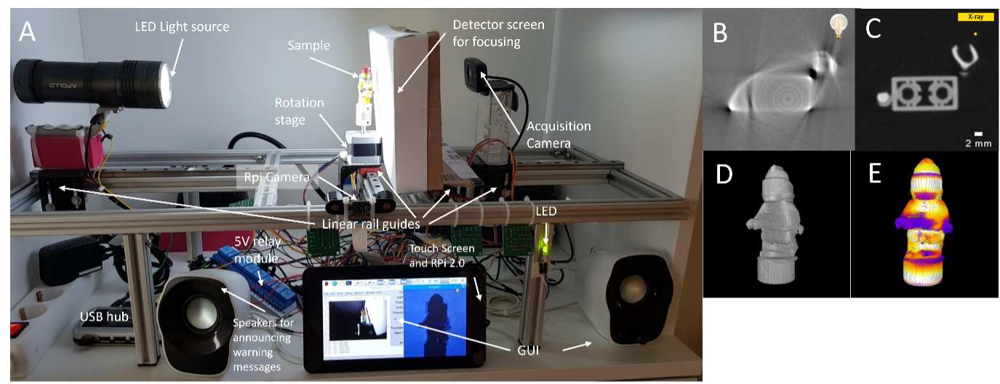
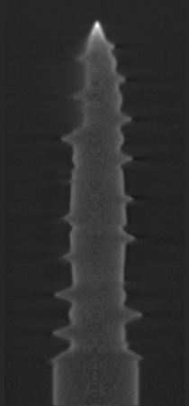
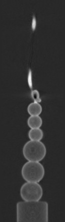
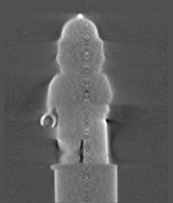
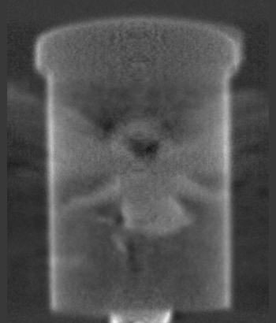
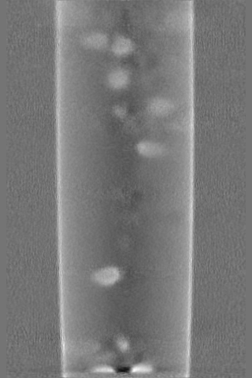
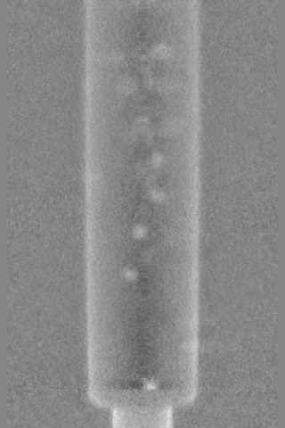
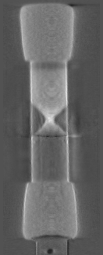
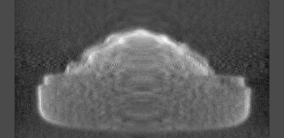
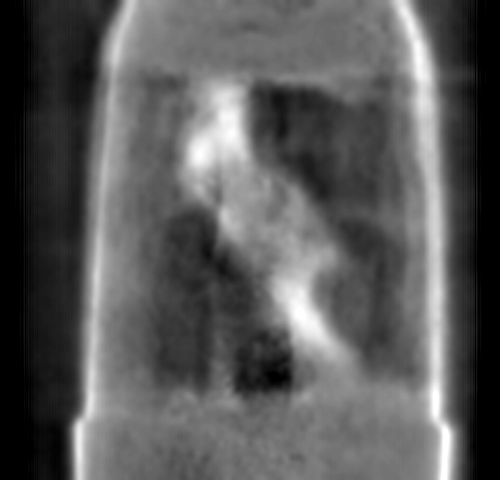

KBLT
----

Kitchen-Based Light Tomography (KBLT) is a DIY toolkit for advancing tomography developed by and for the tomography community. Instead of using X-rays or neutrons, a strong LED flashlight (visible light) is used as a light source. To demonstrate the capabilities of KBLT, both non-transparent and transparent objects were scanned under both static (3D) and dynamic (4D) acquisition modes, also in combination with sample environments, thus modifying the sample during scanning.

-- The KBLT can be used by tomography users - for education and training, prior to carrying out a real X-ray or neutron tomography experiment.

-- The KBLT will be useful for beamline scientists - for testing and implementing new hardware and software solutions, in situations where the X-ray or neutron beam is not available.

-- The KBLT will allow computational researchers working with algorithm development, e.g., image reconstruction, image processing and analysis to test their algorithms on easily-generated KBLT datasets, both in 3D and 4D.

-- Building and collaborating on this open-source KBLT project is foreseen to aid, develop and strengthen the international tomography community.

A) The KBLT setup, reconstructed slice from B) KBLT and C) X-ray microCT and D-E) 3D-renderings of B).

References
~~~~~~~~~~

:cite:`Larsson:2022`

.. _tomo_00099: https://app.globus.org/file-manager?origin_id=9f00a780-4aee-42a7-b7f4-6a2773c8da30&origin_path=%2Ftomo_00099%2F

+---------------------------------+------------------------------------+
| tomo_ID                         |        tomo_00099_                 | 
+---------------------------------+------------------------------------+
| Image preview                   |        |00099-1|                   | 
+---------------------------------+------------------------------------+
| Download file name              |        1_plastic_screw_RGB.h5      | 
+---------------------------------+------------------------------------+
| Instrument                      |        KBLT                        |
+---------------------------------+------------------------------------+
| Sample name                     |        Plastic screw               | 
+---------------------------------+------------------------------------+
| Type of light                   |        white visible light         | 
+---------------------------------+------------------------------------+
| Transparent                     |        No                          | 
+---------------------------------+------------------------------------+
| Scan Range                      |        360 degree                  | 
+---------------------------------+------------------------------------+
| Mode                            |        3D - static                 | 
+---------------------------------+------------------------------------+
| Number of tomos                 |        1                           | 
+---------------------------------+------------------------------------+
| Number of Projections           |        200                         |
+---------------------------------+------------------------------------+
| White Fields                    |        10                          |
+---------------------------------+------------------------------------+
| Detector Name                   |        Logitech B525               | 
+---------------------------------+------------------------------------+
| Pixel Size                      |        0.14 mm                     | 
+---------------------------------+------------------------------------+
| Tilt correction                 |        1.4                         | 
+---------------------------------+------------------------------------+
| Rotation axis location          |        104.75                      | 
+---------------------------------+------------------------------------+

+---------------------------------+------------------------------------+
| tomo_ID                         |        tomo_00099_                 | 
+---------------------------------+------------------------------------+
| Image preview                   |        |00099-2|                   | 
+---------------------------------+------------------------------------+
| Download file name              |        2_plastic_beeds_RGB.h5.h5   | 
+---------------------------------+------------------------------------+
| Instrument                      |        KBLT                        |
+---------------------------------+------------------------------------+
| Sample name                     |        Plastic Beeds               | 
+---------------------------------+------------------------------------+
| Type of light                   |        white visible light         | 
+---------------------------------+------------------------------------+
| Transparent                     |        No                          | 
+---------------------------------+------------------------------------+
| Scan Range                      |        360 degree                  | 
+---------------------------------+------------------------------------+
| Mode                            |        3D - static                 | 
+---------------------------------+------------------------------------+
| Number of tomos                 |        1                           | 
+---------------------------------+------------------------------------+
| Number of Projections           |        200                         |
+---------------------------------+------------------------------------+
| White Fields                    |        10                          |
+---------------------------------+------------------------------------+
| Detector Name                   | ELP Webcam 1080P USBFHD01M-SFV     | 
+---------------------------------+------------------------------------+
| Pixel Size                      |        0.22 mm                     | 
+---------------------------------+------------------------------------+
| Tilt correction                 |        -0.6                        | 
+---------------------------------+------------------------------------+
| Rotation axis location          |         65.0                       | 
+---------------------------------+------------------------------------+

+---------------------------------+------------------------------------+
| tomo_ID                         |        tomo_00099_                 | 
+---------------------------------+------------------------------------+
| Image preview                   |        |00099-3|                   | 
+---------------------------------+------------------------------------+
| Download file name              |        3_legoman_RGB.h5.           | 
+---------------------------------+------------------------------------+
| Instrument                      |        KBLT                        |
+---------------------------------+------------------------------------+
| Sample name                     |        Legoman.                    | 
+---------------------------------+------------------------------------+
| Type of light                   |        white visible light         | 
+---------------------------------+------------------------------------+
| Transparent                     |        No                          | 
+---------------------------------+------------------------------------+
| Scan Range                      |        360 degree                  | 
+---------------------------------+------------------------------------+
| Mode                            |        3D - static                 | 
+---------------------------------+------------------------------------+
| Number of tomos                 |        1                           | 
+---------------------------------+------------------------------------+
| Number of Projections           |        200                         |
+---------------------------------+------------------------------------+
| White Fields                    |        10                          |
+---------------------------------+------------------------------------+
| Detector Name                   |        Logitech B525               | 
+---------------------------------+------------------------------------+
| Pixel Size                      |        0.15 mm                     | 
+---------------------------------+------------------------------------+
| Tilt correction                 |        1.2                         | 
+---------------------------------+------------------------------------+
| Rotation axis location          |        180.0                       | 
+---------------------------------+------------------------------------+

+---------------------------------+------------------------------------+
| tomo_ID                         |        tomo_00099_                 | 
+---------------------------------+------------------------------------+
| Image preview                   |        |00099-4|                   | 
+---------------------------------+------------------------------------+
| Download file name              |        4_fairy_slime_RGB.h5.       | 
+---------------------------------+------------------------------------+
| Instrument                      |        KBLT                        |
+---------------------------------+------------------------------------+
| Sample name                     |        Fairy in slime              | 
+---------------------------------+------------------------------------+
| Type of light                   |        white visible light         | 
+---------------------------------+------------------------------------+
| Transparent                     |        Partially                   | 
+---------------------------------+------------------------------------+
| Scan Range                      |        360 degree                  | 
+---------------------------------+------------------------------------+
| Mode                            |        3D - static                 | 
+---------------------------------+------------------------------------+
| Number of tomos                 |        1                           | 
+---------------------------------+------------------------------------+
| Number of Projections           |        200                         |
+---------------------------------+------------------------------------+
| White Fields                    |        10                          |
+---------------------------------+------------------------------------+
| Detector Name                   |        Logitech C310               | 
+---------------------------------+------------------------------------+
| Pixel Size                      |        0.17 mm                     | 
+---------------------------------+------------------------------------+
| Tilt correction                 |        0                           | 
+---------------------------------+------------------------------------+
| Rotation axis location          |        174.5                       | 
+---------------------------------+------------------------------------+

+---------------------------------+------------------------------------+
| tomo_ID                         |        tomo_00099_                 | 
+---------------------------------+------------------------------------+
| Image preview                   |        |00099-5A|                  | 
+---------------------------------+------------------------------------+
| Download file name              |   5A_seeds_drink_1st_light_RGB.h5  | 
+---------------------------------+------------------------------------+
| Instrument                      |        KBLT                        |
+---------------------------------+------------------------------------+
| Sample name                     |        Seeds drink, 1st light      | 
+---------------------------------+------------------------------------+
| Type of light                   |        white visible light         | 
+---------------------------------+------------------------------------+
| Transparent                     |        Yes                         | 
+---------------------------------+------------------------------------+
| Scan Range                      |        360 degree                  | 
+---------------------------------+------------------------------------+
| Mode                            |        3D - static  (slow)         | 
+---------------------------------+------------------------------------+
| Number of tomos                 |        1                           | 
+---------------------------------+------------------------------------+
| Number of Projections           |        200                         |
+---------------------------------+------------------------------------+
| White Fields                    |        10                          |
+---------------------------------+------------------------------------+
| Detector Name                   |  ELP Webcam 1080P USBFHD01M-SFV    | 
+---------------------------------+------------------------------------+
| Pixel Size                      |        0.16 mm                     | 
+---------------------------------+------------------------------------+
| Tilt correction                 |        -0.6                        | 
+---------------------------------+------------------------------------+
| Rotation axis location          |        158.5                       | 
+---------------------------------+------------------------------------+

+---------------------------------+------------------------------------+
| tomo_ID                         |        tomo_00099_                 | 
+---------------------------------+------------------------------------+
| Image preview                   |        |00099-5B|                  | 
+---------------------------------+------------------------------------+
| Download file name              |  5B_seeds_drink_2nd_light_RGB.h5   | 
+---------------------------------+------------------------------------+
| Instrument                      |        KBLT                        |
+---------------------------------+------------------------------------+
| Sample name                     |    Seeds drink, 2nd light          | 
+---------------------------------+------------------------------------+
| Type of light                   |        white visible light         | 
+---------------------------------+------------------------------------+
| Transparent                     |        Partially                   | 
+---------------------------------+------------------------------------+
| Scan Range                      |        360 degree                  | 
+---------------------------------+------------------------------------+
| Mode                            |        3D - static (slow)          | 
+---------------------------------+------------------------------------+
| Number of tomos                 |        1                           | 
+---------------------------------+------------------------------------+
| Number of Projections           |        200                         |
+---------------------------------+------------------------------------+
| White Fields                    |        10                          |
+---------------------------------+------------------------------------+
| Detector Name                   |  ELP Webcam 1080P USBFHD01M-SFV    | 
+---------------------------------+------------------------------------+
| Pixel Size                      |        0.21 mm                     | 
+---------------------------------+------------------------------------+
| Tilt correction                 |        -0.3                        | 
+---------------------------------+------------------------------------+
| Rotation axis location          |        164.25                      | 
+---------------------------------+------------------------------------+

+---------------------------------+------------------------------------+
| tomo_ID                         |        tomo_00099_                 | 
+---------------------------------+------------------------------------+
| Image preview                   |        |00099-6|                   | 
+---------------------------------+------------------------------------+
| Download file name              |        6_hourglass_RGB.h5.         | 
+---------------------------------+------------------------------------+
| Instrument                      |        KBLT                        |
+---------------------------------+------------------------------------+
| Sample name                     |        Hourglass                   | 
+---------------------------------+------------------------------------+
| Type of light                   |        white visible light         | 
+---------------------------------+------------------------------------+
| Transparent                     |        No                          | 
+---------------------------------+------------------------------------+
| Scan Range                      |        360 degree                  | 
+---------------------------------+------------------------------------+
| Mode                            |        4D - dynamic (fast)         | 
+---------------------------------+------------------------------------+
| Number of tomos                 |        12                          | 
+---------------------------------+------------------------------------+
| Number of Projections           |        201                         |
+---------------------------------+------------------------------------+
| White Fields                    |        10                          |
+---------------------------------+------------------------------------+
| Detector Name                   |        Logitech C310               | 
+---------------------------------+------------------------------------+
| Pixel Size                      |        0.25 mm                     | 
+---------------------------------+------------------------------------+
| Tilt correction                 |        0.4                         | 
+---------------------------------+------------------------------------+
| Rotation axis location          |        93                          | 
+---------------------------------+------------------------------------+

+---------------------------------+------------------------------------+
| tomo_ID                         |        tomo_00099_                 | 
+---------------------------------+------------------------------------+
| Image preview                   |        |00099-7|                   | 
+---------------------------------+------------------------------------+
| Download file name              |        7_chocolate_RGB.h5          | 
+---------------------------------+------------------------------------+
| Instrument                      |        KBLT                        |
+---------------------------------+------------------------------------+
| Sample name                     |        Chocolate                   | 
+---------------------------------+------------------------------------+
| Type of light                   |        white visible light         | 
+---------------------------------+------------------------------------+
| Transparent                     |        Partially                   | 
+---------------------------------+------------------------------------+
| Scan Range                      |        360 degree                  | 
+---------------------------------+------------------------------------+
| Mode                            |        4D - dynamic (fast)         | 
+---------------------------------+------------------------------------+
| Number of tomos                 |        10                          | 
+---------------------------------+------------------------------------+
| Number of Projections           |        200                         |
+---------------------------------+------------------------------------+
| White Fields                    |        10                          |
+---------------------------------+------------------------------------+
| Detector Name                   |        Logitech C310               | 
+---------------------------------+------------------------------------+
| Pixel Size                      |        0.19 mm                     | 
+---------------------------------+------------------------------------+
| Tilt correction                 |        0                           | 
+---------------------------------+------------------------------------+
| Rotation axis location          |        198.75                      | 
+---------------------------------+------------------------------------+

+---------------------------------+------------------------------------+
| tomo_ID                         |        tomo_00099_                 | 
+---------------------------------+------------------------------------+
| Image preview                   |        |00099-8|                   | 
+---------------------------------+------------------------------------+
| Download file name              |        8_lavalamp_RGB.h5.          | 
+---------------------------------+------------------------------------+
| Instrument                      |        KBLT                        |
+---------------------------------+------------------------------------+
| Sample name                     |        Lavalamp                    | 
+---------------------------------+------------------------------------+
| Type of light                   |        white visible light         | 
+---------------------------------+------------------------------------+
| Transparent                     |        Partially                   | 
+---------------------------------+------------------------------------+
| Scan Range                      |        180 degree                  | 
+---------------------------------+------------------------------------+
| Mode                            |       4D - dynamic (medium)        | 
+---------------------------------+------------------------------------+
| Number of tomos                 |        32                          | 
+---------------------------------+------------------------------------+
| Number of Projections           |        100                         |
+---------------------------------+------------------------------------+
| White Fields                    |        10                          |
+---------------------------------+------------------------------------+
| Detector Name                   | ELP Webcam 1080P USBFHD01M-SFV     | 
+---------------------------------+------------------------------------+
| Pixel Size                      |        0.17 mm                     | 
+---------------------------------+------------------------------------+
| Tilt correction                 |        0                           | 
+---------------------------------+------------------------------------+
| Rotation axis location          |        319.25                      | 
+---------------------------------+------------------------------------+
