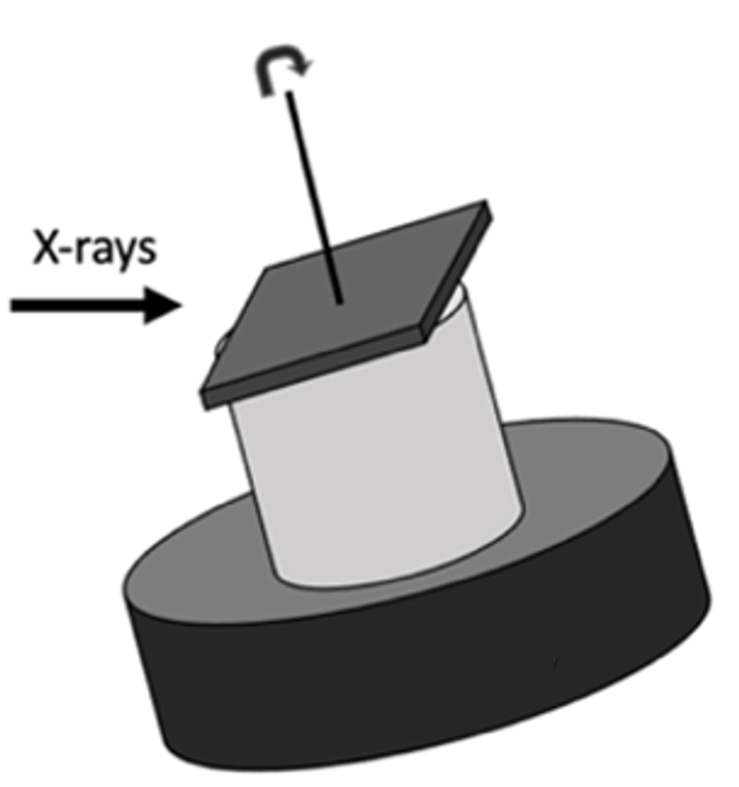

Laminography
------------

Laminography is well suited for flat samples. In this configuration the rotation axis is tilted with respect to the incident x-ray beam:

.. image:: ../img/tomo_00100_2.png
    :width: 128pt

.. _tomo_00100: https://app.globus.org/file-manager?origin_id=9f00a780-4aee-42a7-b7f4-6a2773c8da30&origin_path=%2Ftomo_00100%2F

.. |00100| image:: ../img/tomo_00100_3.png
    :width: 20pt

Camera caffè
~~~~~~~~~~~~

The Camera caffè data set has been created using a leaf from a plant of `Epipremnum aureum <https://en.wikipedia.org/wiki/Epipremnum_aureum>`_ also known as Devil’s Ivy. The specific plant used to live at the University of Trieste, Italy in the so called "Camera Caffè" between  1987 and 1993 where a group of students (Sara, Silvano, Claudio, Federico and Francesco) enjoyed their daily cup of coffee. In 1994 the plant traveled to the Netherland, then Germany in 1995 and since 1998 is at the Advanced Photon Source at Argonne National Laboratory next to the sector 32 coffee machine. Because this plant always lived near a coffee maker we decided to dedicate the data set to the "Camera caffè" to remember and celebrate the coffee discussions with friends and colleagues this plant enjoyed through the years.

.. image:: ../img/tomo_00100_4.png
    :width: 512pt

The leaf was installed on the laminography set up of beamline 2-BM of the Advanced Photon Source:

.. image:: ../img/tomo_00100_3.png
    :width: 256pt

A laminigraphy reconstruction using `tomocupy <https://tomocupy.readthedocs.io/>`_ produces the following result:

.. image:: ../img/tomo_00100_5.png
    :width: 256pt

+---------------------------------+------------------------------------+
|             tomo_ID             |   00100                            |  
+=================================+====================================+
|             Image preview       |  |00100|                           |  
+---------------------------------+------------------------------------+
|             Download            |  tomo_00100_                       |  
+---------------------------------+------------------------------------+
| Instrument                      |        APS 2-BM-B fast tomo        | 
+---------------------------------+------------------------------------+
| Energy                          |        27.4 keV                    | 
+---------------------------------+------------------------------------+
| Monochromator                   |        multi-layer                 | 
+---------------------------------+------------------------------------+
| Scan Range                      |        180 degree                  |
+---------------------------------+------------------------------------+
| Number of Projections           |        1500                        |
+---------------------------------+------------------------------------+
| White Fields                    |        10 before                   |
+---------------------------------+------------------------------------+
| Dark Fields                     |        10 before                   | 
+---------------------------------+------------------------------------+
| Mode                            |        fly-scan                    | 
+---------------------------------+------------------------------------+
| Rotation Speed                  |        0.75 deg/s                  | 
+---------------------------------+------------------------------------+
| Sample Detector Distance        |        60  mm                      | 
+---------------------------------+------------------------------------+
| Attenuator                      |        mm C + 1mm Glass            | 
+---------------------------------+------------------------------------+
| Detector Name                   |        PCO edge                    | 
+---------------------------------+------------------------------------+
| Exposure Time                   |        0.0001 s                    | 
+---------------------------------+------------------------------------+
| Pixel Size                      |        0.65 µm                     | 
+---------------------------------+------------------------------------+
| Detector shutter mode           |        global                      | 
+---------------------------------+------------------------------------+
| Detector Dimension x            |        2560                        | 
+---------------------------------+------------------------------------+
| Detector Dimension y            |        2160                        | 
+---------------------------------+------------------------------------+
| Objective Magnification         |        Mitutoyo 10x                | 
+---------------------------------+------------------------------------+
| Scintillator                    |        LuAG 10 µm                  | 
+---------------------------------+------------------------------------+
