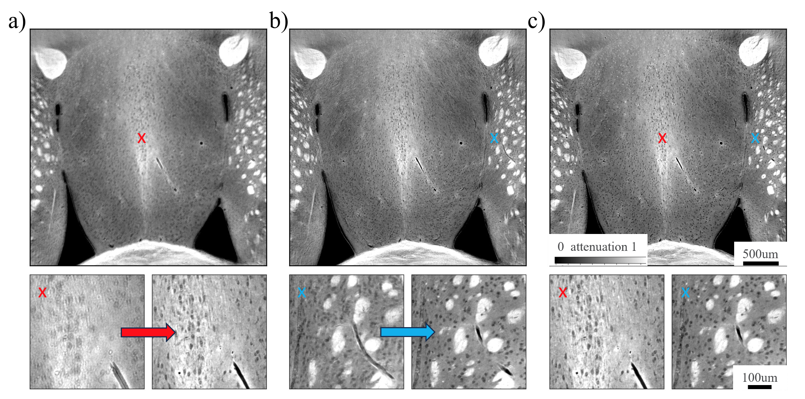

Laminography
------------

Laminography is well suited for flat samples. In this configuration the rotation axis is tilted with respect to the incident x-ray beam:

.. image:: ../img/tomo_00100_1.png
    :width: 128pt

.. image:: ../img/tomo_00100_2.png
    :width: 128pt

.. _tomo_00100: https://app.globus.org/file-manager?origin_id=9f00a780-4aee-42a7-b7f4-6a2773c8da30&origin_path=%2Ftomo_00100%2F

.. |00100| image:: ../img/tomo_00100_3.png
    :width: 20pt

Camera caffè
~~~~~~~~~~~~

The Camera caffè data set has been created using a leaf from a plant of `Epipremnum aureum <https://en.wikipedia.org/wiki/Epipremnum_aureum>`_ also known as Devil’s Ivy. The specific plant used to live at the University of Trieste, Italy in the so called "Camera Caffè" between  1987 and 1993 where a group of students (Sara, Silvano, Claudio, Federico and Francesco) enjoyed their daily cup of coffee. In 1994 the plant traveled to the Netherland, then Germany in 1995 and since 1998 is at the Advanced Photon Source at Argonne National Laboratory next to the sector 32 coffee machine. Because this plant always lived near a coffee maker we decided to dedicate the data set to the "Camera caffè" to remember and celebrate the coffee discussions with friends and colleagues this plant enjoyed through the years.

.. image:: ../img/tomo_00100_6.png
    :width: 512pt

.. image:: ../img/tomo_00100_4.png
    :width: 512pt

The leaf was installed on the laminography set up of beamline 2-BM of the Advanced Photon Source:

.. image:: ../img/tomo_00100_3.png
    :width: 256pt

A laminigraphy reconstruction using `tomocupy <https://tomocupy.readthedocs.io/>`_ produces the following result:

.. image:: ../img/tomo_00100_5.png
    :width: 256pt

+---------------------------------+------------------------------------+
|             tomo_ID             |   00100                            |  
+=================================+====================================+
|             Image preview       |  |00100|                           |  
+---------------------------------+------------------------------------+
|             Download            |  tomo_00100_                       |  
+---------------------------------+------------------------------------+
| Instrument                      |        APS 2-BM-B                  | 
+---------------------------------+------------------------------------+
| Energy                          |        30.0 keV (Pink)             | 
+---------------------------------+------------------------------------+
| Monochromator                   |          -                         | 
+---------------------------------+------------------------------------+
| Scan Range                      |        360 degree                  |
+---------------------------------+------------------------------------+
| Number of Projections           |        3000                        |
+---------------------------------+------------------------------------+
| White Fields                    |        20 before                   |
+---------------------------------+------------------------------------+
| Dark Fields                     |        20 before                   | 
+---------------------------------+------------------------------------+
| Mode                            |        fly-scan                    | 
+---------------------------------+------------------------------------+
| Rotation Speed                  |        2.4 deg/s                   | 
+---------------------------------+------------------------------------+
| Sample Detector Distance        |        120  mm                     | 
+---------------------------------+------------------------------------+
| Attenuator                      |        mm C + 6mm Glass            | 
+---------------------------------+------------------------------------+
| Detector Name                   |        Oryx 31.0 MP Mono 10GigE    | 
+---------------------------------+------------------------------------+
| Exposure Time                   |        0.05 s                      | 
+---------------------------------+------------------------------------+
| Pixel Size                      |        1.38 µm                     | 
+---------------------------------+------------------------------------+
| Detector shutter mode           |        global                      | 
+---------------------------------+------------------------------------+
| Detector Dimension x            |        3232                        | 
+---------------------------------+------------------------------------+
| Detector Dimension y            |        1536                        | 
+---------------------------------+------------------------------------+
| Objective Magnification         |        Mitutoyo 5x                 | 
+---------------------------------+------------------------------------+
| Scintillator                    |        GGG:Eu 23 µm                | 
+---------------------------------+------------------------------------+

Brain slab
----------

Brain slab is a laminography dataset presented at :cite:`nikitin:2024`. This is referred in the paper as brain_x2y1.h5.

.. _tomo_00101: https://app.globus.org/file-manager?origin_id=9f00a780-4aee-42a7-b7f4-6a2773c8da30&origin_path=%2Ftomo_00101%2F

+---------------------------------+------------------------------------+
|             tomo_ID             |   00101                            |  
+=================================+====================================+
|             Image preview       |  |00101|                           |  
+---------------------------------+------------------------------------+
|             Download            |  tomo_00101_                       |  
+---------------------------------+------------------------------------+
| Instrument                      |        APS 2-BM-B                  | 
+---------------------------------+------------------------------------+
| Energy                          |        30.0 keV (Pink)             | 
+---------------------------------+------------------------------------+
| Monochromator                   |          -                         | 
+---------------------------------+------------------------------------+
| Scan Range                      |        360 degree                  |
+---------------------------------+------------------------------------+
| Number of Projections           |        3000                        |
+---------------------------------+------------------------------------+
| White Fields                    |        20 before                   |
+---------------------------------+------------------------------------+
| Dark Fields                     |        20 before                   | 
+---------------------------------+------------------------------------+
| Mode                            |        fly-scan                    | 
+---------------------------------+------------------------------------+
| Rotation Speed                  |        2.4 deg/s                   | 
+---------------------------------+------------------------------------+
| Sample Detector Distance        |        200  mm                     | 
+---------------------------------+------------------------------------+
| Attenuator                      |        mm C + 6mm Glass            | 
+---------------------------------+------------------------------------+
| Detector Name                   |        Oryx 31.0 MP Mono 10GigE    | 
+---------------------------------+------------------------------------+
| Exposure Time                   |        0.05 s                      | 
+---------------------------------+------------------------------------+
| Pixel Size                      |        0.92 µm                     | 
+---------------------------------+------------------------------------+
| Detector shutter mode           |        global                      | 
+---------------------------------+------------------------------------+
| Detector Dimension x            |        3232                        | 
+---------------------------------+------------------------------------+
| Detector Dimension y            |        2256                        | 
+---------------------------------+------------------------------------+
| Objective Magnification         |        Mitutoyo 7.5x               | 
+---------------------------------+------------------------------------+
| Scintillator                    |        GGG:Eu 23 µm                | 
+---------------------------------+------------------------------------+
