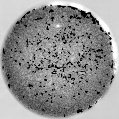

Small ROI
---------

Small Region of Interest (ROI) includes a series of data sets in which the sample is larger than the field of view (see table below). The related sample description and the experimental conditions are reported in tables below. 

.. _tomo_00022: https://app.globus.org/file-manager?origin_id=e133a81a-6d04-11e5-ba46-22000b92c6ec&origin_path=%2Ftomobank%2Ftomo_00022%2F
.. _tomo_00023: https://app.globus.org/file-manager?origin_id=e133a81a-6d04-11e5-ba46-22000b92c6ec&origin_path=%2Ftomobank%2Ftomo_00023%2F
.. _tomo_00024: https://app.globus.org/file-manager?origin_id=e133a81a-6d04-11e5-ba46-22000b92c6ec&origin_path=%2Ftomobank%2Ftomo_00024%2F

.. |00022| image:: ../img/tomo_00022.png
    :width: 20pt
    :height: 20pt

.. |00023| image:: ../img/tomo_00023.png
    :width: 20pt
    :height: 20pt

.. |00024| image:: ../img/tomo_00024.png
    :width: 20pt
    :height: 20pt

Double Bamboo Tin Wire
~~~~~~~~~~~~~~~~~~~~~~

To load the data sets and perform a basic reconstruction using `tomopy <https://tomopy.readthedocs.io>`_ ::

    tomopy recon --file-name tomo_00022.h5 --rotation-axis 980
    tomopy recon --file-name tomo_00023.h5 --rotation-axis 893
    tomopy recon --file-name tomo_00024.h5 --rotation-axis 972

+-----------------------------------------+----------------------------+
|             tomo_ID                     |   00022                    |  
+=========================================+============================+
|             Image preview               |  |00022|                   |  
+-----------------------------------------+----------------------------+
|             Download                    |  tomo_00022_               |  
+-----------------------------------------+----------------------------+
|             Instrument                  |   Elettra Syrmep           |  
+-----------------------------------------+----------------------------+
|             Sample name                 |   Double Bamboo Tin Wire   |  
+-----------------------------------------+----------------------------+
|             X-ray energy                |   white beam mode          |  
+-----------------------------------------+----------------------------+
|             Ring energy                 |   2 GeV                    |  
+-----------------------------------------+----------------------------+
|             Exposure time               |   1 s                      |  
+-----------------------------------------+----------------------------+
|             Detector                    |   SCMOS 16-bit             |  
+-----------------------------------------+----------------------------+
|             Sample-to-detector distance |   150 mm                   |  
+-----------------------------------------+----------------------------+
|             Pixel size                  |   2.4 µm                   |  
+-----------------------------------------+----------------------------+
|             Scan Range                  |   180 degree               |
+-----------------------------------------+----------------------------+
|             Number of Projections       |   400                      |
+-----------------------------------------+----------------------------+
|             Rotation axis location      |   980                      |
+-----------------------------------------+----------------------------+

Bamboo Wires 2
~~~~~~~~~~~~~~

+-----------------------------------------+----------------------------+
|             tomo_ID                     |   00023                    |  
+=========================================+============================+
|             Image preview               |  |00023|                   |  
+-----------------------------------------+----------------------------+
|             Download                    |  tomo_00023_               |  
+-----------------------------------------+----------------------------+
|             Instrument                  |   Elettra Syrmep           |  
+-----------------------------------------+----------------------------+
|             Sample name                 |   Bamboo Wires 2           |  
+-----------------------------------------+----------------------------+
|             X-ray energy                |   white beam mode          |  
+-----------------------------------------+----------------------------+
|             Ring energy                 |   2 GeV                    |  
+-----------------------------------------+----------------------------+
|             Exposure time               |   1 s                      |  
+-----------------------------------------+----------------------------+
|             Detector                    |   SCMOS 16-bit             |  
+-----------------------------------------+----------------------------+
|             Sample-to-detector distance |   150 mm                   |  
+-----------------------------------------+----------------------------+
|             Pixel size                  |   2.6 µm                   |  
+-----------------------------------------+----------------------------+
|             Scan Range                  |   180 degree               |
+-----------------------------------------+----------------------------+
|             Number of Projections       |   1800                     |
+-----------------------------------------+----------------------------+
|             Rotation axis location      |   893                      |
+-----------------------------------------+----------------------------+

Polystyrene
~~~~~~~~~~~

+-----------------------------------------+----------------------------+
|             tomo_ID                     |   00024                    |  
+=========================================+============================+
|             Image preview               |  |00024|                   |  
+-----------------------------------------+----------------------------+
|             Download                    |  tomo_00024_               |  
+-----------------------------------------+----------------------------+
|             Instrument                  |   Elettra Syrmep           |  
+-----------------------------------------+----------------------------+
|             Sample name                 |   Polystyrene              |  
+-----------------------------------------+----------------------------+
|             X-ray energy                |   white beam mode          |  
+-----------------------------------------+----------------------------+
|             Ring energy                 |   2 GeV                    |  
+-----------------------------------------+----------------------------+
|             Exposure time               |   1 s                      |  
+-----------------------------------------+----------------------------+
|             Detector                    |   SCMOS 16-bit             |  
+-----------------------------------------+----------------------------+
|             Sample-to-detector distance |   150 mm                   |  
+-----------------------------------------+----------------------------+
|             Pixel size                  |   2.04 µm                  |  
+-----------------------------------------+----------------------------+
|             Scan Range                  |   180 degree               |
+-----------------------------------------+----------------------------+
|             Number of Projections       |   400                      |
+-----------------------------------------+----------------------------+
|             Rotation axis location      |   972                      |
+-----------------------------------------+----------------------------+

Electrode Particles
~~~~~~~~~~~~~~~~~~~

Detection and quantification of grey level differences of ca. 1% in the electrode particles – local
tomography is making this challenging task even more difficult. Standard solutions used at the
TOMCAT beamline (e.g. constant padding) are not sufficient in the phase retrieved case :cite:`paganin:02`, 
if small grey level differences need to be reliably detected.

To load the data sets and perform a basic reconstruction using `tomopy <https://tomopy.readthedocs.io>`_ ::

    tomopy recon --file-name tomo_00070.h5 --rotation-axis 1289

To enable phase retrieval un-comment the appropriate setting in :download:`tomopy_rec.py <../../demo/tomopy_rec.py>` 

+-----------------------------------------+----------------------------+
|             tomo_ID                     | 00070                      |  
+=========================================+============================+
|             Image preview               | |00070|                    |  
+-----------------------------------------+----------------------------+
|             Download                    | tomo_00070_                |  
+-----------------------------------------+----------------------------+
|             Instrument                  | SLS TOMCAT                 |  
+-----------------------------------------+----------------------------+
|             Sample name                 | SLS_02                     |  
+-----------------------------------------+----------------------------+
|             X-ray energy                | 24.999 keV                 |  
+-----------------------------------------+----------------------------+
|             Sample-to-detector distance | 50 mm                      |  
+-----------------------------------------+----------------------------+
|             Scan Range                  | 180 degree                 |
+-----------------------------------------+----------------------------+
|             Number of Projections       | 1201                       |
+-----------------------------------------+----------------------------+
|             White Fields                | 200 (100 before 100 after) | 
+-----------------------------------------+----------------------------+
|             Dark Fields                 | 10                         |  
+-----------------------------------------+----------------------------+
|             Pixel size                  | 0.65 µm                    |  
+-----------------------------------------+----------------------------+
|             Rotation axis location      |  1289.09525072             |
+-----------------------------------------+----------------------------+

.. _tomo_00070: https://app.globus.org/file-manager?origin_id=e133a81a-6d04-11e5-ba46-22000b92c6ec&origin_path=%2Ftomobank%2Ftomo_00070%2F

TomoLab
~~~~~~~

A second series of data sets (see table below) were acquired by microfocus CT at the TomoLab station of Elettra using a cone-beam geometry. The sample description and the experimental conditions are reported in tables below under tomo_00027 to tomo_00030.

.. _tomo_00027: https://app.globus.org/file-manager?origin_id=e133a81a-6d04-11e5-ba46-22000b92c6ec&origin_path=%2Ftomobank%2Ftomo_00027%2F
.. _tomo_00028: https://app.globus.org/file-manager?origin_id=e133a81a-6d04-11e5-ba46-22000b92c6ec&origin_path=%2Ftomobank%2Ftomo_00028%2F
.. _tomo_00029: https://app.globus.org/file-manager?origin_id=e133a81a-6d04-11e5-ba46-22000b92c6ec&origin_path=%2Ftomobank%2Ftomo_00029%2F
.. _tomo_00030: https://app.globus.org/file-manager?origin_id=e133a81a-6d04-11e5-ba46-22000b92c6ec&origin_path=%2Ftomobank%2Ftomo_00030%2F

.. |00027| image:: ../img/tomo_00001.png
    :width: 20pt
    :height: 20pt

.. |00028| image:: ../img/tomo_00001.png
    :width: 20pt
    :height: 20pt

.. |00029| image:: ../img/tomo_00001.png
    :width: 20pt
    :height: 20pt

.. |00030| image:: ../img/tomo_00001.png
    :width: 20pt
    :height: 20pt

Bone  local
___________

+------------------------------------+------------------------------+
|    tomo_ID                         |      00027                   |
+====================================+==============================+
|    Image preview                   |      |00027|                 |  
+------------------------------------+------------------------------+
|    Download                        |      tomo_00027_             |  
+------------------------------------+------------------------------+
|    Instrument                      |      TomoLab @Elettra        |
+------------------------------------+------------------------------+
|    Sample Name                     |      Bone  local             |
+------------------------------------+------------------------------+
|    Voltage                         |      110 kV                  |
+------------------------------------+------------------------------+
|    Current                         |      145 µA                  |
+------------------------------------+------------------------------+
|    Filter                          |      0.1 mm Cu               |
+------------------------------------+------------------------------+
|    Focal spot                      |      16 µm                   |
+------------------------------------+------------------------------+
|    Exposure time/proj              |      4 s                     |
+------------------------------------+------------------------------+
|    Detector                        |      CCD 12-bit              |
+------------------------------------+------------------------------+
|    Source-to-sample distance       |      100 mm                  |
+------------------------------------+------------------------------+
|    Source-to-detector distance     |      250 mm                  |
+------------------------------------+------------------------------+
|    Pixel size                      |      10.0 µm                 |
+------------------------------------+------------------------------+
|    Number of Projections           |      1800                    |
+------------------------------------+------------------------------+
|    Scan range                      |      360 degrees             |
+------------------------------------+------------------------------+
|    Start angle (degrees)           |      0                       |
+------------------------------------+------------------------------+
|    Horizontal image size           |      2004 pixels             |
+------------------------------------+------------------------------+
|    Vertical image size             |      1335 pixels             |
+------------------------------------+------------------------------+
|    Detector horizontal pixel size  |      25 µm                   |
+------------------------------------+------------------------------+
|    Detector vertical pixel size    |      25 µm                   |
+------------------------------------+------------------------------+

Bone  local  stone
__________________

+------------------------------------+------------------------------+
|    tomo_ID                         |      00028                   |
+====================================+==============================+
|    Image preview                   |      |00028|                 |  
+------------------------------------+------------------------------+
|    Download                        |      tomo_00028_             |  
+------------------------------------+------------------------------+
|    Instrument                      |      TomoLab @Elettra        |
+------------------------------------+------------------------------+
|    Sample Name                     |      bone  local  stone      |
+------------------------------------+------------------------------+
|    Voltage                         |      60 kV                   |
+------------------------------------+------------------------------+
|    Current                         |      250 µA                  |
+------------------------------------+------------------------------+
|    Filter                          |      1.0 mm Al               |
+------------------------------------+------------------------------+
|    Focal spot                      |      16 µm                   |
+------------------------------------+------------------------------+
|    Exposure time/proj              |      4 s                     |
+------------------------------------+------------------------------+
|    Detector                        |      CCD 12-bit              |
+------------------------------------+------------------------------+
|    Source-to-sample distance       |      100 mm                  |
+------------------------------------+------------------------------+
|    Source-to-detector distance     |      250 mm                  |
+------------------------------------+------------------------------+
|    Pixel size                      |      10.0 µm                 |
+------------------------------------+------------------------------+
|    Number of Projections           |      1800                    |
+------------------------------------+------------------------------+
|    Scan range                      |      360 degrees             |
+------------------------------------+------------------------------+
|    Start angle (degrees)           |      0                       |
+------------------------------------+------------------------------+
|    Horizontal image size           |      2004 pixels             |
+------------------------------------+------------------------------+
|    Vertical image size             |      1335 pixels             |
+------------------------------------+------------------------------+
|    Detector horizontal pixel size  |      25 µm                   |
+------------------------------------+------------------------------+
|    Detector vertical pixel size    |      25 µm                   |
+------------------------------------+------------------------------+

Candy  local
____________

+------------------------------------+------------------------------+
|    tomo_ID                         |      00029                   |
+====================================+==============================+
|    Image preview                   |      |00029|                 |  
+------------------------------------+------------------------------+
|    Download                        |      tomo_00029_             |  
+------------------------------------+------------------------------+
|    Instrument                      |      TomoLab @Elettra        |
+------------------------------------+------------------------------+
|    Sample Name                     |      Candy  local            |
+------------------------------------+------------------------------+
|    Voltage                         |      70 kV                   |
+------------------------------------+------------------------------+
|    Current                         |      114 µA                  |
+------------------------------------+------------------------------+
|    Filter                          |      1.5 mm Al               |
+------------------------------------+------------------------------+
|    Focal spot                      |      8 µm                    |
+------------------------------------+------------------------------+
|    Exposure time/proj              |      6 s                     |
+------------------------------------+------------------------------+
|    Detector                        |      CCD 12-bit              |
+------------------------------------+------------------------------+
|    Source-to-sample distance       |      100 mm                  |
+------------------------------------+------------------------------+
|    Source-to-detector distance     |      250 mm                  |
+------------------------------------+------------------------------+
|    Pixel size                      |      10.0 µm                 |
+------------------------------------+------------------------------+
|    Number of Projections           |      1800                    |
+------------------------------------+------------------------------+
|    Scan range                      |      360 degrees             |
+------------------------------------+------------------------------+
|    Start angle (degrees)           |      0                       |
+------------------------------------+------------------------------+
|    Horizontal image size           |      2004 pixels             |
+------------------------------------+------------------------------+
|    Vertical image size             |      1335 pixels             |
+------------------------------------+------------------------------+
|    Detector horizontal pixel size  |      25 µm                   |
+------------------------------------+------------------------------+
|    Detector vertical pixel size    |      25 µm                   |
+------------------------------------+------------------------------+

Smiling  sample
_______________

+------------------------------------+------------------------------+
|    tomo_ID                         |      00030                   |
+====================================+==============================+
|    Image preview                   |      |00030|                 |  
+------------------------------------+------------------------------+
|    Download                        |      tomo_00030_             |  
+------------------------------------+------------------------------+
|    Instrument                      |      TomoLab @Elettra        |
+------------------------------------+------------------------------+
|    Sample Name                     |      Smiling  sample         |
+------------------------------------+------------------------------+
|    Voltage                         |      60 kV                   |
+------------------------------------+------------------------------+
|    Current                         |      300 µA                  |
+------------------------------------+------------------------------+
|    Filter                          |      1.5 mm Al               |
+------------------------------------+------------------------------+
|    Focal spot                      |      20 µm                   |
+------------------------------------+------------------------------+
|    Exposure time/proj              |      1 s                     |
+------------------------------------+------------------------------+
|    Detector                        |      CCD 12-bit              |
+------------------------------------+------------------------------+
|    Source-to-sample distance       |      250 mm                  |
+------------------------------------+------------------------------+
|    Source-to-detector distance     |      350 mm                  |
+------------------------------------+------------------------------+
|    Pixel size                      |      58.0 µm                 |
+------------------------------------+------------------------------+
|    Number of Projections           |      720                     |
+------------------------------------+------------------------------+
|    Scan range                      |      360 degrees             |
+------------------------------------+------------------------------+
|    Start angle (degrees)           |      0                       |
+------------------------------------+------------------------------+
|    Horizontal image size           |      668 pixels              |
+------------------------------------+------------------------------+
|    Vertical image size             |      445 pixels              |
+------------------------------------+------------------------------+
|    Detector horizontal pixel size  |      75 µm                   |
+------------------------------------+------------------------------+
|    Detector vertical pixel size    |      75 µm                   |
+------------------------------------+------------------------------+

