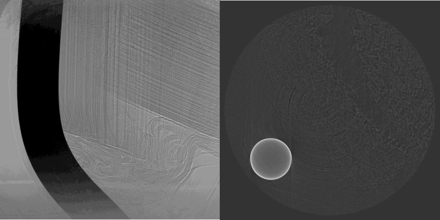
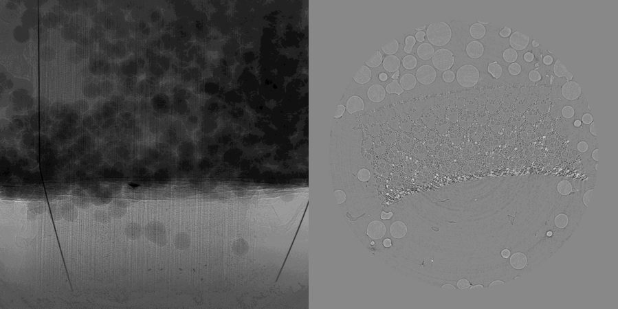
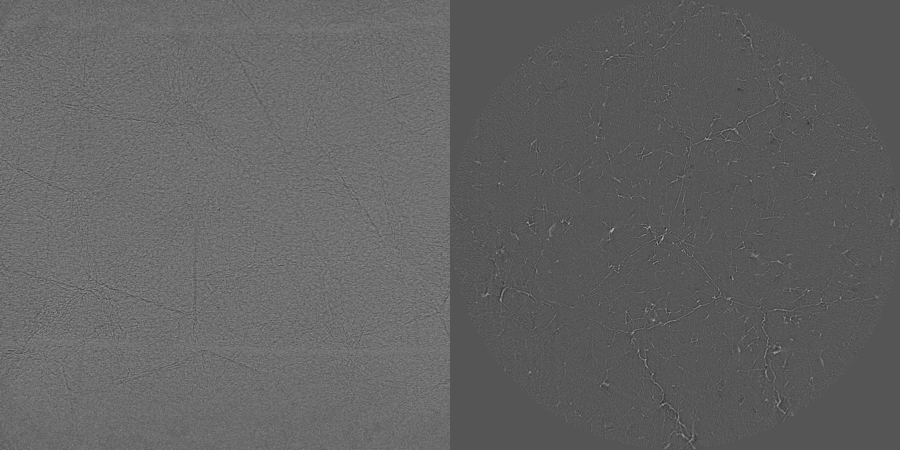
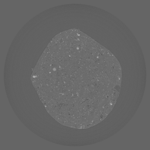

Local Area
----------

Local Area includes a first series of 5 data sets in which the sample is larger than the field of view (see table below). The microCT data sets of these samples were acquired at the SYRMEP beamline of Elettra-Sincrotrone Trieste (Elettra), Italy in nearly-parallel beam geometry. The related sample description and the experimental conditions are reported in tables below under tomo_00022 to tomo_00024. 

+------------------------------------+------------------------------+-----------+-------------------------+
|           tomo_ID                  | Sample Name                  |   Image   |       Downloads         |     
+====================================+==============================+===========+=========================+ 
|      tomo_00022_                   | Double Bamboo Tin Wire       |  |00022|  |      |tomo_00022|       |
+------------------------------------+------------------------------+-----------+-------------------------+ 
|      tomo_00023_                   | Bamboo Wires 2               |  |00023|  |      |tomo_00023|       |
+------------------------------------+------------------------------+-----------+-------------------------+ 
|      tomo_00024_                   | Polystyrene                  |  |00024|  |      |tomo_00024|       |
+------------------------------------+------------------------------+-----------+-------------------------+ 

.. |tomo_00022| replace:: :download:`rec_script.py <../../../docs/demo/rec_tomo_00022.py>`
.. |tomo_00023| replace:: :download:`rec_script.py <../../../docs/demo/rec_tomo_00004.py>`
.. |tomo_00024| replace:: :download:`rec_script.py <../../../docs/demo/rec_tomo_00004.py>`

.. _tomo_00022: https://www.globus.org/app/transfer?origin_id=e133a81a-6d04-11e5-ba46-22000b92c6ec&origin_path=%2Ftomobank%2Ftomo_00022%2F/
.. _tomo_00023: https://www.globus.org/app/transfer?origin_id=e133a81a-6d04-11e5-ba46-22000b92c6ec&origin_path=%2Ftomobank%2Ftomo_00023%2F/
.. _tomo_00024: https://www.globus.org/app/transfer?origin_id=e133a81a-6d04-11e5-ba46-22000b92c6ec&origin_path=%2Ftomobank%2Ftomo_00024%2F/

Double Bamboo Tin Wire
~~~~~~~~~~~~~~~~~~~~~~

+-----------------------------------------+----------------------------+
|             tomo_ID                     |   00022                    |  
+=========================================+============================+
|             Image preview               |  |00022|                   |  
+-----------------------------------------+----------------------------+
|             Download                    |   tomo_00022_              |  
+-----------------------------------------+----------------------------+
|             Instrument                  |   Elettra Syrmep           |  
+-----------------------------------------+----------------------------+
|             Sample name                 |   Double Bamboo Tin Wire   |  
+-----------------------------------------+----------------------------+
|             X-ray energy                |   white beam mode          |  
+-----------------------------------------+----------------------------+
|             Ring energy                 |   2 GeV                    |  
+-----------------------------------------+----------------------------+
|             Exposure time               |   1 s                      |  
+-----------------------------------------+----------------------------+
|             Detector                    |   SCMOS 16-bit             |  
+-----------------------------------------+----------------------------+
|             Sample-to-detector distance |   150 mm                   |  
+-----------------------------------------+----------------------------+
|             Pixel size                  |   2.4 µm                   |  
+-----------------------------------------+----------------------------+
|             Scan Range                  |   180 degree               |
+-----------------------------------------+----------------------------+
|             Number of Projections       |   1800                     |
+-----------------------------------------+----------------------------+

Bamboo Wires 2
~~~~~~~~~~~~~~

+-----------------------------------------+----------------------------+
|             tomo_ID                     |   00023                    |  
+=========================================+============================+
|             Image preview               |  |00023|                   |  
+-----------------------------------------+----------------------------+
|             Download                    |   tomo_00023_              |  
+-----------------------------------------+----------------------------+
|             Instrument                  |   Elettra Syrmep           |  
+-----------------------------------------+----------------------------+
|             Sample name                 |   Bamboo Wires 2           |  
+-----------------------------------------+----------------------------+
|             X-ray energy                |   white beam mode          |  
+-----------------------------------------+----------------------------+
|             Ring energy                 |   2 GeV                    |  
+-----------------------------------------+----------------------------+
|             Exposure time               |   1 s                      |  
+-----------------------------------------+----------------------------+
|             Detector                    |   SCMOS 16-bit             |  
+-----------------------------------------+----------------------------+
|             Sample-to-detector distance |   150 mm                   |  
+-----------------------------------------+----------------------------+
|             Pixel size                  |   2.6 µm                   |  
+-----------------------------------------+----------------------------+
|             Scan Range                  |   180 degree               |
+-----------------------------------------+----------------------------+
|             Number of Projections       |   1800                     |
+-----------------------------------------+----------------------------+

Polystyrene
~~~~~~~~~~~

+-----------------------------------------+----------------------------+
|             tomo_ID                     |   00024                    |  
+=========================================+============================+
|             Image preview               |  |00024|                   |  
+-----------------------------------------+----------------------------+
|             Download                    |   tomo_00024_              |  
+-----------------------------------------+----------------------------+
|             Instrument                  |   Elettra Syrmep           |  
+-----------------------------------------+----------------------------+
|             Sample name                 |   Polystyrene              |  
+-----------------------------------------+----------------------------+
|             X-ray energy                |   white beam mode          |  
+-----------------------------------------+----------------------------+
|             Ring energy                 |   2 GeV                    |  
+-----------------------------------------+----------------------------+
|             Exposure time               |   1 s                      |  
+-----------------------------------------+----------------------------+
|             Detector                    |   SCMOS 16-bit             |  
+-----------------------------------------+----------------------------+
|             Sample-to-detector distance |   150 mm                   |  
+-----------------------------------------+----------------------------+
|             Pixel size                  |   2.04 µm                  |  
+-----------------------------------------+----------------------------+
|             Scan Range                  |   180 degree               |
+-----------------------------------------+----------------------------+
|             Number of Projections       |   1800                     |
+-----------------------------------------+----------------------------+

A second series of data sets (see table below) were acquired by microfocus CT at the TomoLab station of Elettra using a cone-beam geometry. The sample description and the experimental conditions are reported in tables below under tomo_00027 to tomo_00030.

.. |tomo_00027| replace:: :download:`rec_script.py <../../../docs/demo/rec_tomo_00004.py>`
.. |tomo_00028| replace:: :download:`rec_script.py <../../../docs/demo/rec_tomo_00004.py>`
.. |tomo_00029| replace:: :download:`rec_script.py <../../../docs/demo/rec_tomo_00004.py>`
.. |tomo_00030| replace:: :download:`rec_script.py <../../../docs/demo/rec_tomo_00004.py>`

.. _tomo_00027: https://www.globus.org/app/transfer?origin_id=e133a81a-6d04-11e5-ba46-22000b92c6ec&origin_path=%2Ftomobank%2Ftomo_00027%2F/
.. _tomo_00028: https://www.globus.org/app/transfer?origin_id=e133a81a-6d04-11e5-ba46-22000b92c6ec&origin_path=%2Ftomobank%2Ftomo_00028%2F/
.. _tomo_00029: https://www.globus.org/app/transfer?origin_id=e133a81a-6d04-11e5-ba46-22000b92c6ec&origin_path=%2Ftomobank%2Ftomo_00029%2F/
.. _tomo_00030: https://www.globus.org/app/transfer?origin_id=e133a81a-6d04-11e5-ba46-22000b92c6ec&origin_path=%2Ftomobank%2Ftomo_00030%2F/

+------------------------------------+------------------------------+-----------+-------------------------+
|           tomo_ID                  | Sample Name                  |   Image   |       Downloads         |
+====================================+==============================+===========+=========================+
|      tomo_00027_                   | bone local                   |  |00027|  |      |tomo_00027|       |
+------------------------------------+------------------------------+-----------+-------------------------+
|      tomo_00028_                   | bone local stone             |  |00028|  |      |tomo_00028|       |
+------------------------------------+------------------------------+-----------+-------------------------+
|      tomo_00029_                   | candie local                 |  |00029|  |      |tomo_00029|       |
+------------------------------------+------------------------------+-----------+-------------------------+
|      tomo_00030_                   | smiling sammple              |  |00030|  |      |tomo_00030|       |
+------------------------------------+------------------------------+-----------+-------------------------+

Bone  local
~~~~~~~~~~~

+------------------------------------+------------------------------+
|    tomo_ID                         |      00027                   |
+====================================+==============================+
|    Image preview                   |      |00027|                 |  
+------------------------------------+------------------------------+
|    Download                        |      tomo_00027_             |  
+------------------------------------+------------------------------+
|    Instrument                      |      TomoLab @Elettra        |
+------------------------------------+------------------------------+
|    Sample Name                     |      Bone  local             |
+------------------------------------+------------------------------+
|    Voltage                         |      110 kV                  |
+------------------------------------+------------------------------+
|    Current                         |      145 µA                  |
+------------------------------------+------------------------------+
|    Filter                          |      0.1 mm Cu               |
+------------------------------------+------------------------------+
|    Focal spot                      |      16 µm                   |
+------------------------------------+------------------------------+
|    Exposure time/proj              |      4 s                     |
+------------------------------------+------------------------------+
|    Detector                        |      CCD 12-bit              |
+------------------------------------+------------------------------+
|    Source-to-sample distance       |      100 mm                  |
+------------------------------------+------------------------------+
|    Source-to-detector distance     |      250 mm                  |
+------------------------------------+------------------------------+
|    Pixel size                      |      10.0 µm                 |
+------------------------------------+------------------------------+
|    Number of Projections           |      1800                    |
+------------------------------------+------------------------------+
|    Scan range                      |      360 degrees             |
+------------------------------------+------------------------------+
|    Start angle (degrees)           |      0                       |
+------------------------------------+------------------------------+
|    Horizontal image size           |      2004 pixels             |
+------------------------------------+------------------------------+
|    Vertical image size             |      1335 pixels             |
+------------------------------------+------------------------------+
|    Detector horizontal pixel size  |      25 µm                   |
+------------------------------------+------------------------------+
|    Detector vertical pixel size    |      25 µm                   |
+------------------------------------+------------------------------+

Bone  local  stone
~~~~~~~~~~~~~~~~~~

+------------------------------------+------------------------------+
|    tomo_ID                         |      00028                   |
+====================================+==============================+
|    Image preview                   |      |00028|                 |  
+------------------------------------+------------------------------+
|    Download                        |      tomo_00028_             |  
+------------------------------------+------------------------------+
|    Instrument                      |      TomoLab @Elettra        |
+------------------------------------+------------------------------+
|    Sample Name                     |      bone  local  stone      |
+------------------------------------+------------------------------+
|    Voltage                         |      60 kV                   |
+------------------------------------+------------------------------+
|    Current                         |      250 µA                  |
+------------------------------------+------------------------------+
|    Filter                          |      1.0 mm Al               |
+------------------------------------+------------------------------+
|    Focal spot                      |      16 µm                   |
+------------------------------------+------------------------------+
|    Exposure time/proj              |      4 s                     |
+------------------------------------+------------------------------+
|    Detector                        |      CCD 12-bit              |
+------------------------------------+------------------------------+
|    Source-to-sample distance       |      100 mm                  |
+------------------------------------+------------------------------+
|    Source-to-detector distance     |      250 mm                  |
+------------------------------------+------------------------------+
|    Pixel size                      |      10.0 µm                 |
+------------------------------------+------------------------------+
|    Number of Projections           |      1800                    |
+------------------------------------+------------------------------+
|    Scan range                      |      360 degrees             |
+------------------------------------+------------------------------+
|    Start angle (degrees)           |      0                       |
+------------------------------------+------------------------------+
|    Horizontal image size           |      2004 pixels             |
+------------------------------------+------------------------------+
|    Vertical image size             |      1335 pixels             |
+------------------------------------+------------------------------+
|    Detector horizontal pixel size  |      25 µm                   |
+------------------------------------+------------------------------+
|    Detector vertical pixel size    |      25 µm                   |
+------------------------------------+------------------------------+

Candy  local
~~~~~~~~~~~~

+------------------------------------+------------------------------+
|    tomo_ID                         |      00029                   |
+====================================+==============================+
|    Image preview                   |      |00029|                 |  
+------------------------------------+------------------------------+
|    Download                        |      tomo_00029_             |  
+------------------------------------+------------------------------+
|    Instrument                      |      TomoLab @Elettra        |
+------------------------------------+------------------------------+
|    Sample Name                     |      Candy  local            |
+------------------------------------+------------------------------+
|    Voltage                         |      70 kV                   |
+------------------------------------+------------------------------+
|    Current                         |      114 µA                  |
+------------------------------------+------------------------------+
|    Filter                          |      1.5 mm Al               |
+------------------------------------+------------------------------+
|    Focal spot                      |      8 µm                    |
+------------------------------------+------------------------------+
|    Exposure time/proj              |      6 s                     |
+------------------------------------+------------------------------+
|    Detector                        |      CCD 12-bit              |
+------------------------------------+------------------------------+
|    Source-to-sample distance       |      100 mm                  |
+------------------------------------+------------------------------+
|    Source-to-detector distance     |      250 mm                  |
+------------------------------------+------------------------------+
|    Pixel size                      |      10.0 µm                 |
+------------------------------------+------------------------------+
|    Number of Projections           |      1800                    |
+------------------------------------+------------------------------+
|    Scan range                      |      360 degrees             |
+------------------------------------+------------------------------+
|    Start angle (degrees)           |      0                       |
+------------------------------------+------------------------------+
|    Horizontal image size           |      2004 pixels             |
+------------------------------------+------------------------------+
|    Vertical image size             |      1335 pixels             |
+------------------------------------+------------------------------+
|    Detector horizontal pixel size  |      25 µm                   |
+------------------------------------+------------------------------+
|    Detector vertical pixel size    |      25 µm                   |
+------------------------------------+------------------------------+

Smiling  sample
~~~~~~~~~~~~~~~

+------------------------------------+------------------------------+
|    tomo_ID                         |      00030                   |
+====================================+==============================+
|    Image preview                   |      |00030|                 |  
+------------------------------------+------------------------------+
|    Download                        |      tomo_00030_             |  
+------------------------------------+------------------------------+
|    Instrument                      |      TomoLab @Elettra        |
+------------------------------------+------------------------------+
|    Sample Name                     |      Smiling  sample         |
+------------------------------------+------------------------------+
|    Voltage                         |      60 kV                   |
+------------------------------------+------------------------------+
|    Current                         |      300 µA                  |
+------------------------------------+------------------------------+
|    Filter                          |      1.5 mm Al               |
+------------------------------------+------------------------------+
|    Focal spot                      |      20 µm                   |
+------------------------------------+------------------------------+
|    Exposure time/proj              |      1 s                     |
+------------------------------------+------------------------------+
|    Detector                        |      CCD 12-bit              |
+------------------------------------+------------------------------+
|    Source-to-sample distance       |      250 mm                  |
+------------------------------------+------------------------------+
|    Source-to-detector distance     |      350 mm                  |
+------------------------------------+------------------------------+
|    Pixel size                      |      58.0 µm                 |
+------------------------------------+------------------------------+
|    Number of Projections           |      720                     |
+------------------------------------+------------------------------+
|    Scan range                      |      360 degrees             |
+------------------------------------+------------------------------+
|    Start angle (degrees)           |      0                       |
+------------------------------------+------------------------------+
|    Horizontal image size           |      668 pixels              |
+------------------------------------+------------------------------+
|    Vertical image size             |      445 pixels              |
+------------------------------------+------------------------------+
|    Detector horizontal pixel size  |      75 µm                   |
+------------------------------------+------------------------------+
|    Detector vertical pixel size    |      75 µm                   |
+------------------------------------+------------------------------+

add datasets SLS02
~~~~~~~~~~~~~~~~~~

from https://drive.google.com/drive/folders/0B78bW1AwveI_WVdXQlBRMVBKQk0

