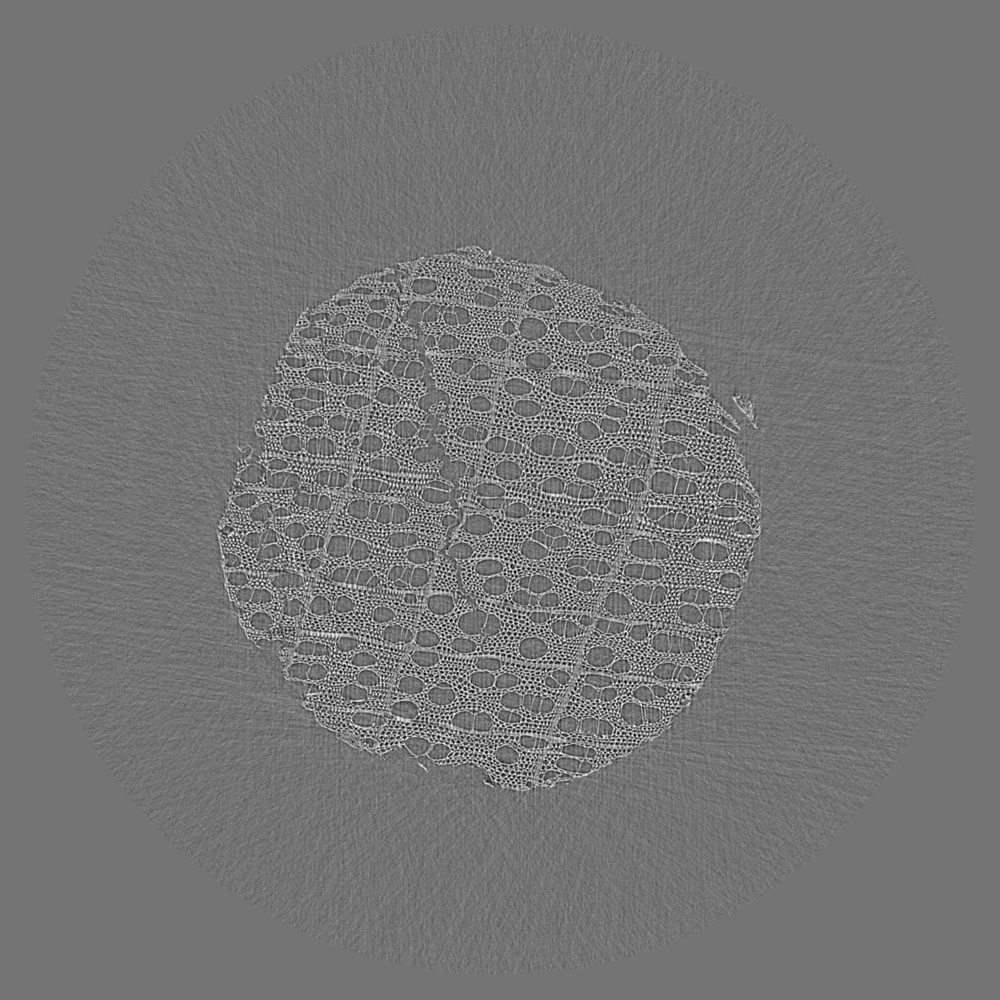

Lorentz
-------

The Lorenz data set is part of a demo data collection perfomed at the  
`Lorentz Workshop <https://www.lorentzcenter.nl/lc/web/2019/1175/info.php3?wsid=1175&venue=Oort>`_

.. _tomo_00088: https://app.globus.org/file-manager?origin_id=e133a81a-6d04-11e5-ba46-22000b92c6ec&origin_path=%2Ftomobank%2F%2Ftomo_00088%2F

+-----------------------------------------+----------------------------+
|             tomo_ID                     | 00088                      |  
+=========================================+============================+
|             Image preview               | |00088|                    |  
+-----------------------------------------+----------------------------+
|             Download                    | tomo_00088_                |  
+-----------------------------------------+----------------------------+
|             Instrument                  | APS 2-BM-BM                |  
+-----------------------------------------+----------------------------+
|             Sample name                 | wood stick                 |  
+-----------------------------------------+----------------------------+
|             X-ray energy                | 27.4 keV                   |  
+-----------------------------------------+----------------------------+
|             Sample-to-detector distance | 50 cm                      |  
+-----------------------------------------+----------------------------+
|             Scan Range                  | 180 degree                 |
+-----------------------------------------+----------------------------+
|             Number of Projections       | 1500                       |
+-----------------------------------------+----------------------------+
|             White Fields                | 10                         | 
+-----------------------------------------+----------------------------+
|             Dark Fields                 | 10                         |  
+-----------------------------------------+----------------------------+
|             Pixel size                  | 1.725 µm                   |  
+-----------------------------------------+----------------------------+
|             FOV size                    | 2448 x 1080                |
+-----------------------------------------+----------------------------+
|             Rotation axis location      | 1226.0                     |
+-----------------------------------------+----------------------------+

To load the data sets and perform a basic reconstruction using `tomopy <https://tomopy.readthedocs.io>`_  

::

    tomopy recon --file-name tomo_00088.h5 --rotation-axis 1226.0

