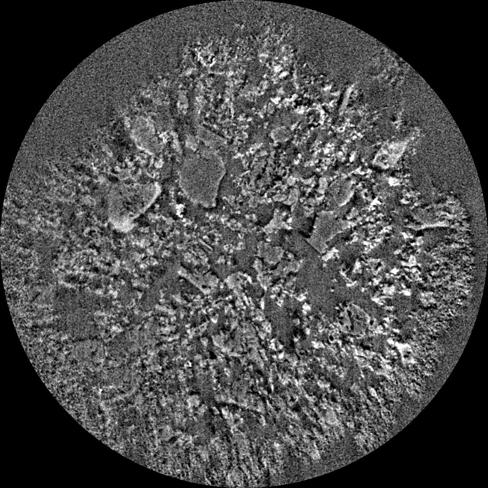
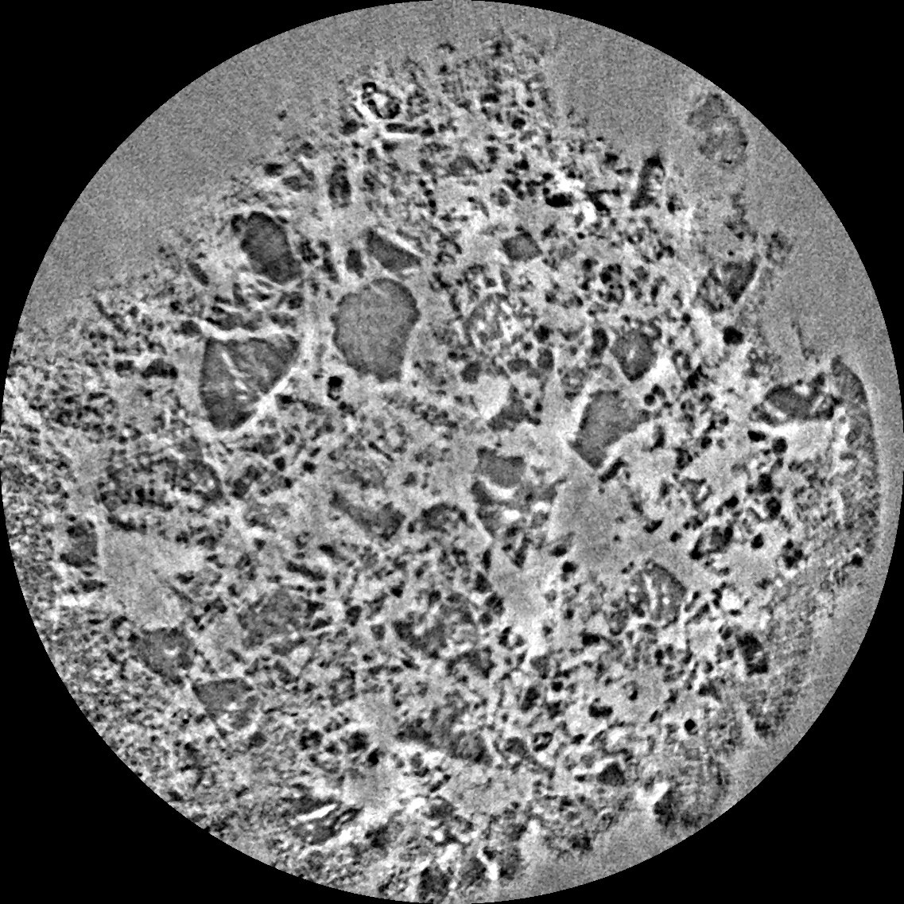

Nano CT
-------

Zernike
~~~~~~~

This data was first provided to TomoBank to be used as part of TomoChallenge, please see https://tomochallenge.github.io/ for more details and for information about how you can participate. 

This sample consists of a polymer electrolyte membrane fuel cell cathode as electrodes with Pt group metal free (PGM-free) catalyst. PGM-free electrodes are porous composite materials made of pyrolyzed Fe-N-C complex and proton conducting perfluoro-sulfonic acid (PFSA) ionomer.

The electrode layer in these samples is formed by spraying the catalyst ink on gas diffusion layer. The catalyst ink is prepared by mixing Fe-N-C catalyst deionized water and Nafion ionomer solution. In these two samples we study the effect of ionomer-water weight ratio in ink to the electrode morphology.

Sample has been measured with the Zernike phase contrast approach, i.e. with the use of an optical mechanism (phase ring) to translate minute variations in phase into corresponding changes in amplitude, which can be visualized as differences in image contrast. The same sample has also been measured in absorption mode, i.e. with the phase ring removed from the optical path.

The challenge here is to apply phase retrieval or some image treatment to reduce Zernike artefacts such as halo effects around objects.

The pixel size is 22.3 nm, but the resolving power of the microscope is between 45 and 50 nm. Therefore, 2x2 binning increasing the statistic without damaging  much the spatial resolution.

+-----------------------------------------+-------------------------------+
|             tomo_ID                     |   00083                       |  
+=========================================+===============================+
|             Image preview               |  |00083|                      |  
+-----------------------------------------+-------------------------------+
|             Downloads                   |   tomo_00083_                 |  
+-----------------------------------------+-------------------------------+
|             Instrument                  |   APS 32-ID TXM               |  
+-----------------------------------------+-------------------------------+
|             Sample name                 |   GDE_45IC_H2Orich            |  
+-----------------------------------------+-------------------------------+
|             X-ray energy                |   8 keV                       |  
+-----------------------------------------+-------------------------------+
|             Sample-to-detector distance |   3400 mm                     |  
+-----------------------------------------+-------------------------------+
|             Scan Range                  |   180 degree                  |
+-----------------------------------------+-------------------------------+
|             Number of Projections       |   1210                        |
+-----------------------------------------+-------------------------------+
|             White Fields                |   40 (20 before - 20 after)   |
+-----------------------------------------+-------------------------------+
|             Pixel size                  |   22.3 nm                     |  
+-----------------------------------------+-------------------------------+
|             Fresnel Zone Plate Δrn      |   50 nm                       |
+-----------------------------------------+-------------------------------+
|             Rotation axis location      |   1230                        |
+-----------------------------------------+-------------------------------+

.. _tomo_00083: https://app.globus.org/file-manager?origin_id=e133a81a-6d04-11e5-ba46-22000b92c6ec&origin_path=%2Ftomobank%2Ftomo_00083%2F

PSF
~~~

This data was first provided to TomoBank to be used as part of TomoChallenge, please see https://tomochallenge.github.io/ for more details and for information about how you can participate. 

This dataset corresponds to a portion of an electronic circuit with some features known to be smaller than 20 nm. The challenge would be to assess the point spread function (PSF) of the microscope to perform high quality PSF deconvolution. There is no ground truth on this dataset, however, the geometry of such circuitry is relatively simple and PSF deconvolution should enable separation of some copper wires or copper objects embedded in silicon. In addition, a radiograph of a Siemens star acquired in similar conditions as the tomogram is provided. The Siemens star is not thick enough to completely absorb hard X-ray but the walls of this test object are vertical.

The pixel size is 16.8 nm, but the resolving power of the microscope is between 35 and 40 nm. Therefore, 2x2 binning increasing the statistic without damaging  much the spatial resolution.

+-----------------------------------------+-------------------------------+
|             tomo_ID                     |   00084                       |  
+=========================================+===============================+
|             Image preview               |  |00084|                      |  
+-----------------------------------------+-------------------------------+
|             Downloads                   |   tomo_00084_                 |  
+-----------------------------------------+-------------------------------+
|             Instrument                  |   APS 32-ID TXM               |  
+-----------------------------------------+-------------------------------+
|             Sample name                 |   Electronic Chip             |  
+-----------------------------------------+-------------------------------+
|             X-ray energy                |   9.1 keV                     |  
+-----------------------------------------+-------------------------------+
|             Sample-to-detector distance |   3400 mm                     |  
+-----------------------------------------+-------------------------------+
|             Scan Range                  |   180 degree                  |
+-----------------------------------------+-------------------------------+
|             Number of Projections       |   1204                        |
+-----------------------------------------+-------------------------------+
|             White Fields                |   20 (10 before - 10 after)   |
+-----------------------------------------+-------------------------------+
|             Pixel size                  |   16.8 nm                     |  
+-----------------------------------------+-------------------------------+
|             Fresnel Zone Plate Δrn      |   40 nm                       |
+-----------------------------------------+-------------------------------+
|             Rotation axis location      |   1204                        |
+-----------------------------------------+-------------------------------+

.. _tomo_00084: https://app.globus.org/file-manager?origin_id=e133a81a-6d04-11e5-ba46-22000b92c6ec&origin_path=%2Ftomobank%2Ftomo_00084%2F

Drift 
~~~~~

When performing nano tomography measurements drift and rotation stage vibration can affect the overall measurement resulotion. In the NPG dataset :cite:`npg-dataset:18` we present a nanoCT measurement of a nanoporous gold (NPG) sample affected by drift and rotation stage vibration.

NPG is high absorbing and, due to the fact that its structural ligaments, can be tailor-made into sizes ranging from 20 nm to 1 µm. For this reason it can be used as an optimal 3D-test pattern for X-ray nanotomography system and for the development of alignment and drift correction software. This data set was used in :cite:`larsson:18`, to characterize the PetraIII P05 nanoCT system.

.. image:: ../img/tomo_00077.png
   :width: 320px
   :alt: project
   :align: center

+-----------------------------------------+----------------------------+
|             tomo_ID                     | 00077                      |  
+=========================================+============================+
|             Image preview               | |00077|                    |  
+-----------------------------------------+----------------------------+
|             Download                    | tomo_00077_                |  
+-----------------------------------------+----------------------------+
|             Instrument                  | PetraIII P05 nanoCT        |  
+-----------------------------------------+----------------------------+
|             Sample name                 | NPG_01                     |  
+-----------------------------------------+----------------------------+
|             X-ray energy                | 11.0 keV                   |  
+-----------------------------------------+----------------------------+
|             Sample-to-detector distance | 18.8 m                     |  
+-----------------------------------------+----------------------------+
|             Scan Range                  | 180 degree                 |
+-----------------------------------------+----------------------------+
|             Number of Projections       | 450                        |
+-----------------------------------------+----------------------------+
|             White Fields                | 93                         | 
+-----------------------------------------+----------------------------+
|             Dark Fields                 | 10                         |  
+-----------------------------------------+----------------------------+
|             Pixel size                  | 19.8 nm                    |  
+-----------------------------------------+----------------------------+
|             Rotation axis location      | 344                        |
+-----------------------------------------+----------------------------+

To load the data sets and perform a basic reconstruction using `tomopy <https://tomopy.readthedocs.io>`_  use the 
:download:`tomopy_rec.py <../../demo/tomopy_rec.py>` python script.

Example: ::

    python tomopy_rec.py tomo_00077.h5 --axis 344.0

To enable phase retrieval un-comment the appropriate setting in :download:`tomopy_rec.py <../../demo/tomopy_rec.py>` 

.. _tomo_00077: https://app.globus.org/file-manager?origin_id=e133a81a-6d04-11e5-ba46-22000b92c6ec&origin_path=%2Ftomobank%2Ftomo_00077%2F

.. |00077| image:: ../img/tomo_00077.png
    :width: 20pt
    :height: 20pt

