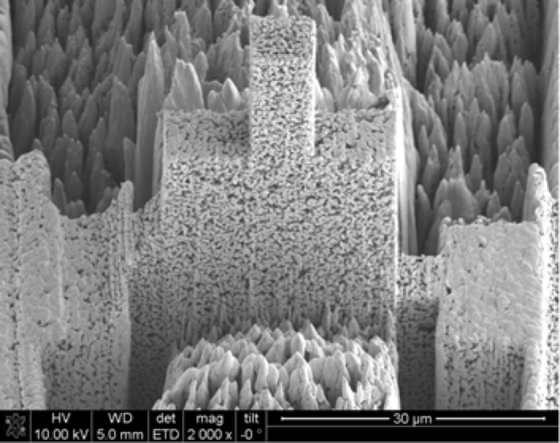

Nano CT
-------

Drift 
~~~~~

When performing nano tomography measurements drift and rotation stage vibration can affect the overall measurement resulotion. In the NPG dataset :cite:`npg-dataset:18` we present a nanoCT measurement of a nanoporous gold (NPG) sample affected by drift and rotation stage vibration.

NPG is high absorbing and, due to the fact that its structural ligaments, can be tailor-made into sizes ranging from 20 nm to 1 µm. For this reason it can be used as an optimal 3D-test pattern for X-ray nanotomography system and for the development of alignment and drift correction software. This data set was used in :cite:`larsson:18`, to characterize the PetraIII P05 nanoCT system.

+-----------------------------------------+----------------------------+
|             tomo_ID                     | 00077                      |  
+=========================================+============================+
|             Image preview               | |00077|                    |  
+-----------------------------------------+----------------------------+
|             Download                    | tomo_00077_                |  
+-----------------------------------------+----------------------------+
|             Instrument                  | PetraIII P05 nanoCT        |  
+-----------------------------------------+----------------------------+
|             Sample name                 | NPG_01                     |  
+-----------------------------------------+----------------------------+
|             X-ray energy                | 11.0 keV                   |  
+-----------------------------------------+----------------------------+
|             Sample-to-detector distance | 18.8 m                     |  
+-----------------------------------------+----------------------------+
|             Scan Range                  | 180 degree                 |
+-----------------------------------------+----------------------------+
|             Number of Projections       | 450                        |
+-----------------------------------------+----------------------------+
|             White Fields                | 93                         | 
+-----------------------------------------+----------------------------+
|             Dark Fields                 | 10                         |  
+-----------------------------------------+----------------------------+
|             Pixel size                  | 19.8 nm                    |  
+-----------------------------------------+----------------------------+
|             Rotation axis location      | 344                        |
+-----------------------------------------+----------------------------+

To load the data sets and perform a basic reconstruction using `tomopy <https://tomopy.readthedocs.io>`_  use the 
:download:`tomopy_rec.py <../../demo/tomopy_rec.py>` python script.

Example: ::

    python tomopy_rec.py tomo_00077.h5 --axis 344.0

To enable phase retrieval un-comment the appropriate setting in :download:`tomopy_rec.py <../../demo/tomopy_rec.py>` 

.. _tomo_00077: https://www.globus.org/app/transfer?origin_id=e133a81a-6d04-11e5-ba46-22000b92c6ec&origin_path=%2Ftomobank%2Ftomo_00077%2F

