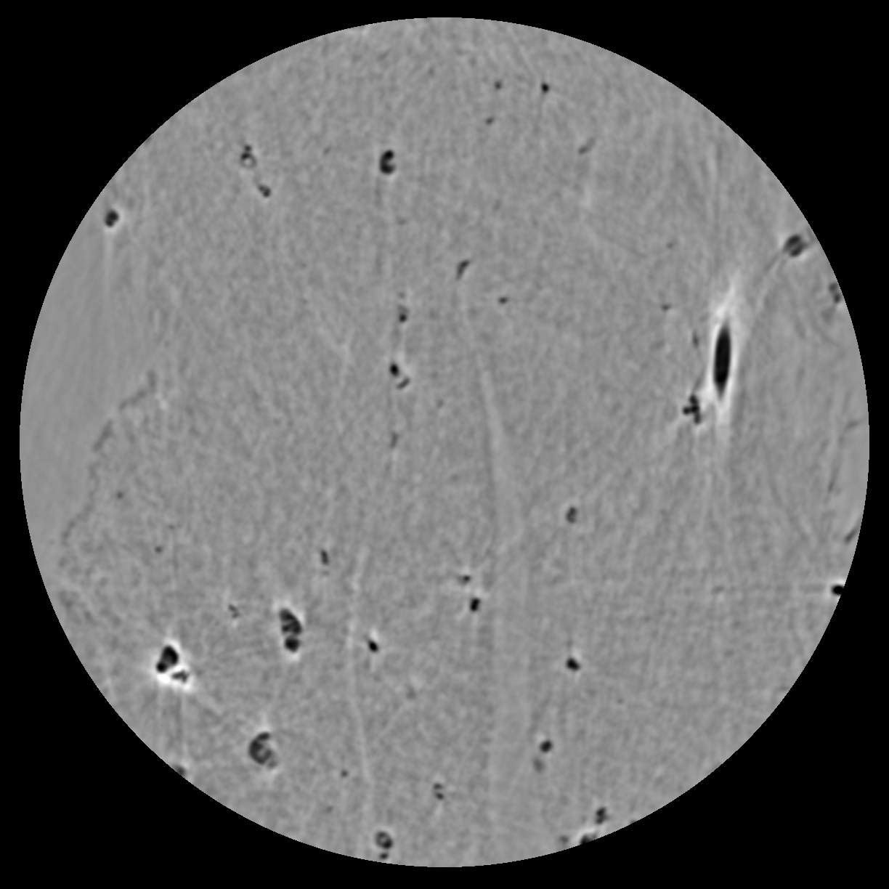
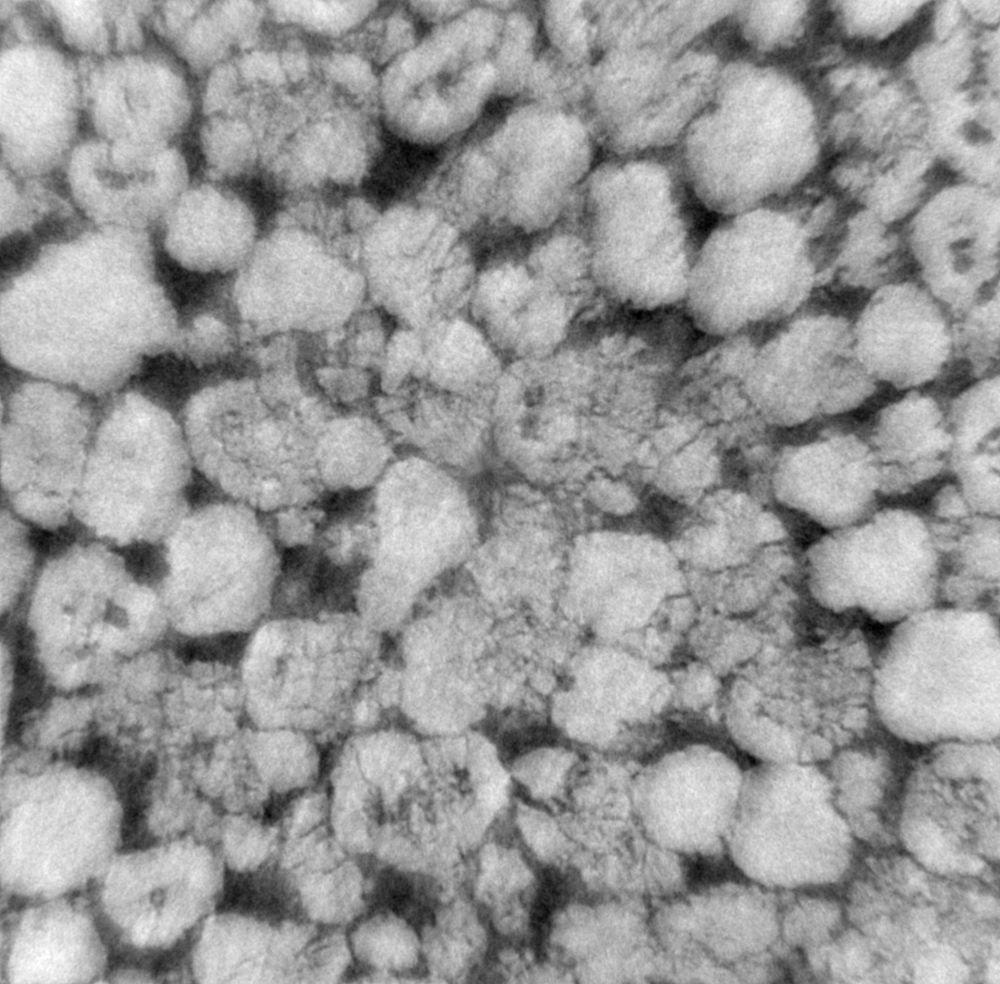
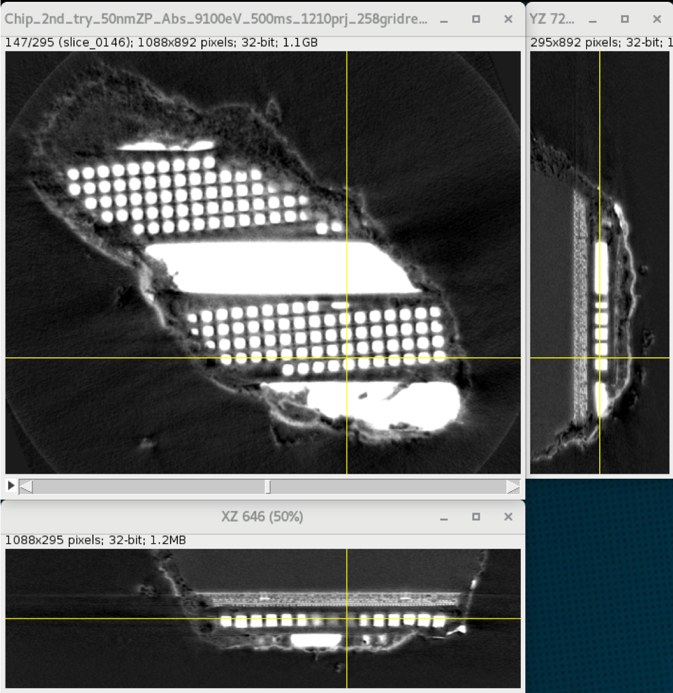
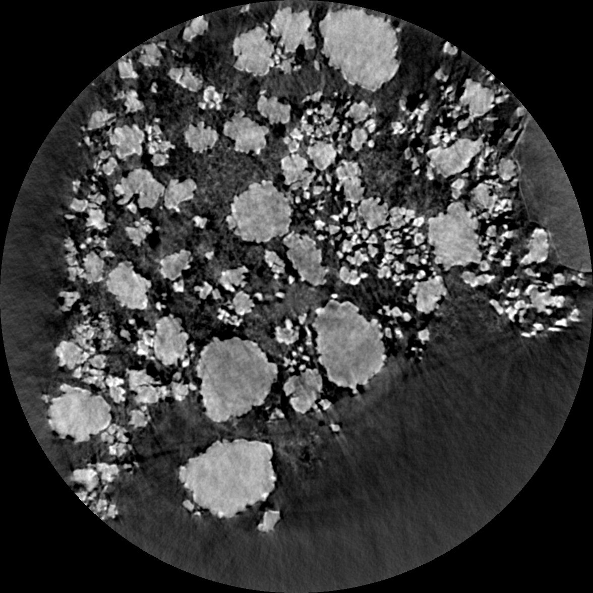
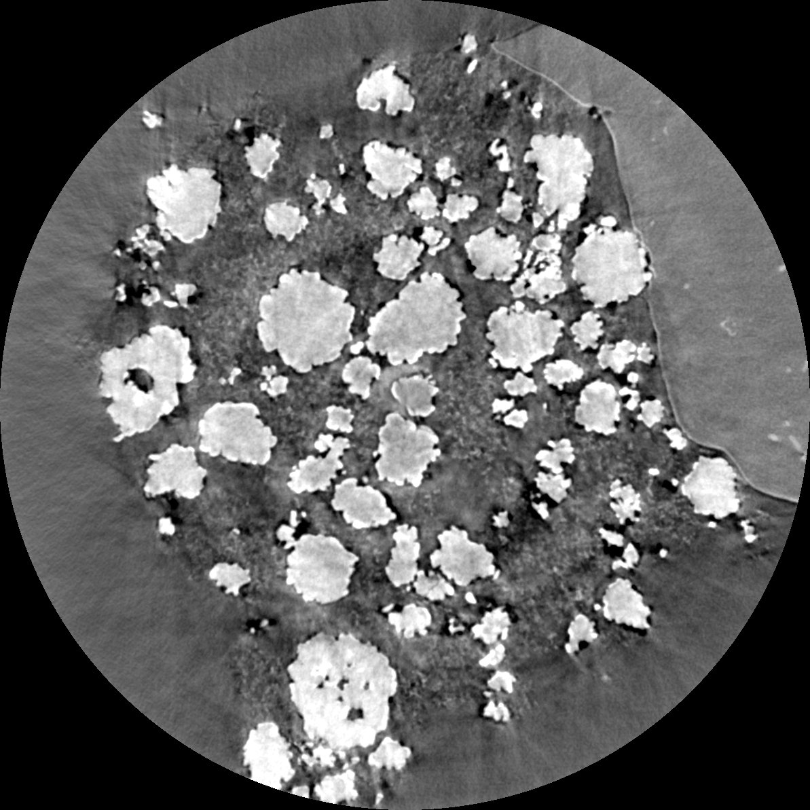

Nano CT
-------

Zernike
~~~~~~~

Polymer
+++++++

This data was first provided to TomoBank to be used as part of **TomoChallenge**, please see https://tomochallenge.github.io/ for more details and for information about how you can participate. 

This sample consists of a polymer electrolyte membrane fuel cell cathode as electrodes with Pt group metal free (PGM-free) catalyst. PGM-free electrodes are porous composite materials made of pyrolyzed Fe-N-C complex and proton conducting perfluoro-sulfonic acid (PFSA) ionomer.

The electrode layer in these samples is formed by spraying the catalyst ink on gas diffusion layer. The catalyst ink is prepared by mixing Fe-N-C catalyst deionized water and Nafion ionomer solution. In these two samples we study the effect of ionomer-water weight ratio in ink to the electrode morphology.

Sample has been measured with the Zernike phase contrast approach, i.e. with the use of an optical mechanism (phase ring) to translate minute variations in phase into corresponding changes in amplitude, which can be visualized as differences in image contrast. The same sample has also been measured in absorption mode, i.e. with the phase ring removed from the optical path.

The challenge here is to apply phase retrieval or some image treatment to reduce Zernike artefacts such as halo effects around objects.

The pixel size is 22.3 nm, but the resolving power of the microscope is between 45 and 50 nm. Therefore, 2x2 binning increasing the statistic without damaging  much the spatial resolution.

+-----------------------------------------+-------------------------------+
|             tomo_ID                     |   00083                       |  
+=========================================+===============================+
|             Image preview               |  |00083|                      |  
+-----------------------------------------+-------------------------------+
|             Downloads                   |  tomo_00083_                  |  
+-----------------------------------------+-------------------------------+
|             Instrument                  |  APS 32-ID TXM                |  
+-----------------------------------------+-------------------------------+
|             Sample name                 |  PGM-free electrode Absorption|  
+-----------------------------------------+-------------------------------+
|             X-ray energy                |  8 keV                        |  
+-----------------------------------------+-------------------------------+
|             Sample-to-detector distance |  3400 mm                      |  
+-----------------------------------------+-------------------------------+
|             Scan Range                  |  180 degree                   |
+-----------------------------------------+-------------------------------+
|             Number of Projections       |  1210                         |
+-----------------------------------------+-------------------------------+
|             White Fields                |  40 (20 before - 20 after)    |
+-----------------------------------------+-------------------------------+
|             Pixel size                  |  22.3 nm                      |  
+-----------------------------------------+-------------------------------+
|             Fresnel Zone Plate Δrn      |  50 nm                        |
+-----------------------------------------+-------------------------------+
|             Rotation axis location      |  1230                         |
+-----------------------------------------+-------------------------------+

.. _tomo_00083: https://app.globus.org/file-manager?origin_id=e133a81a-6d04-11e5-ba46-22000b92c6ec&origin_path=%2Ftomobank%2Ftomo_00083%2F

.. |00083| image:: ../img/tomo_00083.png
    :width: 20pt
    :height: 20pt

+-----------------------------------------+-------------------------------+
|             tomo_ID                     |   00084                       |  
+=========================================+===============================+
|             Image preview               |  |00084|                      |  
+-----------------------------------------+-------------------------------+
|             Downloads                   |  tomo_00084_                  |  
+-----------------------------------------+-------------------------------+
|             Instrument                  |  APS 32-ID TXM                |  
+-----------------------------------------+-------------------------------+
|             Sample name                 |  PGM-free electrode Zernike   |  
+-----------------------------------------+-------------------------------+
|             X-ray energy                |  8 keV                        |  
+-----------------------------------------+-------------------------------+
|             Sample-to-detector distance |  3400 mm                      |  
+-----------------------------------------+-------------------------------+
|             Scan Range                  |  180 degree                   |
+-----------------------------------------+-------------------------------+
|             Number of Projections       |  1210                         |
+-----------------------------------------+-------------------------------+
|             White Fields                |  40 (20 before - 20 after)    |
+-----------------------------------------+-------------------------------+
|             Pixel size                  |  22.3 nm                      |  
+-----------------------------------------+-------------------------------+
|             Fresnel Zone Plate Δrn      |  50 nm                        |
+-----------------------------------------+-------------------------------+
|             Rotation axis location      |  1230                         |
+-----------------------------------------+-------------------------------+

.. _tomo_00084: https://app.globus.org/file-manager?origin_id=e133a81a-6d04-11e5-ba46-22000b92c6ec&origin_path=%2Ftomobank%2Ftomo_00084%2F

.. |00084| image:: ../img/tomo_00084.png
    :width: 20pt
    :height: 20pt

Carbon Nanotube
+++++++++++++++

tomo_00095 is a pristine binder-free carbon nanotube (CNT) cathode of Li-O2 battery. Zernike Phase Contrast is used to enhance the contrast of light Z elements. An empirical Paganin-filter is applied to further improve the reconstruction quality. The pixel size of the camera is 27nm. After applying the -log to the reconstruction, the nanotubes have light grey color. Other residuals glassy fibers issued from the synthesis and inclusions are darker than the CNT. The challenge of the reconstruction of this data is the CNT which has roughly a sub-pixel diameter (20nm in average).

+-----------------------------------------+------------------------------------+
|             tomo_ID                     |   00095                            |  
+=========================================+====================================+
|             Image preview               |  |00095|                           |  
+-----------------------------------------+------------------------------------+
|             Downloads                   |  tomo_00095_                       |
+-----------------------------------------+------------------------------------+
|             Instrument                  |  APS 32-ID TXM                     |  
+-----------------------------------------+------------------------------------+
|             Sample name                 |  pristine binder-free CNT electrode|  
+-----------------------------------------+------------------------------------+
|             X-ray energy                |  8 keV                             |  
+-----------------------------------------+------------------------------------+
|             Sample-to-detector distance |  3400 mm                           |  
+-----------------------------------------+------------------------------------+
|             Scan Range                  |  180 degree                        |
+-----------------------------------------+------------------------------------+
|             Number of Projections       |  1209                              |
+-----------------------------------------+------------------------------------+
|             White Fields                |  19 (19 before)                    |
+-----------------------------------------+------------------------------------+
|             Pixel size                  |  26.9 nm                           |  
+-----------------------------------------+------------------------------------+
|             Fresnel Zone Plate Δrn      |  50 nm                             |
+-----------------------------------------+------------------------------------+
|             Rotation axis location      |  1210                              |
+-----------------------------------------+------------------------------------+

.. _tomo_00095: https://app.globus.org/file-manager?origin_id=e133a81a-6d04-11e5-ba46-22000b92c6ec&origin_path=%2Ftomobank%2Ftomo_00095%2F

Tomo_00096 is the same materials in a new batch, in which the CNT were treated first by acid then underwent one discharge-charge round-trip. This cycled binder-free CNT retrieved from the battery was chopped and mounted on a graphite pin and further sealed in a Kapton tubing in the dry room to avoid the moisture. The bright domains are the non-dissolved lithium peroxide and other side products grown on the CNT during the cycling and the dark domain correspond to the area where peroxide/side-products are dissolved.

+-----------------------------------------+------------------------------------+
|             tomo_ID                     |   00096                            |  
+=========================================+====================================+
|             Image preview               |  |00096|                           |  
+-----------------------------------------+------------------------------------+
|             Downloads                   |  tomo_00096_                       |
+-----------------------------------------+------------------------------------+
|             Instrument                  |  APS 32-ID TXM                     |  
+-----------------------------------------+------------------------------------+
|             Sample name                 |  cycled binder-free CNT electrode  |
+-----------------------------------------+------------------------------------+
|             X-ray energy                |  8 keV                             |  
+-----------------------------------------+------------------------------------+
|             Sample-to-detector distance |  3400 mm                           |  
+-----------------------------------------+------------------------------------+
|             Scan Range                  |  180 degree                        |
+-----------------------------------------+------------------------------------+
|             Number of Projections       |  1209                              |
+-----------------------------------------+------------------------------------+
|             White Fields                |  15 (15 before)                    |
+-----------------------------------------+------------------------------------+
|             Pixel size                  |  26.9 nm                           |  
+-----------------------------------------+------------------------------------+
|             Fresnel Zone Plate Δrn      |  50 nm                             |
+-----------------------------------------+------------------------------------+
|             Rotation axis location      |  1177                              |
+-----------------------------------------+------------------------------------+

.. _tomo_00096: https://app.globus.org/file-manager?origin_id=e133a81a-6d04-11e5-ba46-22000b92c6ec&origin_path=%2Ftomobank%2Ftomo_00096%2F

.. |00096| image:: ../img/tomo_00096.png
    :width: 30pt

Absorption
~~~~~~~~~~

tomo_00097 and tomo_00098 are commercial NMC532 Li-ion cathode materials. Both materials have the same composition but have different loading (thickness) during manufacturing. These samples consist of LiNi0.5Mn0.3Co0.2 oxide, carbon, and PVdF as binder. These materials are firstly cut by Zeiss Palm Micro-dissector into a cylinder and then mounted onto a graphite pin with a micromanipulator as described in :cite:`Su:2021`. The round big and white particles are NMC materials. And the binder and porosity are in the darker domains. With the 32-ID-C nano-XCT high resolution, the granular carbon-binder domain is visible.

+-----------------------------------------+-------------------------------+
|             tomo_ID                     |   00097                       |  
+=========================================+===============================+
|             Image preview               |  |00097|                      |  
+-----------------------------------------+-------------------------------+
|             Downloads                   |  tomo_00097_                  |
+-----------------------------------------+-------------------------------+
|             Instrument                  |  APS 32-ID TXM                |  
+-----------------------------------------+-------------------------------+
|             Sample name                 |  NMC532_low_loading           |  
+-----------------------------------------+-------------------------------+
|             X-ray energy                |  8 keV                        |  
+-----------------------------------------+-------------------------------+
|             Sample-to-detector distance |  3400 mm                      |  
+-----------------------------------------+-------------------------------+
|             Scan Range                  |  180 degree                   |
+-----------------------------------------+-------------------------------+
|             Number of Projections       |  725                          |
+-----------------------------------------+-------------------------------+
|             White Fields                |  19                           |
+-----------------------------------------+-------------------------------+
|             Pixel size                  |  26.9 nm                      |  
+-----------------------------------------+-------------------------------+
|             Fresnel Zone Plate Δrn      |  50 nm                        |
+-----------------------------------------+-------------------------------+
|             Rotation axis location      |  1254                         |
+-----------------------------------------+-------------------------------+

+-----------------------------------------+-------------------------------+
|             tomo_ID                     |   00098                       |  
+=========================================+===============================+
|             Image preview               |  |00098|                      |  
+-----------------------------------------+-------------------------------+
|             Downloads                   |  tomo_00098_                  |
+-----------------------------------------+-------------------------------+
|             Instrument                  |  APS 32-ID TXM                |  
+-----------------------------------------+-------------------------------+
|             Sample name                 |  NMC532_high_loading          |  
+-----------------------------------------+-------------------------------+
|             X-ray energy                |  8 keV                        |  
+-----------------------------------------+-------------------------------+
|             Sample-to-detector distance |  3400 mm                      |  
+-----------------------------------------+-------------------------------+
|             Scan Range                  |  180 degree                   |
+-----------------------------------------+-------------------------------+
|             Number of Projections       |  725                          |
+-----------------------------------------+-------------------------------+
|             White Fields                |  19                           |
+-----------------------------------------+-------------------------------+
|             Pixel size                  |  26.9 nm                      |  
+-----------------------------------------+-------------------------------+
|             Fresnel Zone Plate Δrn      |  50 nm                        |
+-----------------------------------------+-------------------------------+
|             Rotation axis location      |  1176                         |
+-----------------------------------------+-------------------------------+

.. _tomo_00097: https://app.globus.org/file-manager?origin_id=e133a81a-6d04-11e5-ba46-22000b92c6ec&origin_path=%2Ftomobank%2Ftomo_00097%2F

.. _tomo_00098: https://app.globus.org/file-manager?origin_id=e133a81a-6d04-11e5-ba46-22000b92c6ec&origin_path=%2Ftomobank%2Ftomo_00098%2F

.. |00098| image:: ../img/tomo_00098.png
    :width: 30pt

PSF
~~~

This data was first provided to TomoBank to be used as part of **TomoChallenge**, please see https://tomochallenge.github.io/ for more details and for information about how you can participate. 

This dataset corresponds to a portion of an electronic circuit with some features known to be smaller than 20 nm. The challenge would be to assess the point spread function (PSF) of the microscope to perform high quality PSF deconvolution. There is no ground truth on this dataset, however, the geometry of such circuitry is relatively simple and PSF deconvolution should enable separation of some copper wires or copper objects embedded in silicon. In addition, a radiograph of a Siemens star acquired in following conditions:

+-----------------------------------------+-------------------------------+
|             Sample name                 |   Siemens Star                |  
+=========================================+===============================+
|             X-ray energy                |   9.1 keV                     |  
+-----------------------------------------+-------------------------------+
|             Downloads                   |   tomo_00085_                 |  
+-----------------------------------------+-------------------------------+
|             Sample-to-detector distance |   3400 mm                     |  
+-----------------------------------------+-------------------------------+
|             Fresnel Zone Plate Δrn      |   40 nm                       |
+-----------------------------------------+-------------------------------+

similar as the tomogram is provided. The Siemens star is not thick enough to completely absorb hard X-ray but the walls of this test object are vertical.

The pixel size is 16.8 nm, but the resolving power of the microscope is between 35 and 40 nm. Therefore, 2x2 binning increasing the statistic without damaging  much the spatial resolution.

+-----------------------------------------+-------------------------------+
|             tomo_ID                     |   00085                       |  
+=========================================+===============================+
|             Image preview               |  |00085|                      |  
+-----------------------------------------+-------------------------------+
|             Downloads                   |   tomo_00085_                 |  
+-----------------------------------------+-------------------------------+
|             Instrument                  |   APS 32-ID TXM               |  
+-----------------------------------------+-------------------------------+
|             Sample name                 |   Electronic Chip             |  
+-----------------------------------------+-------------------------------+
|             X-ray energy                |   9.1 keV                     |  
+-----------------------------------------+-------------------------------+
|             Sample-to-detector distance |   3400 mm                     |  
+-----------------------------------------+-------------------------------+
|             Scan Range                  |   180 degree                  |
+-----------------------------------------+-------------------------------+
|             Number of Projections       |   1204                        |
+-----------------------------------------+-------------------------------+
|             White Fields                |   20 (10 before - 10 after)   |
+-----------------------------------------+-------------------------------+
|             Pixel size                  |   16.8 nm                     |  
+-----------------------------------------+-------------------------------+
|             Fresnel Zone Plate Δrn      |   40 nm                       |
+-----------------------------------------+-------------------------------+
|             Rotation axis location      |   1204                        |
+-----------------------------------------+-------------------------------+

.. _tomo_00085: https://app.globus.org/file-manager?origin_id=e133a81a-6d04-11e5-ba46-22000b92c6ec&origin_path=%2Ftomobank%2Ftomo_00085%2F

Sparse angles
~~~~~~~~~~~~~

This data was first provided to TomoBank to be used as part of **TomoChallenge**, please see https://tomochallenge.github.io/ for more details and for information about how you can participate. 

One of the main challenge in nanotomgraphy consists in limiting the total dose deposited into a sample in order to speed up acquisitions and limit beam damage inducing sample deformation. The challenge here would consist in reconstructing electrode made of lithium nickel manganese cobalt oxide (NMC) particles surrounded by binder. 202 projections out of 1210 projections has been kept.
The pixel size is 23.2 nm, but the resolving power of the microscope is between 45 and 50 nm. Therefore, 2x2 binning increases the statistic without damaging  much the spatial resolution.

    
+-----------------------------------------+-------------------------------+
|             tomo_ID                     |   00086                       |  
+=========================================+===============================+
|             Image preview               |  |00086|                      |  
+-----------------------------------------+-------------------------------+
|             Downloads                   |   tomo_00086_                 |  
+-----------------------------------------+-------------------------------+
|             Instrument                  |   APS 32-ID TXM               |  
+-----------------------------------------+-------------------------------+
|             Sample name                 |   NMC 02                      |  
+-----------------------------------------+-------------------------------+
|             X-ray energy                |   8.3 keV                     |  
+-----------------------------------------+-------------------------------+
|             Sample-to-detector distance |   3400 mm                     |  
+-----------------------------------------+-------------------------------+
|             Scan Range                  |   179.4 degree                |
+-----------------------------------------+-------------------------------+
|             Number of Projections       |   202                         |
+-----------------------------------------+-------------------------------+
|             White Fields                |   40 (20 before - 20 after)   |
+-----------------------------------------+-------------------------------+
|             Pixel size                  |   23.2 nm                     |  
+-----------------------------------------+-------------------------------+
|             Fresnel Zone Plate Δrn      |   50 nm                       |
+-----------------------------------------+-------------------------------+
|             Rotation axis location      |   1227                        |
+-----------------------------------------+-------------------------------+

.. _tomo_00086: https://app.globus.org/file-manager?origin_id=e133a81a-6d04-11e5-ba46-22000b92c6ec&origin_path=%2Ftomobank%2Ftomo_00086%2F

Wedge
~~~~~

This data was first provided to TomoBank to be used as part of **TomoChallenge**, please see https://tomochallenge.github.io/ for more details and for information about how you can participate. 

Electrode made of lithium nickel manganese cobalt oxide (NMC) particles surrounded by binder. Projections from a complete 180 degrees dataset were removed to create an artificial missing wedge. Obtaining good reconstructions from dataset with 40 degrees missing wedge would improve our ability to image batteries in operando, where walls of pouch cells are preventing full 180 degrees acquisitions.
The pixel size is 23.2 nm, but the resolving power of the microscope is between 45 and 50 nm. Therefore, 2x2 binning increases the statistic without damaging  much the spatial resolution.

+-----------------------------------------+-------------------------------+
|             tomo_ID                     |   00087                       |  
+=========================================+===============================+
|             Image preview               |  |00087|                      |  
+-----------------------------------------+-------------------------------+
|             Downloads                   |   tomo_00087_                 |  
+-----------------------------------------+-------------------------------+
|             Instrument                  |   APS 32-ID TXM               |  
+-----------------------------------------+-------------------------------+
|             Sample name                 |   NMC 01                      |  
+-----------------------------------------+-------------------------------+
|             X-ray energy                |   8.3 keV                     |  
+-----------------------------------------+-------------------------------+
|             Sample-to-detector distance |   3400 mm                     |  
+-----------------------------------------+-------------------------------+
|             Scan Range                  |   140 degree                  |
+-----------------------------------------+-------------------------------+
|             Number of Projections       |   941                         |
+-----------------------------------------+-------------------------------+
|             White Fields                |   40 (20 before - 20 after)   |
+-----------------------------------------+-------------------------------+
|             Pixel size                  |   23.2 nm                     |  
+-----------------------------------------+-------------------------------+
|             Fresnel Zone Plate Δrn      |   50 nm                       |
+-----------------------------------------+-------------------------------+
|             Rotation axis location      |   1196                        |
+-----------------------------------------+-------------------------------+

.. _tomo_00087: https://app.globus.org/file-manager?origin_id=e133a81a-6d04-11e5-ba46-22000b92c6ec&origin_path=%2Ftomobank%2Ftomo_00087%2F

Drift 
~~~~~

When performing nano tomography measurements drift and rotation stage vibration can affect the overall measurement resulotion. In the NPG dataset :cite:`npg-dataset:18` we present a nanoCT measurement of a nanoporous gold (NPG) sample affected by drift and rotation stage vibration.

NPG is high absorbing and, due to the fact that its structural ligaments, can be tailor-made into sizes ranging from 20 nm to 1 µm. For this reason it can be used as an optimal 3D-test pattern for X-ray nanotomography system and for the development of alignment and drift correction software. This data set was used in :cite:`larsson:18`, to characterize the PetraIII P05 nanoCT system.

.. image:: ../img/tomo_00077.png
   :width: 320px
   :alt: project
   :align: center

+-----------------------------------------+----------------------------+
|             tomo_ID                     | 00077                      |  
+=========================================+============================+
|             Image preview               | |00077|                    |  
+-----------------------------------------+----------------------------+
|             Download                    | tomo_00077_                |  
+-----------------------------------------+----------------------------+
|             Instrument                  | PetraIII P05 nanoCT        |  
+-----------------------------------------+----------------------------+
|             Sample name                 | NPG_01                     |  
+-----------------------------------------+----------------------------+
|             X-ray energy                | 11.0 keV                   |  
+-----------------------------------------+----------------------------+
|             Sample-to-detector distance | 18.8 m                     |  
+-----------------------------------------+----------------------------+
|             Scan Range                  | 180 degree                 |
+-----------------------------------------+----------------------------+
|             Number of Projections       | 450                        |
+-----------------------------------------+----------------------------+
|             White Fields                | 93                         | 
+-----------------------------------------+----------------------------+
|             Dark Fields                 | 10                         |  
+-----------------------------------------+----------------------------+
|             Pixel size                  | 19.8 nm                    |  
+-----------------------------------------+----------------------------+
|             Rotation axis location      | 344                        |
+-----------------------------------------+----------------------------+

To load the data sets and perform a basic reconstruction using `tomopy <https://tomopy.readthedocs.io>`_.

Example: ::

    tomopy recon --file-name tomo_00077.h5 --rotation-axis 344.0

To enable phase retrieval un-comment the appropriate setting in :download:`tomopy_rec.py <../../demo/tomopy_rec.py>` 

.. _tomo_00077: https://app.globus.org/file-manager?origin_id=e133a81a-6d04-11e5-ba46-22000b92c6ec&origin_path=%2Ftomobank%2Ftomo_00077%2F

.. |00077| image:: ../img/tomo_00077.png
    :width: 20pt
    :height: 20pt

