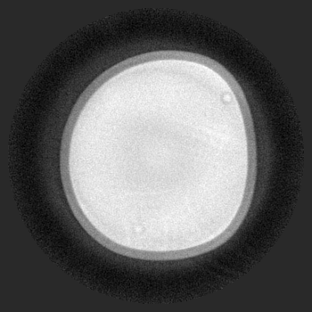
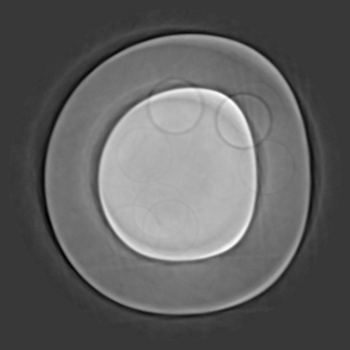
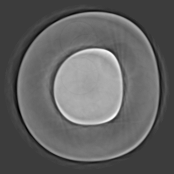
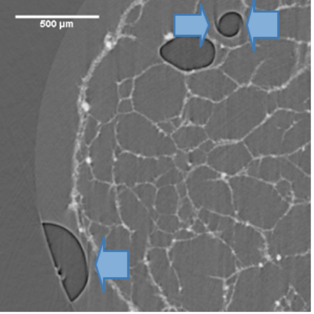

Phase Contrast
--------------

When performing in-line (propagation-based) phase-contrast X-ray tomographic measurements, images are obtained with both absorption and refraction contribution. This allows to obtain an enhanced contrast (Fresnel diffraction) at the edges of sample features  producing local phase variations. By this technique, 3D variations of the electron density in the sample can be resolved and the experiments aim at a quantitative 3D reconstruction of the complex refraction index. The recorded sample radiographs are determined by the projection of the real and imaginary part of the refractive index within the sample volume. 
The Fresnel fringes visible at the edges of the phase objects can be considered as an artefact in the reconstructed slices and should be reduced or removed before any quantitative post-processing and analysis of the images.  

Radiographs can be recorded at a single or multiple distances. If a single distance is employed, a phase retrieval algorithm is applied most often based on the homogeneity assumption and the transport of intensity equation proposed by :cite:`paganin:02`. In the case of multiple distances :cite:`cloetens:99`, the problem is afforded by using contrast transfer functions.  Because the phase-retrieval application usually produces a blurring of the reconstructed slices, it is crucial to optimize the algorithm parameters in order to obtain a good compromise between spatial resolution and discrimination of the phases of interest in the final images.

The common reconstruction approach foresees a two-steps procedure: 1) a phase-retrieval algorithm is individually applied to the acquired projections; 2) a full tomographic reconstruction is then performed using as input data the phase-retrieved projections.

Multi-distance
~~~~~~~~~~~~~~

Discreteness in propagation based (multi-distance) phase contrast tomography :cite:`Guigay:07`

Intrinsic limitations in recovering low spatial frequencies in the phase retrieval step usually lead to fluctuating background in the tomographic reconstructions
(Figure 1, right panel). In particular in the case of weak contrast between the constituent phases of the material, the 3D segmentation of these different regions may no longer be possible. In the case of objects with discrete values of the refractive index, combined phase retrieval & reconstruction schemes like the one pioneered in :cite:`Kostenko:13` may allow solving this problem. Further research and developments in this direction are required.

The challange of this dataset includes incorporate / impose / use knowledge about discreteness of the refractive index inside an object in order to improve the quality of tomographic reconstructions of the refractive index from (multi-distance) propagation based phase contrast tomography.

These multi-distance phase contrastat datasets contains 4 measurements of the same sample a Duplex (austenitic, ferritic) steel at 4 sample-to-detector distances (8, 58, 158 and 308 mm). The two sample constituents phases austenite (fcc) and ferrite (bcc) only have a weak difference in electron density. The projection images also contains dark diffraction contrast spot (some grains fulfill the Bragg condition and give rise to diffracted beams). 
These contrast appear and disappear from projection to projection and act as an additional perturbation/noise.
The experimental conditions reported in the table below:

+---------------------------------+------------------------------------+
| Instrument                      |        ESRF                        | 
+---------------------------------+------------------------------------+
| Energy                          |        55  keV                     | 
+---------------------------------+------------------------------------+
| Scan Range                      |        360 degree                  |
+---------------------------------+------------------------------------+
| Number of Projections           |        450                         |
+---------------------------------+------------------------------------+
| White Fields                    |        21                          |
+---------------------------------+------------------------------------+
| Dark Fields                     |        21                          | 
+---------------------------------+------------------------------------+
| Ref ON                          |        150                         | 
+---------------------------------+------------------------------------+
| Rotation Speed                  |        0.75 deg/s                  | 
+---------------------------------+------------------------------------+
| Sample Detector Distance        |        8, 58, 158 and 308 mm       | 
+---------------------------------+------------------------------------+
| Exposure Time                   |        2 s                         | 
+---------------------------------+------------------------------------+
| Pixel Size                      |        1.4 µm                      | 
+---------------------------------+------------------------------------+
| Detector Dimension x            |        350                         | 
+---------------------------------+------------------------------------+
| Detector Dimension y            |        650                         | 
+---------------------------------+------------------------------------+

The sphere data sets includes 4 tomographic data sets collected at different 
sample to detector distance and different concentrations as reported in the table below:

To load the data sets and perform a basic reconstruction using `tomopy <https://tomopy.readthedocs.io>`_  use the 
:download:`tomopy_rec.py <../../demo/tomopy_rec.py>` python script.

Example: ::

    python tomopy_rec.py tomo_00064.h5 --axis 175
    python tomopy_rec.py tomo_00065.h5 --axis 175
    python tomopy_rec.py tomo_00066.h5 --axis 175
    python tomopy_rec.py tomo_00067.h5 --axis 175

To enable phase retrieval un-comment the appropriate setting in :download:`tomopy_rec.py <../../demo/tomopy_rec.py>` 

.. _tomo_00064: https://app.globus.org/file-manager?origin_id=e133a81a-6d04-11e5-ba46-22000b92c6ec&origin_path=%2Ftomobank%2F%2Ftomo_00064_to_00067%2F
.. _tomo_00065: https://app.globus.org/file-manager?origin_id=e133a81a-6d04-11e5-ba46-22000b92c6ec&origin_path=%2Ftomobank%2F%2Ftomo_00064_to_00067%2F
.. _tomo_00066: https://app.globus.org/file-manager?origin_id=e133a81a-6d04-11e5-ba46-22000b92c6ec&origin_path=%2Ftomobank%2F%2Ftomo_00064_to_00067%2F
.. _tomo_00067: https://app.globus.org/file-manager?origin_id=e133a81a-6d04-11e5-ba46-22000b92c6ec&origin_path=%2Ftomobank%2F%2Ftomo_00064_to_00067%2F

+-------------+---------------+---------------+-----------+-----------------------+ 
| Tomo ID     | Distance (mm) | Sample Name   |   Image   |       Axis            |     
+=============+===============+===============+===========+=======================+ 
| tomo_00064_ |     8         |   p2_pct_1    |  |00064|  |       175             |
+-------------+---------------+---------------+-----------+-----------------------+ 
| tomo_00065_ |    58         |   p2_pct_2    |  |00065|  |       175             |
+-------------+---------------+---------------+-----------+-----------------------+ 
| tomo_00066_ |   158         |   p2_pct_3    |  |00066|  |       175             |
+-------------+---------------+---------------+-----------+-----------------------+ 
| tomo_00067_ |   308         |   p2_pct_4    |  |00067|  |       175             |
+-------------+---------------+---------------+-----------+-----------------------+ 

Wet Sample
~~~~~~~~~~

The evaluation of wettability and swelling properties of biomaterials is fundamental in several applications in order to assess 
the structural stability as well as the ability of water uptake of the synthesized 3D structures :cite:`brun:15`. However, 
experiments carried  out in wet conditions might be affected by motion artfacts.  These artifacts negatively affect image 
interpretation. 

Here we present a dataset in which the challange is to compensate a partial motion artifact occurring in air bubbles within 
a liquid-embedded biomaterial structure causing the edges of the air bubbles to contain streaks due to motio of the air bubbles
instead of forming a complete contour. The experimental conditions reported in the table below:

To load the data sets and perform a basic reconstruction using `tomopy <https://tomopy.readthedocs.io>`_  use the 
:download:`tomopy_rec.py <../../demo/tomopy_rec.py>` python script.

Example: ::

    python tomopy_rec.py tomo_00068.h5 --axis 1463.5

.. _tomo_00068: https://app.globus.org/file-manager?origin_id=e133a81a-6d04-11e5-ba46-22000b92c6ec&origin_path=%2Ftomobank%2Ftomo_00068%2F

1463.5

+-----------------------------------------+-------------------------------+
|             tomo_ID                     |   00068                       |  
+=========================================+===============================+
|             Image preview               |  |00068|                      |  
+-----------------------------------------+-------------------------------+
|             Downloads                   |   tomo_00068_                 |  
+-----------------------------------------+-------------------------------+
|             Instrument                  |   Elettra Syrmep              |  
+-----------------------------------------+-------------------------------+
|             Sample name                 |   wet sample                  |  
+-----------------------------------------+-------------------------------+
|             X-ray energy                |   14 keV                      |  
+-----------------------------------------+-------------------------------+
|             Sample-to-detector distance |   150 mm                      |  
+-----------------------------------------+-------------------------------+
|             Pixel size                  |   4.1 µm                      |  
+-----------------------------------------+-------------------------------+
|             Scan Range                  |   180 degree                  |
+-----------------------------------------+-------------------------------+
|             Number of Projections       |   1800                        |
+-----------------------------------------+-------------------------------+
|             Rotation axis location      |   1463.5                      |
+-----------------------------------------+-------------------------------+

Zernike
~~~~~~~

This data was first provided to TomoBank to be used as part of TomoChallenge, please see https://tomochallenge.github.io/ for more details and for information about how you can participate. 

This sample consists of a polymer electrolyte membrane fuel cell cathode as electrodes with Pt group metal free (PGM-free) catalyst. PGM-free electrodes are porous composite materials made of pyrolyzed Fe-N-C complex and proton conducting perfluoro-sulfonic acid (PFSA) ionomer.

The electrode layer in these samples is formed by spraying the catalyst ink on gas diffusion layer. The catalyst ink is prepared by mixing Fe-N-C catalyst deionized water and Nafion ionomer solution. In these two samples we study the effect of ionomer-water weight ratio in ink to the electrode morphology.

Sample has been measured with the Zernike phase contrast approach, i.e. with the use of an optical mechanism (phase ring) to translate minute variations in phase into corresponding changes in amplitude, which can be visualized as differences in image contrast. The same sample has also been measured in absorption mode, i.e. with the phase ring removed from the optical path.

The challenge here is to apply phase retrieval or some image treatment to reduce Zernike artefacts such as halo effects around objects.

The pixel size is 22.3 nm, but the resolving power of the microscope is between 45 and 50 nm. Therefore, 2x2 binning increasing the statistic without damaging  much the spatial resolution.

+-----------------------------------------+-------------------------------+
|             tomo_ID                     |   00068                       |  
+=========================================+===============================+
|             Image preview               |  |00068|                      |  
+-----------------------------------------+-------------------------------+
|             Downloads                   |   tomo_00068_                 |  
+-----------------------------------------+-------------------------------+
|             Instrument                  |   APS 32-ID TXM               |  
+-----------------------------------------+-------------------------------+
|             Sample name                 |   GDE_45IC_H2Orich            |  
+-----------------------------------------+-------------------------------+
|             X-ray energy                |   8 keV                       |  
+-----------------------------------------+-------------------------------+
|             Sample-to-detector distance |   3400 mm                     |  
+-----------------------------------------+-------------------------------+
|             Pixel size                  |   22.3 nm                     |  
+-----------------------------------------+-------------------------------+
|             Scan Range                  |   180 degree                  |
+-----------------------------------------+-------------------------------+
|             Number of Projections       |   1210                        |
+-----------------------------------------+-------------------------------+
|             White Fields                |   40 (20 before - 20 after)   |
+-----------------------------------------+-------------------------------+
|             Fresnel Zone Plate Δrn      |   50 nm                       |
+-----------------------------------------+-------------------------------+
|             Rotation axis location      |   1230                        |
+-----------------------------------------+-------------------------------+

