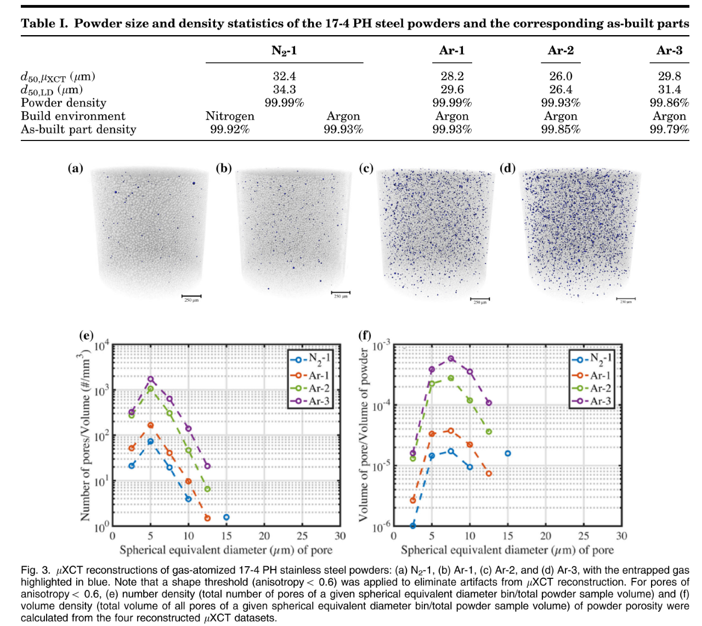

Porosity
--------

N2-1, Ar-1, Ar-2, and Ar-3 are CT datasets of a few different gas atomized 17-4 stainless powders. They have various levels of entrapped gas porosity which were intentionally introduced during atomization.

Detailed information area available at :cite:`Wu:2021`. 

+---------------------------------+------------------------------------+
| Instrument                      |        APS 2-BM-A fast tomo        | 
+---------------------------------+------------------------------------+
| Energy                          |        pink beam                   | 
+---------------------------------+------------------------------------+
| Scan Range                      |        180 degree                  |
+---------------------------------+------------------------------------+
| Number of Projections           |        1500                        |
+---------------------------------+------------------------------------+
| White Fields                    |        10 before                   |
+---------------------------------+------------------------------------+
| Dark Fields                     |        10 before                   | 
+---------------------------------+------------------------------------+
| Mode                            |        fly-scan                    | 
+---------------------------------+------------------------------------+
| Detector Name                   |        FLIR                        | 
+---------------------------------+------------------------------------+
| Exposure Time                   |        0.024 s                     | 
+---------------------------------+------------------------------------+
| Pixel Size                      |        0.69 µm                     | 
+---------------------------------+------------------------------------+
| Detector shutter mode           |        global                      | 
+---------------------------------+------------------------------------+
| Detector Dimension (mm)         |        1.55                        | 
+---------------------------------+------------------------------------+
| Detector Dimension (mm)         |        1.41                        | 
+---------------------------------+------------------------------------+
| Objective Magnification         |        Mitutoyo 5x                 | 
+---------------------------------+------------------------------------+
| Scintillator                    |        LuAG 10 µm                  | 
+---------------------------------+------------------------------------+

To load the data sets and perform a basic reconstruction using `tomopy <https://tomopy.readthedocs.io>`_ ::

    tomopy recon --file-name tomo_00090.h5 
    tomopy recon --file-name tomo_00091.h5 
    tomopy recon --file-name tomo_00092.h5 
    tomopy recon --file-name tomo_00093.h5 

.. _tomo_00090: https://app.globus.org/file-manager?origin_id=9f00a780-4aee-42a7-b7f4-6a2773c8da30&origin_path=%2Ftomo_00090_to_00093%2F
.. _tomo_00091: https://app.globus.org/file-manager?origin_id=9f00a780-4aee-42a7-b7f4-6a2773c8da30&origin_path=%2Ftomo_00090_to_00093%2F
.. _tomo_00092: https://app.globus.org/file-manager?origin_id=9f00a780-4aee-42a7-b7f4-6a2773c8da30&origin_path=%2Ftomo_00090_to_00093%2F
.. _tomo_00093: https://app.globus.org/file-manager?origin_id=9f00a780-4aee-42a7-b7f4-6a2773c8da30&origin_path=%2Ftomo_00090_to_00093%2F

+-------------+-----------------------------------------+-----------------------------------------+
| Tomo ID     |             Original File Name          |   Sample Name used in :cite:`Wu:2021`   |
+-------------+-----------------------------------------+-----------------------------------------+
| tomo_00090_ |   070_carpenter_174ph_powder_27347      |       Ar-3                              |
+-------------+-----------------------------------------+-----------------------------------------+
| tomo_00091_ |   072_carpenter_174ph_powder_017175     |       Ar-2                              |
+-------------+-----------------------------------------+-----------------------------------------+
| tomo_00092_ |   073_carpenter_174ph_powder_Y5863B     |       N2-1                              |
+-------------+-----------------------------------------+-----------------------------------------+
| tomo_00093_ |   074_carpenter_174ph_powder_017174     |       Ar-1                              |
+-------------+-----------------------------------------+-----------------------------------------+

