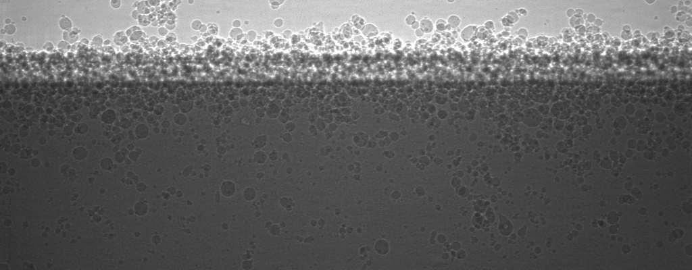
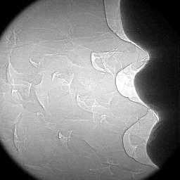

Radiography
-----------

XradFusion 
~~~~~~~~~~

XradFusion are a set of radiography data sets used in :cite:`tang:2024`. 

Each dataset consists in a series of high speed radiagraphy images at high and low resolution:

Add here a description of data set1:

+-----------------------------------------+----------------------------+
|             rad_ID                      |  00001                     |  
+=========================================+============================+
|             Image preview               | |r00001l| - |r00001h|      |  
+-----------------------------------------+----------------------------+
|             Download                    | rad_00001_                 |  
+-----------------------------------------+----------------------------+
|             Instrument                  |                            |  
+-----------------------------------------+----------------------------+
|             Sample name                 |                            |  
+-----------------------------------------+----------------------------+
|             X-ray energy                |                            |  
+-----------------------------------------+----------------------------+
|             Low res                     |                            |  
+-----------------------------------------+----------------------------+
|             --------- Image size        |    256 x 100 pixels        |  
+-----------------------------------------+----------------------------+
|             --------- Number of images  |    450                     |  
+-----------------------------------------+----------------------------+
|             --------- Pixel size        |    8 µm                    |  
+-----------------------------------------+----------------------------+
|             --------- Frame rate        |    50000 fps               |  
+-----------------------------------------+----------------------------+
|             High res                    |                            |  
+-----------------------------------------+----------------------------+
|             --------- Image size        |    1024 x 400 pixels       |  
+-----------------------------------------+----------------------------+
|             --------- Number of images  |    450                     |  
+-----------------------------------------+----------------------------+
|             --------- Pixel size        |    2 µm                    |  
+-----------------------------------------+----------------------------+
|             --------- Frame rate(*)     |    50000 fps               |  
+-----------------------------------------+----------------------------+

Add here a description of data set2:

+-----------------------------------------+----------------------------+
|             rad_ID                      |  00002                     |  
+=========================================+============================+
|             Image preview               | |r00002l| - |r00002h|      |  
+-----------------------------------------+----------------------------+
|             Download                    | rad_00002_                 |  
+-----------------------------------------+----------------------------+
|             Instrument                  |                            |  
+-----------------------------------------+----------------------------+
|             Sample name                 |                            |  
+-----------------------------------------+----------------------------+
|             X-ray energy                |                            |  
+-----------------------------------------+----------------------------+
|             Low res                     |                            |  
+-----------------------------------------+----------------------------+
|             --------- Image size        |    256 x 256 pixels        |  
+-----------------------------------------+----------------------------+
|             --------- Number of images  |    450                     |  
+-----------------------------------------+----------------------------+
|             --------- Pixel size        |    8 µm                    |  
+-----------------------------------------+----------------------------+
|             --------- Frame rate        |    20000 fps               |  
+-----------------------------------------+----------------------------+
|             High res                    |                            |  
+-----------------------------------------+----------------------------+
|             --------- Image size        |    1024 x 1024 pixels      |  
+-----------------------------------------+----------------------------+
|             --------- Number of images  |    450                     |  
+-----------------------------------------+----------------------------+
|             --------- Pixel size        |    2 µm                    |  
+-----------------------------------------+----------------------------+
|             --------- Frame rate(*)     |    20000 fps               |  
+-----------------------------------------+----------------------------+

(*) lower frame rate were obtained by time downsampling.

.. _rad_00001: https://g-a0400.fd635.8443.data.globus.org/rad_00001/rad_00001.zip

.. |r00001l| image:: ../img/rad_00001l.png
    :width: 20pt
    :height: 20pt

.. _rad_00002: https://g-a0400.fd635.8443.data.globus.org/rad_00002/rad_00002.zip

