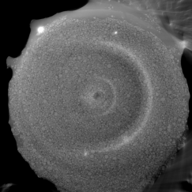
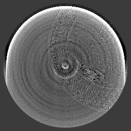
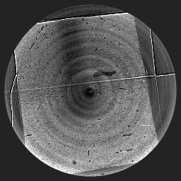
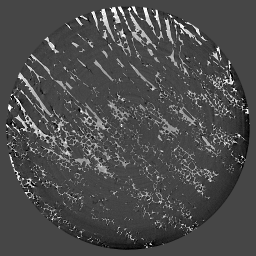
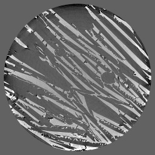
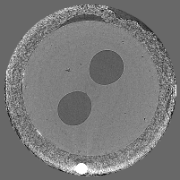

Rings
-----

Broad rings 
~~~~~~~~~~~

Detection and quantification of grey level differences of ca. 1% in the electrode particles – local
tomography and broad ring artifacts are making this challenging task even more difficult. Standard
solutions used at the TOMCAT beamline (e.g. constant padding) are not sufficient in the phase
retrieved case :cite:`paganin:02`, if small grey level differences need to be reliably detected. 
A more sophisticated flat-field correction might help for the ring artefact problem.

+-----------------------------------------+----------------------------+
|             tomo_ID                     | 00071                      |  
+=========================================+============================+
|             Image preview               | |00071|                    |  
+-----------------------------------------+----------------------------+
|             Download                    | tomo_00071_, |tomo_00071|  |  
+-----------------------------------------+----------------------------+
|             Instrument                  | SLS TOMCAT                 |  
+-----------------------------------------+----------------------------+
|             Sample name                 | SLS_01                     |  
+-----------------------------------------+----------------------------+
|             X-ray energy                | 24.999 keV                 |  
+-----------------------------------------+----------------------------+
|             Sample-to-detector distance | 15 mm                      |  
+-----------------------------------------+----------------------------+
|             Scan Range                  | 180 degree                 |
+-----------------------------------------+----------------------------+
|             Number of Projections       | 1201                       |
+-----------------------------------------+----------------------------+
|             White Fields                | 200 (100 before 100 after) | 
+-----------------------------------------+----------------------------+
|             Dark Fields                 | 10                         |  
+-----------------------------------------+----------------------------+
|             Pixel size                  | 0.65 µm                    |  
+-----------------------------------------+----------------------------+

.. |tomo_00071| replace:: :download:`rec_script.py <../../../docs/demo/rec_tomo_00071.py>`

.. _tomo_00071: https://www.globus.org/app/transfer?origin_id=e133a81a-6d04-11e5-ba46-22000b92c6ec&origin_path=%2Ftomobank%2Ftomo_00071%2F

Soft Tissue
~~~~~~~~~~~

To limit radiation damage of soft tissue, the energy is set in the hard x-ray regime. Samples are weakly absorbing and generate severe ring artefact. Below are two soft tissue sample measurements collected as follows:

+-----------------------------------------+----------------------------+
|             tomo_ID                     | 00072                      |  
+=========================================+============================+
|             Image preview               | |00072|                    |  
+-----------------------------------------+----------------------------+
|             Download                    | tomo_00072_, |tomo_00072|  |  
+-----------------------------------------+----------------------------+
|             Instrument                  | APS 2-BM                   |  
+-----------------------------------------+----------------------------+
|             Sample name                 | soft tissue                |  
+-----------------------------------------+----------------------------+
|             X-ray energy                | 20 keV                     |  
+-----------------------------------------+----------------------------+
|             Sample-to-detector distance | 15 mm                      |  
+-----------------------------------------+----------------------------+
|             Scan Range                  | 180 degree                 |
+-----------------------------------------+----------------------------+
|             Number of Projections       | 1500                       |
+-----------------------------------------+----------------------------+
|             White Fields                | 10                         | 
+-----------------------------------------+----------------------------+
|             Dark Fields                 | 10                         |  
+-----------------------------------------+----------------------------+
|             Pixel size                  | 1.43 µm                    |  
+-----------------------------------------+----------------------------+

.. |tomo_00072| replace:: :download:`rec_script.py <../../../docs/demo/rec_tomo_00072.py>`

.. _tomo_00072: https://www.globus.org/app/transfer?origin_id=e133a81a-6d04-11e5-ba46-22000b92c6ec&origin_path=%2Ftomobank%2Ftomo_00072%2F

+-----------------------------------------+----------------------------+
|             tomo_ID                     | 00076                      |  
+=========================================+============================+
|             Image preview               | |00076|                    |  
+-----------------------------------------+----------------------------+
|             Download                    | tomo_00076_, |tomo_00076|  |  
+-----------------------------------------+----------------------------+
|             Instrument                  | APS 2-BM                   |  
+-----------------------------------------+----------------------------+
|             Detector                    | PCO edge                   |
+-----------------------------------------+----------------------------+
|             Sample name                 | soft tissue                |  
+-----------------------------------------+----------------------------+
|             X-ray energy                | braod 60-70 keV            |  
+-----------------------------------------+----------------------------+
|             Exposure Time               | 100 ms                     |         
+-----------------------------------------+----------------------------+
|             Scan Type                   | Fly Scan                   |
+-----------------------------------------+----------------------------+
|             Scan Speed                  | 0.75 deg/s                 |
+-----------------------------------------+----------------------------+
|             Shutter Mode                | Rolling                    |
+-----------------------------------------+----------------------------+
|             Scintillator                | 10um LuAG                  |
+-----------------------------------------+----------------------------+
|             Sample-to-detector distance | 90 mm                      |  
+-----------------------------------------+----------------------------+
|             Scan Range                  | 180 degree                 |
+-----------------------------------------+----------------------------+
|             Number of Projections       | 2000                       |
+-----------------------------------------+----------------------------+
|             White Fields                | 10 pre scan                | 
+-----------------------------------------+----------------------------+
|             Dark Fields                 | 10                         |  
+-----------------------------------------+----------------------------+
|             Pixel size                  | 2.2  µm                    |  
+-----------------------------------------+----------------------------+

.. |tomo_00076| replace:: :download:`rec_script.py <../../../docs/demo/rec_tomo_00076.py>`

.. _tomo_00076: https://www.globus.org/app/transfer?origin_id=e133a81a-6d04-11e5-ba46-22000b92c6ec&origin_path=%2Ftomobank%2Ftomo_00076%2F

Al Samples
~~~~~~~~~~

Here we present two measuremend done on the same Al sample presenting mild ring artefacts.
Mesurements have a different white field data collection strategy.

+-----------------------------------------+----------------------------+
|             tomo_ID                     | 00073                      |  
+=========================================+============================+
|             Image preview               | |00073|                    |  
+-----------------------------------------+----------------------------+
|             Download                    | tomo_00073_, |tomo_00073|  |  
+-----------------------------------------+----------------------------+
|             Instrument                  | APS 2-BM                   |  
+-----------------------------------------+----------------------------+
|             Sample name                 | AlO2_01                    |  
+-----------------------------------------+----------------------------+
|             X-ray energy                | 25 keV                     |  
+-----------------------------------------+----------------------------+
|             Sample-to-detector distance | 10 mm                      |  
+-----------------------------------------+----------------------------+
|             Scan Range                  | 180 degree                 |
+-----------------------------------------+----------------------------+
|             Number of Projections       | 1500                       |
+-----------------------------------------+----------------------------+
|             White Fields                | 100 at the end             | 
+-----------------------------------------+----------------------------+
|             Dark Fields                 | 1                          |  
+-----------------------------------------+----------------------------+
|             Pixel size                  | 0.74 µm                    |  
+-----------------------------------------+----------------------------+

.. |tomo_00073| replace:: :download:`rec_script.py <../../../docs/demo/rec_tomo_00073.py>`

.. _tomo_00073: https://www.globus.org/app/transfer?origin_id=e133a81a-6d04-11e5-ba46-22000b92c6ec&origin_path=%2Ftomobank%2Ftomo_00073%2F

+-----------------------------------------+----------------------------+
|             tomo_ID                     | 00074                      |  
+=========================================+============================+
|             Image preview               | |00074|                    |  
+-----------------------------------------+----------------------------+
|             Download                    | tomo_00074_, |tomo_00074|  |  
+-----------------------------------------+----------------------------+
|             Instrument                  | APS 2-BM                   |  
+-----------------------------------------+----------------------------+
|             Sample name                 | AlO2_02                    |  
+-----------------------------------------+----------------------------+
|             X-ray energy                | 25 keV                     |  
+-----------------------------------------+----------------------------+
|             Sample-to-detector distance | 10 mm                      |  
+-----------------------------------------+----------------------------+
|             Scan Range                  | 180 degree                 |
+-----------------------------------------+----------------------------+
|             Number of Projections       | 1500                       |
+-----------------------------------------+----------------------------+
|             White Fields                | 200 (100 pre 100 post)     | 
+-----------------------------------------+----------------------------+
|             Dark Fields                 | 1                          |  
+-----------------------------------------+----------------------------+
|             Pixel size                  | 0.74 µm                    |  
+-----------------------------------------+----------------------------+

.. |tomo_00074| replace:: :download:`rec_script.py <../../../docs/demo/rec_tomo_00074.py>`

.. _tomo_00074: https://www.globus.org/app/transfer?origin_id=e133a81a-6d04-11e5-ba46-22000b92c6ec&origin_path=%2Ftomobank%2Ftomo_00074%2F

White beam
~~~~~~~~~~

To increase data collection speed on a BM source, the beamline is set in white beam mode. This data set contains mild ring artefacts and was collected with the following experimental conditions:

+-----------------------------------------+----------------------------+
|             tomo_ID                     | 00075                      |  
+=========================================+============================+
|             Image preview               | |00075|                    |  
+-----------------------------------------+----------------------------+
|             Download                    | tomo_00075_, |tomo_00075|  |  
+-----------------------------------------+----------------------------+
|             Instrument                  | APS 2-BM                   |  
+-----------------------------------------+----------------------------+
|             Detector                    | PCO DIMAX                  |
+-----------------------------------------+----------------------------+
|             Exposure Time               | 5 ms                       |         
+-----------------------------------------+----------------------------+
|             Scan Type                   | Fly Scan                   |
+-----------------------------------------+----------------------------+
|             Scan Speed                  | 9 deg/s                    |
+-----------------------------------------+----------------------------+
|             Shutter Mode                | Rolling                    |
+-----------------------------------------+----------------------------+
|             Scintillator                | 100um LuAG 28mm Glass      |
+-----------------------------------------+----------------------------+
|             Sample name                 | Ceramic Rod + Clay + Wire  |  
+-----------------------------------------+----------------------------+
|             X-ray energy                | white beam                 |  
+-----------------------------------------+----------------------------+
|             Sample-to-detector distance | 110 mm                     |  
+-----------------------------------------+----------------------------+
|             Scan Range                  | 180 degree                 |
+-----------------------------------------+----------------------------+
|             Number of Projections       | 3000                       |
+-----------------------------------------+----------------------------+
|             White Fields                | 200 (100 pre 100 post)     | 
+-----------------------------------------+----------------------------+
|             Dark Fields                 | none                       |  
+-----------------------------------------+----------------------------+
|             Pixel size                  | 1.43 µm                    |  
+-----------------------------------------+----------------------------+

.. |tomo_00075| replace:: :download:`rec_script.py <../../../docs/demo/rec_tomo_00075.py>`

.. _tomo_00075: https://www.globus.org/app/transfer?origin_id=e133a81a-6d04-11e5-ba46-22000b92c6ec&origin_path=%2Ftomobank%2Ftomo_00075%2F

add datasets APS05 
~~~~~~~~~~~~~~~~~~

from https://drive.google.com/drive/folders/0B78bW1AwveI_WVdXQlBRMVBKQk0

