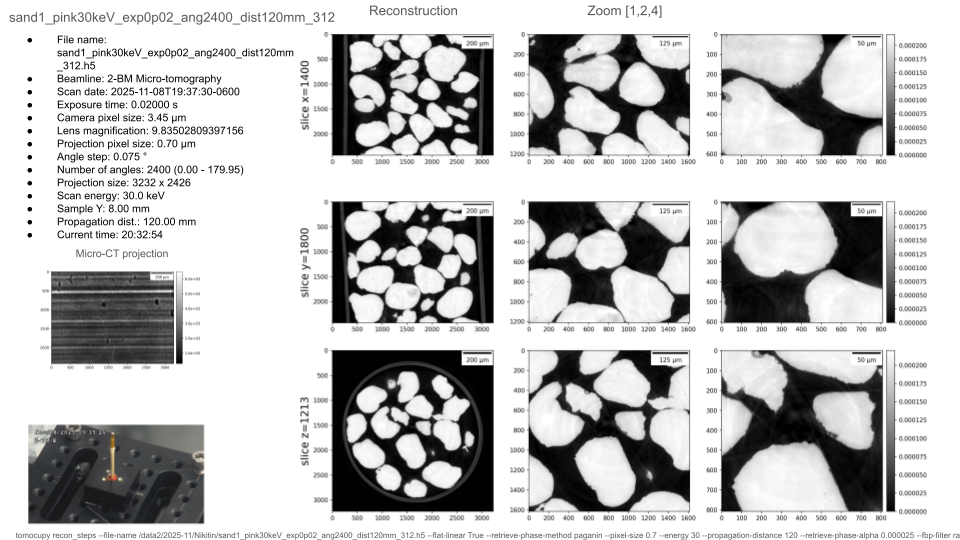
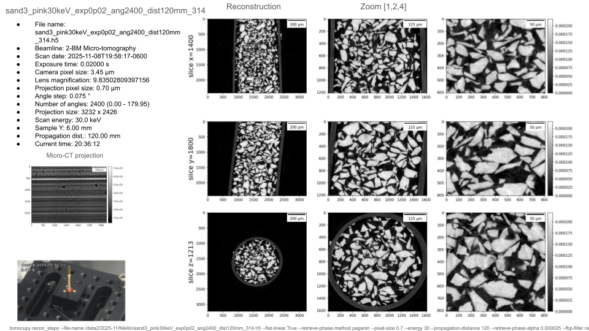
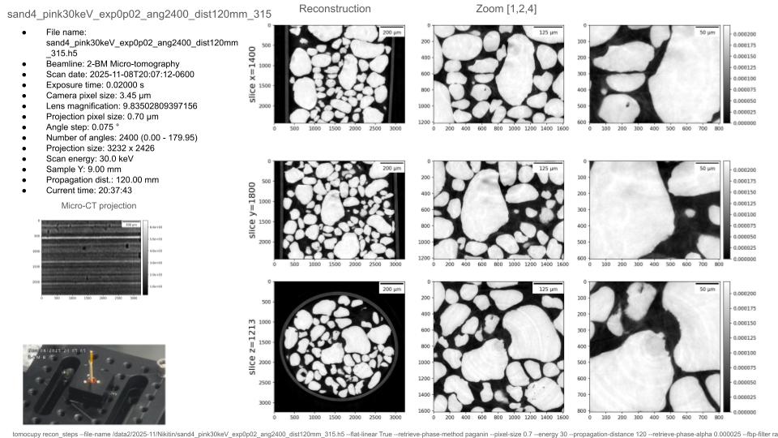

Round-Robin
-----------

Shale
~~~~~

The Tomography Round-Robin data sets :cite:`round-robin:17` consist of two shale samples obtained from the North Sea (sample N1) and the Upper Barnett Formation in Texas (sample B1) :cite:`Kanitpanyacharoen:13`. Shale is a challenging material because of its multiphase composition, small grain size, low but significant amount of porosity, as well as strong shape- and lattice-preferred orientation. The goals of this round-robin project were to (i) characterize microstructures and porosity on the micrometer scale, (ii) compare results measured at three synchrotron facilities, and (iii) identify optimal experimental conditions of high-resolution tomography (microCT) for fine-grained materials. microCT data of these shales were acquired under similar conditions at the Advanced Photon Source (APS) of Argonne National Laboratory, USA, at the Swiss Light Source (SLS) of the Paul Scherrer Institut, Switzerland and at the Advanced Light Source (ALS) of Lawrence Berkeley National Laboratory, USA with the goal to compare the data quality and determine phase proportions and microstructures differences from the same samples as measured at the three facilities. All instruments used a 10× objective lens with an effective pixel size of ~ 0.7 µm. The Round-Robin Data Sets consists of one measurement of sample N1 and one measurement of sample B1 taken at all three facilities for a total of 6 tomographic data sets.

To load the data sets and perform a basic reconstruction using tomoPy  :cite:`Gursoy:14a` use the 
:download:`tomopy_rec.py <../../demo/tomopy_rec.py>` python script.

Example: ::

    tomopy recon --file-name /tomobank/tomo_00001.h5 --rotation-axis 1024

.. |d00001| image:: ../img/tomo_00001.png
    :width: 20pt
    :height: 20pt
.. |d00002| image:: ../img/tomo_00002.png
    :width: 20pt
    :height: 20pt
.. |d00003| image:: ../img/tomo_00003.png
    :width: 20pt
    :height: 20pt
.. |d00004| image:: ../img/tomo_00004.png
    :width: 20pt
    :height: 20pt
    

.. _tomo_00001: https://app.globus.org/file-manager?origin_id=9f00a780-4aee-42a7-b7f4-6a2773c8da30&origin_path=%2Ftomo_00001_to_00006%2F
.. _tomo_00002: https://app.globus.org/file-manager?origin_id=9f00a780-4aee-42a7-b7f4-6a2773c8da30&origin_path=%2Ftomo_00001_to_00006%2F
.. _tomo_00003: https://app.globus.org/file-manager?origin_id=9f00a780-4aee-42a7-b7f4-6a2773c8da30&origin_path=%2Ftomo_00001_to_00006%2F
.. _tomo_00004: https://app.globus.org/file-manager?origin_id=9f00a780-4aee-42a7-b7f4-6a2773c8da30&origin_path=%2Ftomo_00001_to_00006%2F
.. _tomo_00005: https://app.globus.org/file-manager?origin_id=9f00a780-4aee-42a7-b7f4-6a2773c8da30&origin_path=%2Ftomo_00001_to_00006%2F
.. _tomo_00006: https://app.globus.org/file-manager?origin_id=9f00a780-4aee-42a7-b7f4-6a2773c8da30&origin_path=%2Ftomo_00001_to_00006%2F

+---------------+----------------+------------------+--------------+-----------+-------------------------+
|    Tomo ID    |    Facility    |    Sample        |   Scan Name  |   Image   |          Axis           |
+---------------+----------------+------------------+--------------+-----------+-------------------------+
| tomo_00001_   |        APS     |       B1         |    hornby    |  |d00001| |          1024           |
+---------------+----------------+------------------+--------------+-----------+-------------------------+
| tomo_00002_   |        APS     |       N1         |    blakely   |  |d00002| |          1029           |
+---------------+----------------+------------------+--------------+-----------+-------------------------+
| tomo_00003_   |        SLS     |       B1         |    hornby    |  |d00003| |          1011           |
+---------------+----------------+------------------+--------------+-----------+-------------------------+
| tomo_00004_   |        SLS     |       N1         |    blakely   |  |d00004| |          1048           |
+---------------+----------------+------------------+--------------+-----------+-------------------------+
| tomo_00005_   |        ALS     |       B1         |    hornby    |           |                         |
+---------------+----------------+------------------+--------------+-----------+-------------------------+
| tomo_00006_   |        ALS     |       N1         |    blakely   |           |                         |
+---------------+----------------+------------------+--------------+-----------+-------------------------+

Sand
~~~~~

A second round-robin data set consisiting in a sand sample was acquire at the APS, ALS and NSLS-II.  

.. figure:: ../img/tomo_00104_to_00107.png
   :alt: Alternative text for the image
   :width: 400px
   :align: center

   Sand samples 1-2-3-4 corresponding to tomo_00104, ..., 00107.

.. _tomo_00104: https://app.globus.org/file-manager?origin_id=9f00a780-4aee-42a7-b7f4-6a2773c8da30&origin_path=%2Ftomo_00104_to_107%2F
.. _tomo_00105: https://app.globus.org/file-manager?origin_id=9f00a780-4aee-42a7-b7f4-6a2773c8da30&origin_path=%2Ftomo_00104_to_107%2F
.. _tomo_00106: https://app.globus.org/file-manager?origin_id=9f00a780-4aee-42a7-b7f4-6a2773c8da30&origin_path=%2Ftomo_00104_to_107%2F
.. _tomo_00107: https://app.globus.org/file-manager?origin_id=9f00a780-4aee-42a7-b7f4-6a2773c8da30&origin_path=%2Ftomo_00104_to_107%2F

.. |d00105| image:: ../img/tomo_00105.png
    :width: 20pt
    :height: 20pt

**APS data** 

+----------------------------+-------------------------------------------+---------+
| Name                       | Value                                     | Units   |
+============================+===========================================+=========+
| Tomo ID                    | tomo_00104_                               |         |
+----------------------------+-------------------------------------------+---------+
| TomoLog                    | |d00104|                                  |         |
+----------------------------+-------------------------------------------+---------+
| Instrument                 | APS beamline 2-BM                         |         |
+----------------------------+-------------------------------------------+---------+
| Sample Name                | sand1_pink30keV_exp0p02_ang2400_dist120mm |         |
+----------------------------+-------------------------------------------+---------+
| Resolution                 | 0.7016558051109314                        | µm      |
+----------------------------+-------------------------------------------+---------+
| Acquire period             | 0.019528192                               | s       |
+----------------------------+-------------------------------------------+---------+
| Energy                     | 30.0 (pink)                               | keV     |
+----------------------------+-------------------------------------------+---------+
| Sample to detector distance| 120.0                                     | mm      |
+----------------------------+-------------------------------------------+---------+

+----------------------------+-------------------------------------------+---------+
| Name                       | Value                                     | Units   |
+============================+===========================================+=========+
| Tomo ID                    | tomo_00105_                               |         |
+----------------------------+-------------------------------------------+---------+
| TomoLog                    | |d00105|                                  |         |
+----------------------------+-------------------------------------------+---------+
| Instrument                 | APS beamline 2-BM                         |         |
+----------------------------+-------------------------------------------+---------+
| Sample Name                | sand2_pink30keV_exp0p02_ang2400_dist120mm |         |
+----------------------------+-------------------------------------------+---------+
| Resolution                 | 0.7016558051109314                        | µm      |
+----------------------------+-------------------------------------------+---------+
| Acquire period             | 0.019528192                               | s       |
+----------------------------+-------------------------------------------+---------+
| Energy                     | 30.0 (pink)                               | keV     |
+----------------------------+-------------------------------------------+---------+
| Sample to detector distance| 120.0                                     | mm      |
+----------------------------+-------------------------------------------+---------+

+----------------------------+-------------------------------------------+---------+
| Name                       | Value                                     | Units   |
+============================+===========================================+=========+
| Tomo ID                    | tomo_00106_                               |         |
+----------------------------+-------------------------------------------+---------+
| TomoLog                    | |d00106|                                  |         |
+----------------------------+-------------------------------------------+---------+
| Instrument                 | APS beamline 2-BM                         |         |
+----------------------------+-------------------------------------------+---------+
| Sample Name                | sand3_pink30keV_exp0p02_ang2400_dist120mm |         |
+----------------------------+-------------------------------------------+---------+
| Resolution                 | 0.7016558051109314                        | µm      |
+----------------------------+-------------------------------------------+---------+
| Acquire period             | 0.019528192                               | s       |
+----------------------------+-------------------------------------------+---------+
| Energy                     | 30.0 (pink)                               | keV     |
+----------------------------+-------------------------------------------+---------+
| Sample to detector distance| 120.0                                     | mm      |
+----------------------------+-------------------------------------------+---------+

+----------------------------+-------------------------------------------+---------+
| Name                       | Value                                     | Units   |
+============================+===========================================+=========+
| Tomo ID                    | tomo_00107_                               |         |
+----------------------------+-------------------------------------------+---------+
| TomoLog                    | |d00107|                                  |         |
+----------------------------+-------------------------------------------+---------+
| Instrument                 | APS beamline 2-BM                         |         |
+----------------------------+-------------------------------------------+---------+
| Sample Name                | sand4_pink30keV_exp0p02_ang2400_dist120mm |         |
+----------------------------+-------------------------------------------+---------+
| Resolution                 | 0.7016558051109314                        | µm      |
+----------------------------+-------------------------------------------+---------+
| Acquire period             | 0.019528192                               | s       |
+----------------------------+-------------------------------------------+---------+
| Energy                     | 30.0 (pink)                               | keV     |
+----------------------------+-------------------------------------------+---------+
| Sample to detector distance| 120.0                                     | mm      |
+----------------------------+-------------------------------------------+---------+

**ALS data**

to be completed 
