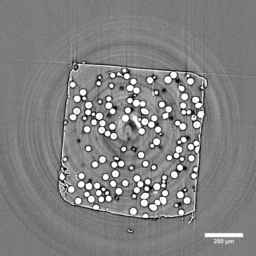
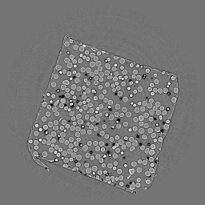
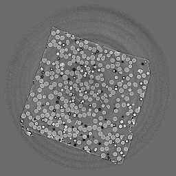
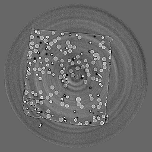
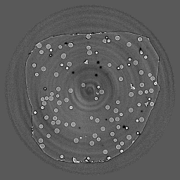
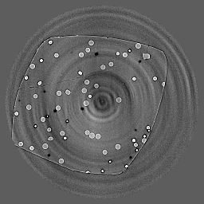

Spheres
-------

These sphere data sets  :cite:`stannard_01:17` contains samples with varied volume fractions of 
borosilicate glass spheres encased in a polypropylene matrix. 
The sphere diameter is a gaussian distribution ranging from 38-45 µm. 
The samples were scanned at both 25 mm and 60 mm sample to detector distance  with 
the experimental conditions reported in the table below:

+---------------------------------+------------------------------------+
| Instrument                      |        APS 2-BM-A fast tomo        | 
+---------------------------------+------------------------------------+
| Energy                          |        27.4 keV                    | 
+---------------------------------+------------------------------------+
| Monochromator                   |        multi-layer                 | 
+---------------------------------+------------------------------------+
| Scan Range                      |        180 degree                  |
+---------------------------------+------------------------------------+
| Number of Projections           |        1500                        |
+---------------------------------+------------------------------------+
| White Fields                    |        10 before                   |
+---------------------------------+------------------------------------+
| Dark Fields                     |        10 before                   | 
+---------------------------------+------------------------------------+
| Mode                            |        fly-scan                    | 
+---------------------------------+------------------------------------+
| Rotation Speed                  |        0.75 deg/s                  | 
+---------------------------------+------------------------------------+
| Sample Detector Distance        |        60  mm                      | 
+---------------------------------+------------------------------------+
| Attenuator                      |        mm C + 1mm Glass            | 
+---------------------------------+------------------------------------+
| Detector Name                   |        PCO edge                    | 
+---------------------------------+------------------------------------+
| Exposure Time                   |        0.0001 s                    | 
+---------------------------------+------------------------------------+
| Pixel Size                      |        0.65 µm                     | 
+---------------------------------+------------------------------------+
| Detector shutter mode           |        global                      | 
+---------------------------------+------------------------------------+
| Detector Dimension x            |        2560                        | 
+---------------------------------+------------------------------------+
| Detector Dimension y            |        2160                        | 
+---------------------------------+------------------------------------+
| Objective Magnification         |        Mitutoyo 10x                | 
+---------------------------------+------------------------------------+
| Scintillator                    |        LuAG 10 µm                  | 
+---------------------------------+------------------------------------+

The sphere data sets includes 6 tomographic data sets collected at different 
sample to detector distance and different concentrations as reported in the table below:

.. |tomo_00058| replace:: :download:`rec_script.py <../../../docs/demo/rec_tomo_00058_to_00063.py>`
.. |tomo_00059| replace:: :download:`rec_script.py <../../../docs/demo/rec_tomo_00058_to_00063.py>`
.. |tomo_00060| replace:: :download:`rec_script.py <../../../docs/demo/rec_tomo_00058_to_00063.py>`
.. |tomo_00061| replace:: :download:`rec_script.py <../../../docs/demo/rec_tomo_00058_to_00063.py>`
.. |tomo_00062| replace:: :download:`rec_script.py <../../../docs/demo/rec_tomo_00058_to_00063.py>`
.. |tomo_00063| replace:: :download:`rec_script.py <../../../docs/demo/rec_tomo_00058_to_00063.py>`

.. _tomo_00058: https://www.globus.org/app/transfer?origin_id=e133a81a-6d04-11e5-ba46-22000b92c6ec&origin_path=%2Ftomobank%2F%2Ftomo_00058_to_00063%2F
.. _tomo_00059: https://www.globus.org/app/transfer?origin_id=e133a81a-6d04-11e5-ba46-22000b92c6ec&origin_path=%2Ftomobank%2F%2Ftomo_00058_to_00063%2F
.. _tomo_00060: https://www.globus.org/app/transfer?origin_id=e133a81a-6d04-11e5-ba46-22000b92c6ec&origin_path=%2Ftomobank%2F%2Ftomo_00058_to_00063%2F
.. _tomo_00061: https://www.globus.org/app/transfer?origin_id=e133a81a-6d04-11e5-ba46-22000b92c6ec&origin_path=%2Ftomobank%2F%2Ftomo_00058_to_00063%2F
.. _tomo_00062: https://www.globus.org/app/transfer?origin_id=e133a81a-6d04-11e5-ba46-22000b92c6ec&origin_path=%2Ftomobank%2F%2Ftomo_00058_to_00063%2F
.. _tomo_00063: https://www.globus.org/app/transfer?origin_id=e133a81a-6d04-11e5-ba46-22000b92c6ec&origin_path=%2Ftomobank%2F%2Ftomo_00058_to_00063%2F

+-------------+-----------------------+----------+--------------+-----------+-----------------------+ 
| Tomo ID     |  Concentration (%)    | Distance | Sample Name  |   Image   |       Downloads       |     
+-------------+-----------------------+----------+--------------+-----------+-----------------------+ 
| tomo_00058_ |          20           |    60    | Somya_20_60  |  |00058|  |      |tomo_00058|     |
+-------------+-----------------------+----------+--------------+-----------+-----------------------+ 
| tomo_00059_ |          30           |    60    | Somya_30_60  |  |00059|  |      |tomo_00059|     |
+-------------+-----------------------+----------+--------------+-----------+-----------------------+ 
| tomo_00060_ |          30           |    25    | Somya_30_25  |  |00060|  |      |tomo_00060|     |
+-------------+-----------------------+----------+--------------+-----------+-----------------------+ 
| tomo_00061_ |          20           |    25    | Somya_20_25  |  |00061|  |      |tomo_00061|     |
+-------------+-----------------------+----------+--------------+-----------+-----------------------+ 
| tomo_00062_ |          10           |    25    | Somya_10_25  |  |00062|  |      |tomo_00062|     |
+-------------+-----------------------+----------+--------------+-----------+-----------------------+ 
| tomo_00063_ |           5           |    25    | Somya_5_25   |  |00063|  |      |tomo_00063|     |
+-------------+-----------------------+----------+--------------+-----------+-----------------------+ 

