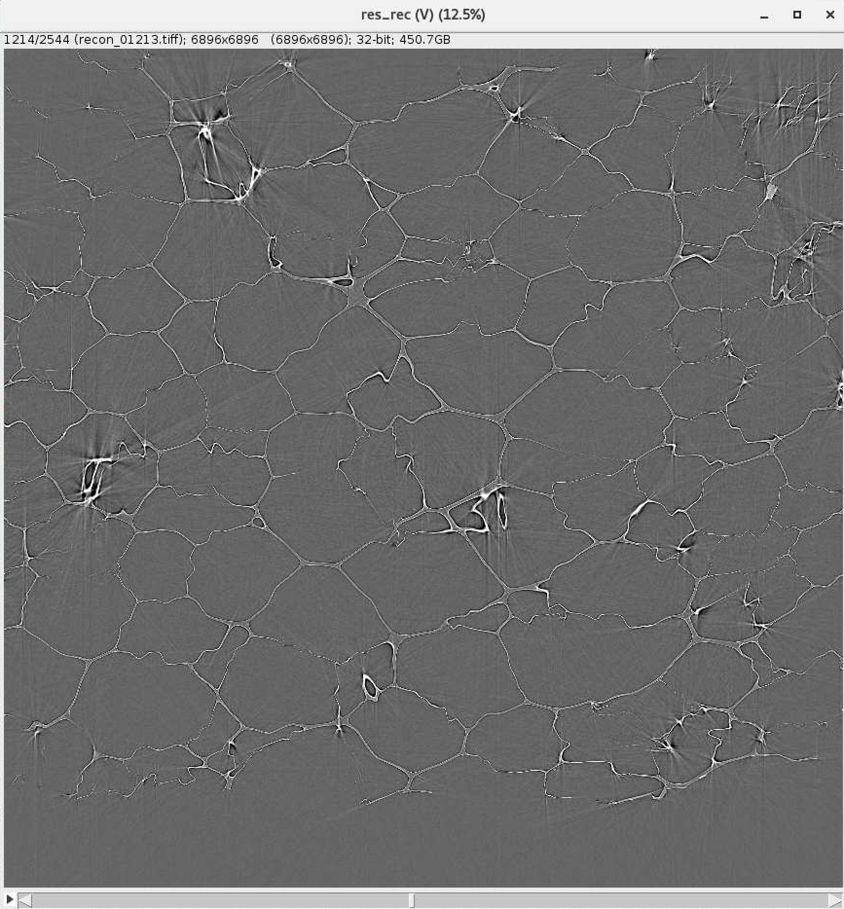
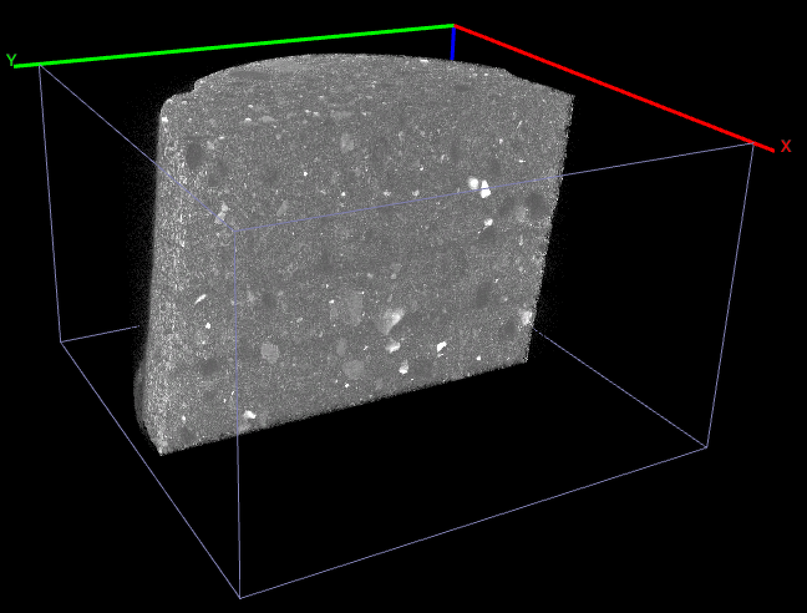

Mosaic
------

Foam
----

Foam is a 3 x 3 mosaic tomography data set used as a test data set during the development of 
`mosaic <https://github.com/xray-imaging/mosaic>`_, a command line inteface from mosaic tomography 
data processing.

Data sets were collected with the following mosaic parameters:

::

    image   size (x, y) in pixels: (2448, 900)
    mosaic shift (x, y) in pixels: (2202, 811)

+---------------------+------------------------------+-----------------------------+--------------------------------+
|   Tile location     |   X (h) tile position (mm)   |  Y (v) tile position (mm)   |  file name                     |
+=====================+==============================+=============================+================================+
|        x0y0         |      -3.800300;              |         15.000000           |      mosaic_test_001.h5        |
+---------------------+------------------------------+-----------------------------+--------------------------------+
|        x1y0         |      -0.000300;              |         15.000000           |      mosaic_test_002.h5        |
+---------------------+------------------------------+-----------------------------+--------------------------------+
|        x2y0         |       3.799700;              |         15.000000           |      mosaic_test_003.h5        |
+---------------------+------------------------------+-----------------------------+--------------------------------+
|        x0y1         |      -3.800300;              |         16.400000           |      mosaic_test_004.h5        |
+---------------------+------------------------------+-----------------------------+--------------------------------+
|        x1y1         |      -0.000300;              |         16.400000           |      mosaic_test_005.h5        |
+---------------------+------------------------------+-----------------------------+--------------------------------+
|        x2y1         |       3.799700;              |         16.400000           |      mosaic_test_006.h5        |
+---------------------+------------------------------+-----------------------------+--------------------------------+
|        x0y2         |      -3.800300;              |         17.800000           |      mosaic_test_007.h5        |
+---------------------+------------------------------+-----------------------------+--------------------------------+
|        x1y2         |      -0.000300;              |         17.800000           |      mosaic_test_008.h5        |
+---------------------+------------------------------+-----------------------------+--------------------------------+
|        x2y2         |       3.799700;              |         17.800000           |      mosaic_test_009.h5        |
+---------------------+------------------------------+-----------------------------+--------------------------------+

mosaic file name grid:

+------------+------------------------+---------------------------+-------------------------+
|            |         x_0            |             x_1           |          x_2            |
+============+========================+===========================+=========================+
|     y_0    |    mosaic_test_001.h5  |       mosaic_test_002.h5  |    mosaic_test_003.h5   |
+------------+------------------------+---------------------------+-------------------------+
|     y_1    |    mosaic_test_004.h5  |       mosaic_test_005.h5  |    mosaic_test_006.h5   |
+------------+------------------------+---------------------------+-------------------------+
|     y_2    |    mosaic_test_007.h5  |       mosaic_test_008.h5  |    mosaic_test_009.h5   |
+------------+------------------------+---------------------------+-------------------------+

Each data set is collected with the following parameters:

+-------------------------+----------------------------------------+-----------+
| tomo_ID                 |  00094                                 |           |  
+=========================+========================================+===========+
| Image preview           | |00094|                                |           |  
+-------------------------+----------------------------------------+-----------+
| Recon preview           | |00094_rec|                            |           |  
+-------------------------+----------------------------------------+-----------+
| Download                | tomo_00094_                            |           |  
+-------------------------+----------------------------------------+-----------+
| camera_distance         | 100.00000000000011                     | mm        |
+-------------------------+----------------------------------------+-----------+
| camera_objective        | 2x                                     |           |
+-------------------------+----------------------------------------+-----------+
| resolution              | 1.725                                  | microns   |
+-------------------------+----------------------------------------+-----------+
| scintillating_thickness | 50.0                                   | microns   |
+-------------------------+----------------------------------------+-----------+
| scintillator_type       | LuAG:Ce                                |           |
+-------------------------+----------------------------------------+-----------+
| size_x                  | 2448                                   |           |
+-------------------------+----------------------------------------+-----------+
| size_y                  | 900                                    |           |
+-------------------------+----------------------------------------+-----------+
| instrument_name         | Micro-tomography                       |           |
+-------------------------+----------------------------------------+-----------+
| energy                  | 25.51                                  | keV       |
+-------------------------+----------------------------------------+-----------+
| beamline                | 2-BM-A                                 |           |
+-------------------------+----------------------------------------+-----------+
| current                 | 102.038222190282                       | mA        |
+-------------------------+----------------------------------------+-----------+
| fill_mode               | 0+24x1                                 |           |
+-------------------------+----------------------------------------+-----------+
| source_name             | Advanced Photon Source                 |           |
+-------------------------+----------------------------------------+-----------+
| top_up                  | Enable                                 |           |
+-------------------------+----------------------------------------+-----------+
| description_2           | 25.51 kEv                              |           |
+-------------------------+----------------------------------------+-----------+
| description_3           | 100mm sample to detector off center    |           |
+-------------------------+----------------------------------------+-----------+
| title                   | mosaic_test                            |           |
+-------------------------+----------------------------------------+-----------+
| institution             | Advanced Photon Source                 |           |
+-------------------------+----------------------------------------+-----------+
| file_name               | mosaic_test                            |           |
+-------------------------+----------------------------------------+-----------+
| file_path               | /local/data/2021-09/Pasha/             |           |
+-------------------------+----------------------------------------+-----------+
| full_file_name          | mosaic_test_001.h5                     |           |
+-------------------------+----------------------------------------+-----------+
| sample_name             | test mosaic scan                       |           |
+-------------------------+----------------------------------------+-----------+
| num_dark_fields         | 40                                     |           |
+-------------------------+----------------------------------------+-----------+
| num_flat_fields         | 40                                     |           |
+-------------------------+----------------------------------------+-----------+
| sample_in_x             | -3.8                                   | mm        |
+-------------------------+----------------------------------------+-----------+
| sample_in_y             | 0.0                                    | mm        |
+-------------------------+----------------------------------------+-----------+
| sample_out_x            | 15.0                                   | mm        |
+-------------------------+----------------------------------------+-----------+
| sample_out_y            | 0.0                                    | mm        |
+-------------------------+----------------------------------------+-----------+
| num_angles              | 6000                                   |           |
+-------------------------+----------------------------------------+-----------+
| return_rotation         | Yes                                    |           |
+-------------------------+----------------------------------------+-----------+
| rotation_speed          | 0.19518786863429474                    | degrees/s |
+-------------------------+----------------------------------------+-----------+
| rotation_start          | 0.0                                    | degrees   |
+-------------------------+----------------------------------------+-----------+
| rotation_step           | 0.03000973466739211                    | degrees   |
+-------------------------+----------------------------------------+-----------+
| start_date              | 2021-09-27T16:51:55-0500               |           |
+-------------------------+----------------------------------------+-----------+
| end_date                | 2021-09-27T17:07:57-0500               |           |
+-------------------------+----------------------------------------+-----------+

.. _tomo_00094: https://app.globus.org/file-manager?origin_id=9f00a780-4aee-42a7-b7f4-6a2773c8da30&origin_path=%2Ftomo_00094%2F

.. |00094| image:: ../img/tomo_00094.png
    :width: 20pt
    :height: 20pt

Activated charcoal
~~~~~~~~~~~~~~~~~~

This dataset contains an activated charcoal sample that is approximately 4 mm in diameter. 
Since the sample extends beyond the field-of-view (FOV), the acquisition and reconstruction
were conducted using the Tomosaic protocol [ref]. A full dataset stitched from a 4 by 4 mosaic
tile grid is available here.

Tomosaic, the software used to for processing and reconstructing the mosaic dataset, is an
open-source project which can be found here: tomosaic_

Metadata files in the repository include:
  * `center_pos.txt`: Center axis positions for each of the 4 rows of tiles.
  * `shifts.txt`: Relative positions of all 16 tiles. The 6 columns in the file provide information

of: tile position y, tile position x, relative shift y to right neightbor, 
relative shift x to right neightbor, relative shift y to bottom neightbor, 
relative shift x to bottom neightbor.

.. _tomo_00078: https://app.globus.org/file-manager?origin_id=9f00a780-4aee-42a7-b7f4-6a2773c8da30&origin_path=%2F%2Ftomo_00078%2F

.. _tomosaic: https://github.com/mdw771/tomosaic2.git

+-----------------------------------------+----------------------------+
|             tomo_ID                     | 00078                      |  
+=========================================+============================+
|             Image preview               | |00078|                    |  
+-----------------------------------------+----------------------------+
|             Download                    | tomo_00078_                |  
+-----------------------------------------+----------------------------+
|             Instrument                  | APS 32-ID-C                |  
+-----------------------------------------+----------------------------+
|             Sample name                 | Charcoal                   |  
+-----------------------------------------+----------------------------+
|             X-ray energy                | 25.0 keV                   |  
+-----------------------------------------+----------------------------+
|             Sample-to-detector distance | 30 cm                      |  
+-----------------------------------------+----------------------------+
|             Scan Range                  | 180 degree                 |
+-----------------------------------------+----------------------------+
|             Number of Projections       | 4500                       |
+-----------------------------------------+----------------------------+
|             White Fields                | 50                         | 
+-----------------------------------------+----------------------------+
|             Dark Fields                 | 10                         |  
+-----------------------------------------+----------------------------+
|             Pixel size                  | 0.8 um                     |  
+-----------------------------------------+----------------------------+
|             Mosaic tile grid            | 4 x 4                      |
+-----------------------------------------+----------------------------+
|             FOV size                    | 1920 x 1200                |
+-----------------------------------------+----------------------------+
|             Stitched panorama size      | 6618 x 4205                |
+-----------------------------------------+----------------------------+
|             Rotation axis location      | See globus                 |
+-----------------------------------------+----------------------------+

To load the data sets and perform a basic reconstruction using `tomopy <https://tomopy.readthedocs.io>`_  use the 
:download:`tomopy_rec.py <../../demo/tomopy_rec.py>` python script. Check `center_pos.txt` for rotation axis positions.

Example: ::

    tomopy recon --file-name tomo_00078.h5 --rotation-axis 3316

To enable phase retrieval un-comment the appropriate setting in :download:`tomopy_rec.py <../../demo/tomopy_rec.py>` 

To find the correct axis value in `center_pos.txt` to use, you need to first figure out which row the slice you want
to reconstruct belong to. You can do this with the aid of `shifts.txt`. For example, the y-shift of the second row
of tile relative to the first row is 997, and that of the third row relative to the second row is 996. So slice
997 to 1993 will be on the second row, corresponding to an axis of 3324. The most convenient way to reconstruct
this dataset is to use the `recon_hdf5` function in Tomosaic. The source codes of Tomosaic can be found here: tomosaic_
