Dynamic
~~~~~~~

TomoPhantom
-----------

The dynamic phantom model was generated and customized for two spatial variables :math:`x,y` by employing the TomoPhantom toolbox :cite:`kazantsev:18`. 
It contains three types of the particle motion: rotation, shifting, and expansion. 
In addition to different motion types, we also analyze different motion velocities chosen according to the pixel size and the time spent for measuring projections 
in the interval of the size :math:`\pi`. 

The movement of the particles is captured in 8 intervals of each consisting by angular views across :math:`\pi`. 
The model has sizes :math:`(N,N,N_t)=(256,256,8)`, and the projection data has sizes :math:`(N_\theta,N)=(128\times 8,256)=(1024,256)`, where :math:`128` is the number of projections for covering the interval :math:`[0,\pi)`.
Reconstructions are also performed by using the standard FBP method for intervals :math:`[0,\pi)`, :math:`[\pi,2\pi)`, and so on, and by the proposed time-domain decomposition + regularization approach :cite:`Nikitin:2019` with :math:`M=16` Fourier basis functions for decomposition. 
Motion artifacts in the FBP reconstruction are clearly visible and significantly distort reconstructions with increasing the motion velocity. 
The method of Time-domain decomposition + regularization in turn suppresses all motion artifacts.

Reconstruction by the method with suppressing motion artifacts requires module `rectv` that can be installed from https://github.com/math-vrn/rectv_gpu. 
To perform reconstruction use the :download:`rec_phantom_00015.py <../../demo/rec_phantom_00015.py>` python script::

        python rec_phantom_00015.py phantom_00015_00000.tiff

.. _phantom_00015: https://app.globus.org/file-manager?origin_id=9f00a780-4aee-42a7-b7f4-6a2773c8da30&origin_path=%2Fphantom_00015%2F

.. |gt00000| image:: ../img/phantom_00015/f_00000.png
    :width: 100pt
    :height: 100pt
.. |rec00000| image:: ../img/phantom_00015/rec_0_00000.png
    :width: 100pt
    :height: 100pt
.. |rectv00000| image:: ../img/phantom_00015/recb16tv_0_00000.png
    :width: 100pt
    :height: 100pt

.. |gt00001| image:: ../img/phantom_00015/f_00001.png
    :width: 100pt
    :height: 100pt
.. |rec00001| image:: ../img/phantom_00015/rec_1_00000.png
    :width: 100pt
    :height: 100pt
.. |rectv00001| image:: ../img/phantom_00015/recb16tv_1_00000.png
    :width: 100pt
    :height: 100pt

.. |gt00002| image:: ../img/phantom_00015/f_00002.png
    :width: 100pt
    :height: 100pt
.. |rec00002| image:: ../img/phantom_00015/rec_2_00000.png
    :width: 100pt
    :height: 100pt

.. |gt00003| image:: ../img/phantom_00015/f_00003.png
    :width: 100pt
    :height: 100pt

.. |rectv00003| image:: ../img/phantom_00015/recb16tv_3_00000.png
    :width: 100pt
    :height: 100pt

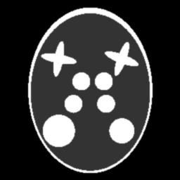
.. |rec00004| image:: ../img/phantom_00015/rec_4_00000.png
    :width: 100pt
    :height: 100pt

.. |gt00005| image:: ../img/phantom_00015/f_00005.png
    :width: 100pt
    :height: 100pt

.. |gt00006| image:: ../img/phantom_00015/f_00006.png
    :width: 100pt
    :height: 100pt

.. |rectv00006| image:: ../img/phantom_00015/recb16tv_6_00000.png
    :width: 100pt
    :height: 100pt

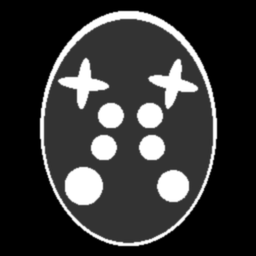

.. |rectv00007| image:: ../img/phantom_00015/recb16tv_7_00000.png
    :width: 100pt
    :height: 100pt

Projection data, ground truth, and reconstructions: phantom_00015_

+----------+--------------+------------+------------+
|Time frame| Ground Truth |   Gridrec  |  dec+TV    |
+----------+--------------+------------+------------+
|     0    |  |gt00000|   | |rec00000| ||rectv00000||
+----------+--------------+------------+------------+
|     1    |  |gt00001|   | |rec00001| ||rectv00001||
+----------+--------------+------------+------------+
|     2    |  |gt00002|   | |rec00002| ||rectv00002||
+----------+--------------+------------+------------+
|3 (fast)  |  |gt00003|   | |rec00003| ||rectv00003||
+----------+--------------+------------+------------+
|     4    |  |gt00004|   | |rec00004| ||rectv00004||
+----------+--------------+------------+------------+
|     5    |  |gt00005|   | |rec00005| ||rectv00005||
+----------+--------------+------------+------------+
|     6    |  |gt00006|   | |rec00006| ||rectv00006||
+----------+--------------+------------+------------+
|     7    |  |gt00007|   | |rec00007| ||rectv00007||
+----------+--------------+------------+------------+

pt4 Phantoms
------------

The following phantoms have been created using `pt4 <https://github.com/MaterialsPhysicsANU/pt4>`_ 
version `1.0.0 <https://github.com/MaterialsPhysicsANU/pt4/releases/tag/v1.0.0>`_.
pt4 is a phantom description tool which is specialised for generating time-evolving 4D phantoms. More information can be found on the linked code repository or in the `software overview <https://github.com/MaterialsPhysicsANU/pt4/blob/master/pt4-doc.pdf>`_

This data has been generated with
::

    pt4.exe -p -v (path to .pt4 without extension)

To load the phantom data sets into Python use 
:download:`pt4_volume.py <../../demo/pt4_volume.py>` for volumes as:
::

    pt4_volumes.py (volume file name)

and
:download:`pt4_projection.py <../../demo/pt4_projection.py>` for projections as:
::

    pt4_projection.py (projections directory name)

~~~~~~~~~~~~~~~~~~~
Spheres Translating
~~~~~~~~~~~~~~~~~~~

The spheres translating phantom consists of 16 spheres of equal and constant attenuation each moving independently. The phantom is sampled at 10 time steps with volumes of size :math:`256^3`. The projection data consists of 400 projections with a fixed angle and time step per projection and at size :math:`256^2`. The projections cover the range :math:`[0,8\pi)` where successive revolutions capture the interleaving angles.

:download:`https://g-a0400.fd635.8443.data.globus.org/phantom_00029/spheres_translating.zip`

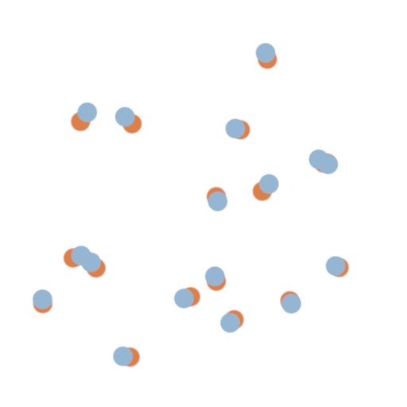

+----------------------------------------------------------------------+
| 2D projection of phantom. Blue, :math:`t = 0`. Orange, :math:`t = 1` |
+----------------------------------------------------------------------+
| |sp00000|                                                            |
+----------------------------------------------------------------------+

~~~~~~~~~~~~
Bread Baking
~~~~~~~~~~~~

The bread baking phantom takes inspiration from a loaf of bread rising during baking. Throughout its evolution it expands while voids appear that also expand. In its final state the phantom has seven voids. To emulate conservation of mass, the phantom reduces in density as it expands. This manifests as phantom's main ellipsoid decreasing in attenuation proportionally to its volume  ( :math:`\mu(t) = \mu(0) \frac{V(t)}{V(0)}`, where :math:`\mu(t)` and :math:`V(t)` are the attenuation and volume at time :math:`t` ). The phantom is sampled at 10 time steps with volumes of size :math:`256^3`. The projection data consists of 400 projections with a fixed angle and time step per projection and at size :math:`256^2`. The projections cover the range :math:`[0,8\pi)` where successive revolutions capture the interleaving angles.

:download:`https://g-a0400.fd635.8443.data.globus.org/phantom_00029/bread_baking.zip`

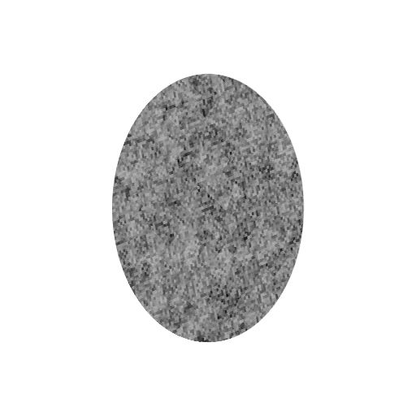

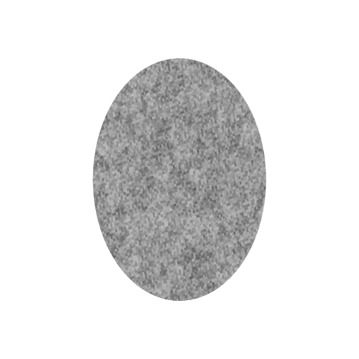

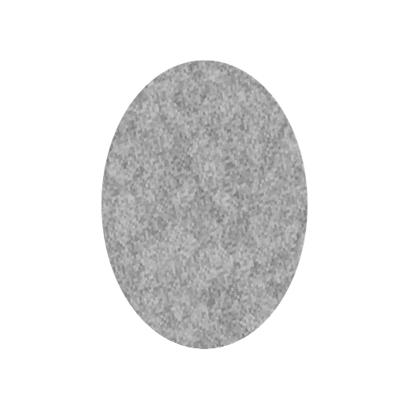

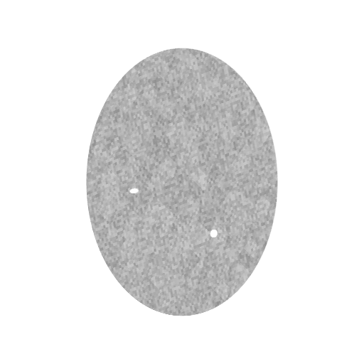

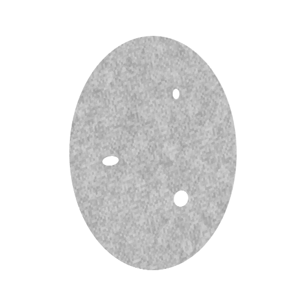

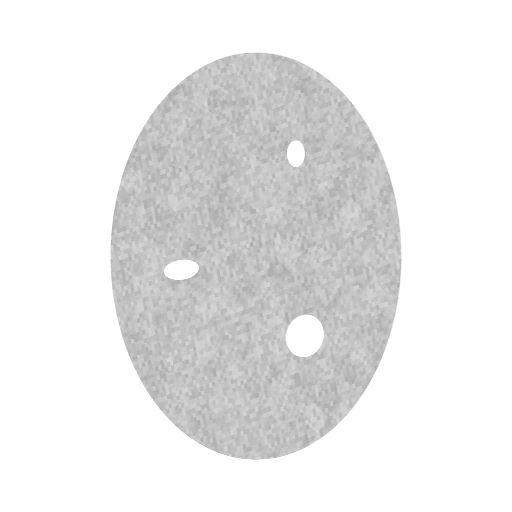

+----------+--------------+--------------+--------------+--------------+--------------+--------------+
|Time      |  0.0         | 0.2          | 0.4          | 0.6          | 0.8          | 1.0          |
+----------+--------------+--------------+--------------+--------------+--------------+--------------+
|ZX Slice  |  |bb00000|   |  |bb00001|   |  |bb00002|   |  |bb00003|   |  |bb00004|   |  |bb00005|   |
+----------+--------------+--------------+--------------+--------------+--------------+--------------+

~~~~~~~~~~~~~~~~
Tensile Fracture
~~~~~~~~~~~~~~~~

The tensile failure phantom emulates a sample undergoing a tensile test to failure. This phantom exhibit both motion and fracturing dynamics. In the first half of the test, the sample stretches vertically and contracts in radius such that its volume remains constant. At :math:`t = 0.5`, the sample fractures and the two halves begin to move away from each other. The phantom is sampled at 20 time steps with volumes of size :math:`256^3`. The projection data consists of 400 projections with a fixed angle and time step per projection and at size :math:`256^2`. The projections cover the range :math:`[0,8\pi)` where successive revolutions capture the interleaving angles.

:download:`https://g-a0400.fd635.8443.data.globus.org/phantom_00029/tensile_fracture.zip`

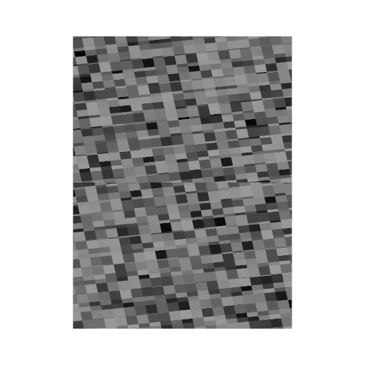

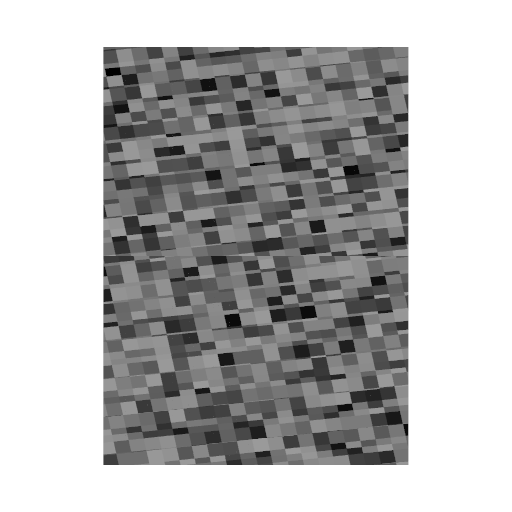

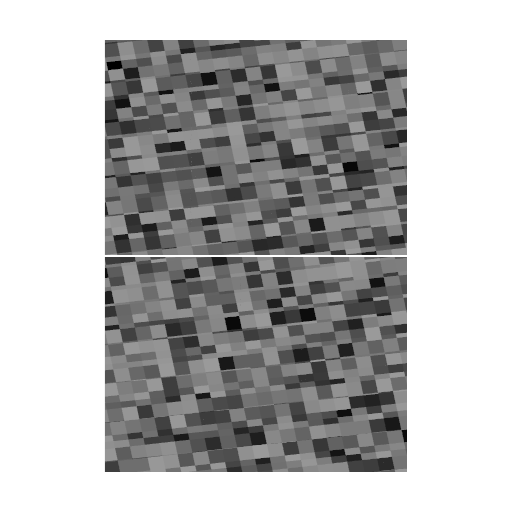

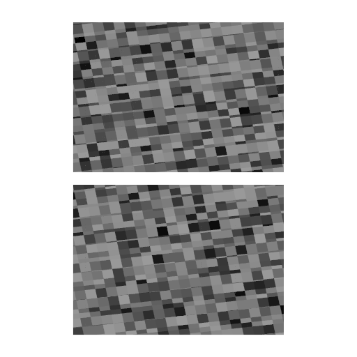

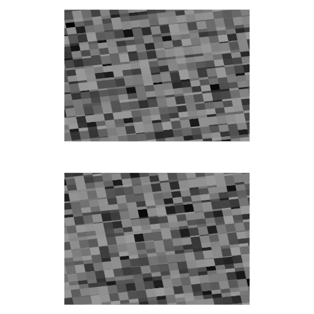

+----------+--------------+--------------+--------------+--------------+--------------+--------------+
|Time      |  0.0         | 0.2          | 0.4          | 0.6          | 0.8          | 1.0          |
+----------+--------------+--------------+--------------+--------------+--------------+--------------+
|ZX Slice  |  |fd00000|   |  |fd00001|   |  |fd00002|   |  |fd00003|   |  |fd00004|   |  |fd00005|   |
+----------+--------------+--------------+--------------+--------------+--------------+--------------+

~~~~~~~~~~~~
Brazil Crush
~~~~~~~~~~~~

The Brazil crush phantom represents a sample undergoing the Brazilian test. In this test a cylindrical sample is placed between two jaws which apply compressive load to the sample. This results in a tensile load on the sample that increases until fracture. In the phantom, multiple fractures appear and close up. For simplicity, the jaws have been modelled nonphysically as they form a contiguous piece of material, however the contact points between the jaws and the sample still close with time. The phantom is sampled at 10 time steps with volumes of size :math:`256^3`. The projection data consists of 400 projections with a fixed angle and time step per projection and at size :math:`256^2`. The projections cover the range :math:`[0,8\pi)` where successive revolutions capture the interleaving angles.

:download:`https://g-a0400.fd635.8443.data.globus.org/phantom_00029/brazil_crush.zip`

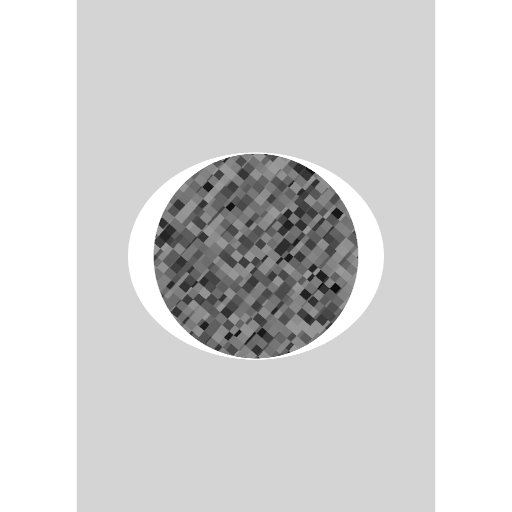

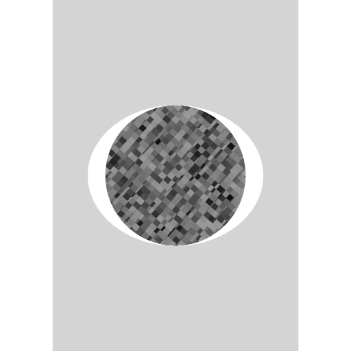

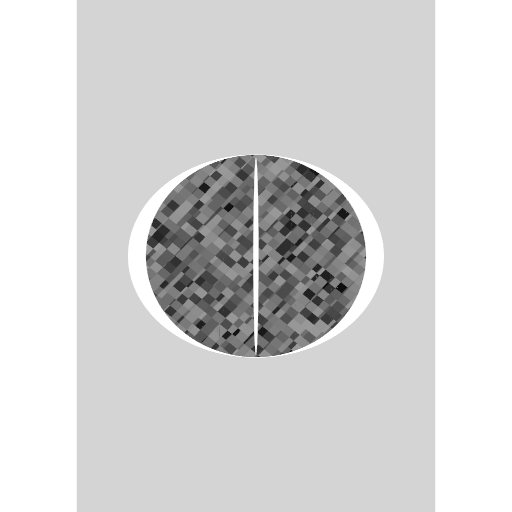

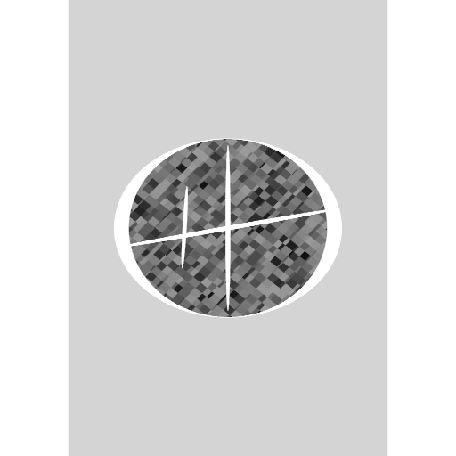

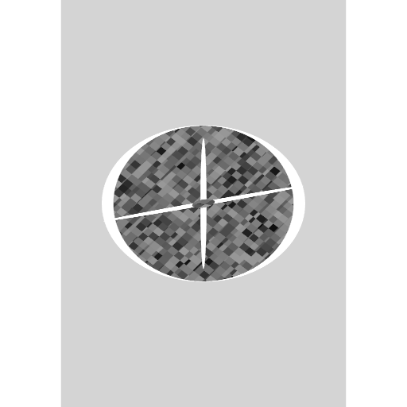

+----------+--------------+--------------+--------------+--------------+--------------+--------------+
|Time      |  0.0         | 0.2          | 0.4          | 0.6          | 0.8          | 1.0          |
+----------+--------------+--------------+--------------+--------------+--------------+--------------+
|ZX Slice  |  |bc00000|   |  |bc00001|   |  |bc00002|   |  |bc00003|   |  |bc00004|   |  |bc00005|   |
+----------+--------------+--------------+--------------+--------------+--------------+--------------+

~~~~~~~~~~
Fluid Flow
~~~~~~~~~~

The fluid flow phantom gives an example of fluid flowing through a porous medium. This has been implemented as the fluid level rising uniformly in time inside the porous medium. The phantom is sampled at 5 time steps with volumes of size :math:`256^3`. The projection data consists of 400 projections with a fixed angle and time step per projection and at size :math:`256^2`. The projections cover the range :math:`[0,8\pi)` where successive revolutions capture the interleaving angles.

:download:`https://g-a0400.fd635.8443.data.globus.org/phantom_00029/fluid_flow.zip`

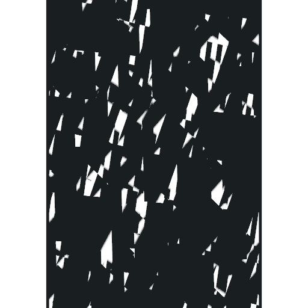

.. |ff00002| image:: ../img/pt4/fluid_flow/vol00002_ZX256.png
    :width: 60pt
    :height: 60pt

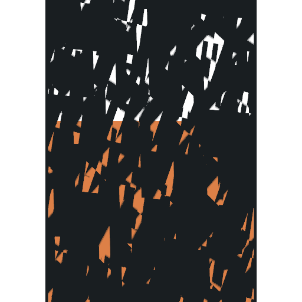

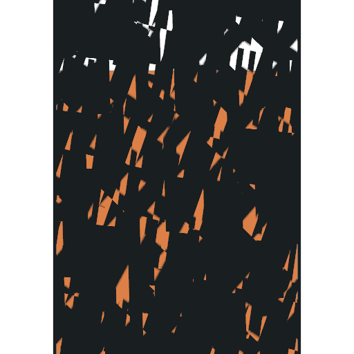

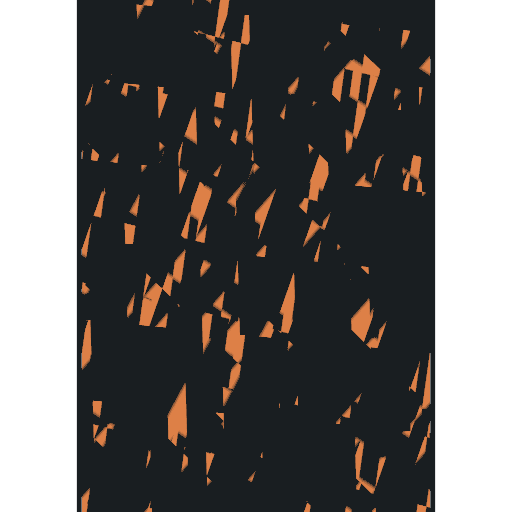

+----------+--------------+--------------+--------------+--------------+--------------+--------------+
|Time      |  0.0         | 0.2          | 0.4          | 0.6          | 0.8          | 1.0          |
+----------+--------------+--------------+--------------+--------------+--------------+--------------+
|ZX Slice  |  |ff00000|   |  |ff00001|   |  |ff00002|   |  |ff00003|   |  |ff00004|   |  |ff00005|   |
+----------+--------------+--------------+--------------+--------------+--------------+--------------+

