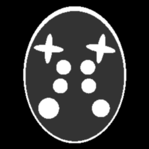
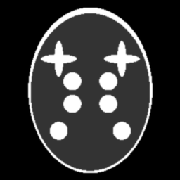
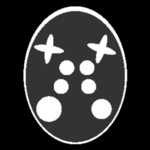
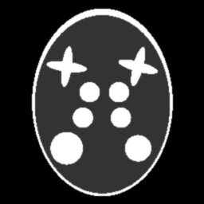

Dynamic
~~~~~~~~~~~~~~~
The dynamic phantom model was generated and customized for two spatial variables :math:`x,y` by employing the TomoPhantom toolbox :cite:`kazantsev:18`. 
It contains three types of the particle motion: rotation, shifting, and expansion. 
In addition to different motion types, we also analyze different motion velocities chosen according to the pixel size and the time spent for measuring projections 
in the interval of the size :math:`\pi`. 

The movement of the particles is captured in 8 intervals of each consisting by angular views across :math:`\pi`. 
The model has sizes :math:`(N,N,N_t)=(256,256,8)`, and the projection data has sizes :math:`(N_\theta,N)=(128\times 8,256)=(1024,256)`, where :math:`128` is the number of projections for covering the interval :math:`[0,\pi)`.
Reconstructions are also performed by using the standard FBP method for intervals :math:`[0,\pi)`, :math:`[\pi,2\pi)`, and so on, and by the proposed time-domain decomposition + regularization approach :cite:`Nikitin:2018` with :math:`M=16` Fourier basis functions for decomposition. 
Motion artifacts in the FBP reconstruction are clearly visible and significantly distort reconstructions with increasing the motion velocity. 
The method of Time-domain decomposition + regularization in turn suppresses all motion artifacts.

Reconstruction by the method with suppressing motion artifacts requires module `rectv` that can be installed from https://github.com/math-vrn/rectv_gpu. 
To perform reconstruction use the :download:`rec_phantom_00015.py <../../demo/rec_phantom_00015.py>` python script::

        python rec_phantom_00015.py python rec_dyn.py phantom_dyn_data_00000.tiff
        

.. _phantom_00015: https://www.globus.org/app/transfer?origin_id=e133a81a-6d04-11e5-ba46-22000b92c6ec&origin_path=%2Ftomobank%2Fphantom_00015%2F

.. |rectv00001| image:: ../img/phantom_dyn/recb16tv_1_00000.png
    :width: 100pt
    :height: 100pt

.. |rectv00002| image:: ../img/phantom_dyn/recb16tv_2_00000.png
    :width: 100pt
    :height: 100pt

.. |rec00003| image:: ../img/phantom_dyn/rec_3_00000.png
    :width: 100pt
    :height: 100pt

.. |gt00004| image:: ../img/phantom_dyn/f_00004.png
    :width: 100pt
    :height: 100pt
.. |rec00004| image:: ../img/phantom_dyn/rec_4_00000.png
    :width: 100pt
    :height: 100pt
.. |rectv00004| image:: ../img/phantom_dyn/recb16tv_4_00000.png
    :width: 100pt
    :height: 100pt

.. |rec00005| image:: ../img/phantom_dyn/rec_5_00000.png
    :width: 100pt
    :height: 100pt
.. |rectv00005| image:: ../img/phantom_dyn/recb16tv_5_00000.png
    :width: 100pt
    :height: 100pt

.. |rec00006| image:: ../img/phantom_dyn/rec_6_00000.png
    :width: 100pt
    :height: 100pt

.. |gt00007| image:: ../img/phantom_dyn/f_00007.png
    :width: 100pt
    :height: 100pt
.. |rec00007| image:: ../img/phantom_dyn/rec_7_00000.png
    :width: 100pt
    :height: 100pt

Projection data, ground truth, and reconstructions: phantom_00015_

+----------+--------------+------------+------------+
|Time frame| Ground Truth |   Gridrec  |  dec+TV    |
+----------+--------------+------------+------------+
|     0    |  |gt00000|   | |rec00000| ||rectv00000||
+----------+--------------+------------+------------+
|     1    |  |gt00001|   | |rec00001| ||rectv00001||
+----------+--------------+------------+------------+
|     2    |  |gt00002|   | |rec00002| ||rectv00002||
+----------+--------------+------------+------------+
|3 (fast)  |  |gt00003|   | |rec00003| ||rectv00003||
+----------+--------------+------------+------------+
|     4    |  |gt00004|   | |rec00004| ||rectv00004||
+----------+--------------+------------+------------+
|     5    |  |gt00005|   | |rec00005| ||rectv00005||
+----------+--------------+------------+------------+
|     6    |  |gt00006|   | |rec00006| ||rectv00006||
+----------+--------------+------------+------------+
|     7    |  |gt00007|   | |rec00007| ||rectv00007||
+----------+--------------+------------+------------+

