Foam
----

Challenge
~~~~~~~~~

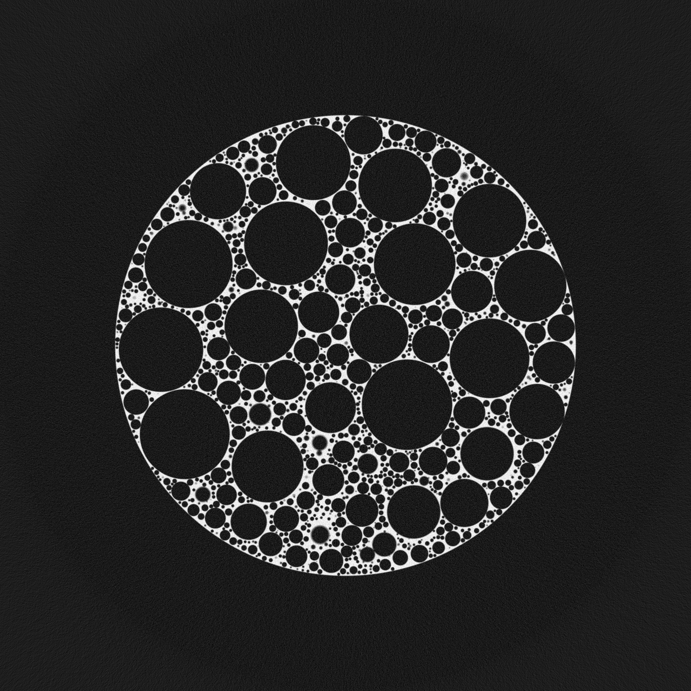

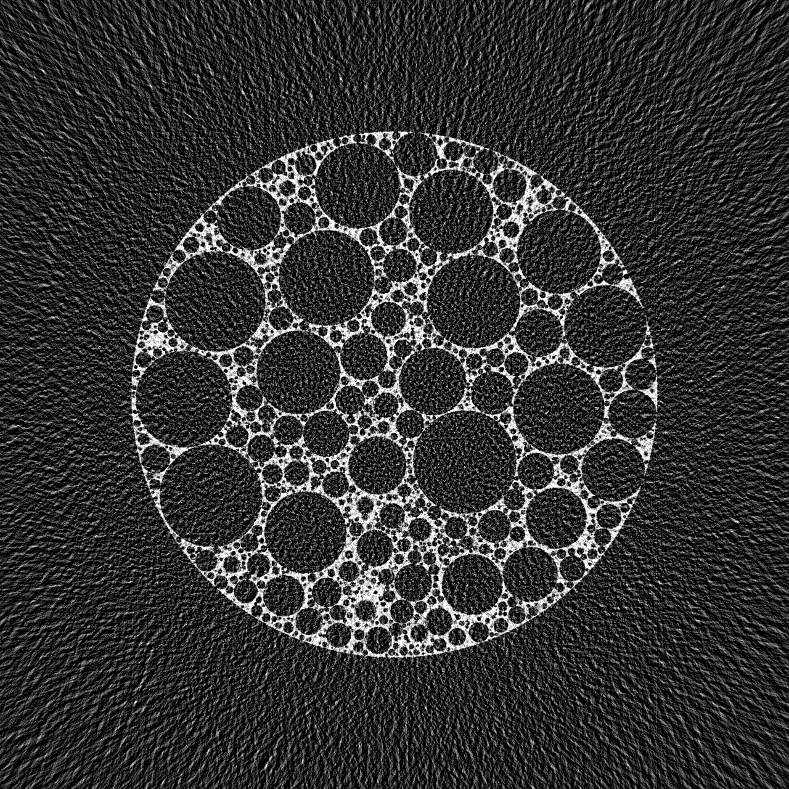

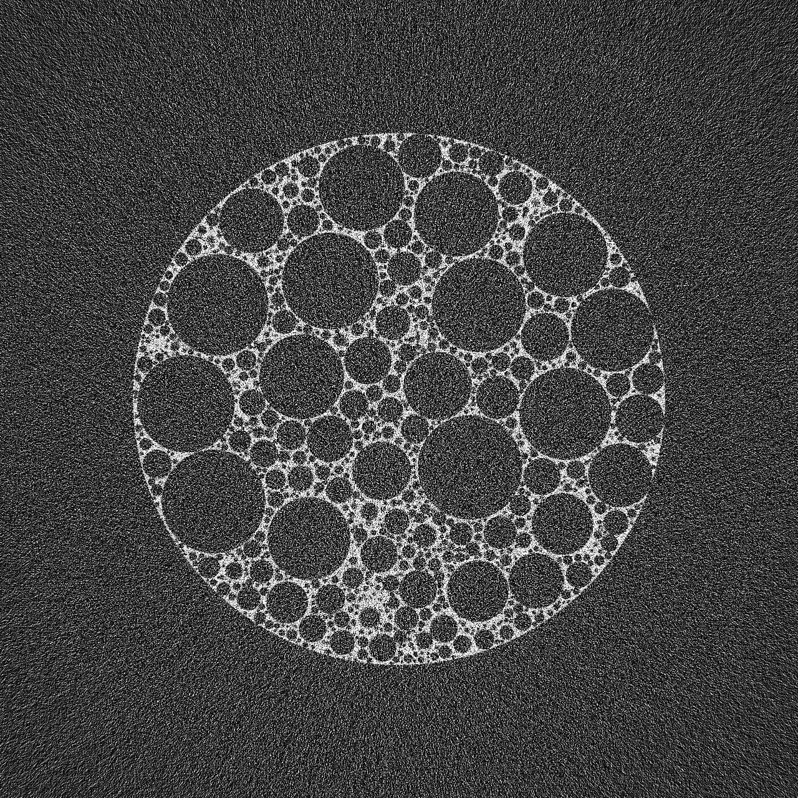

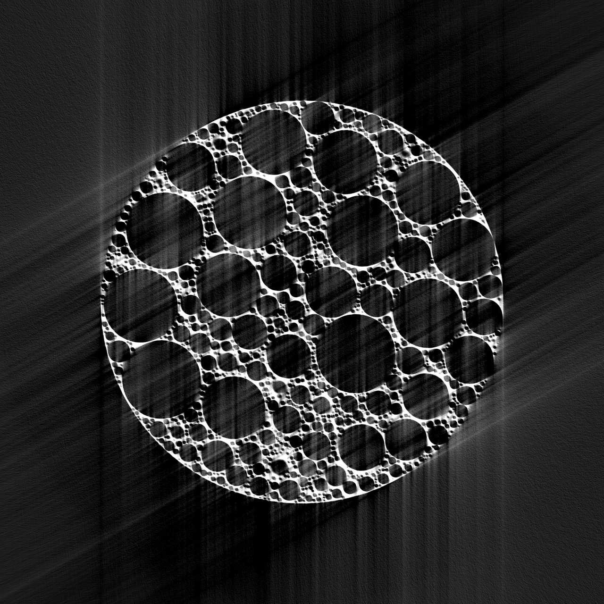

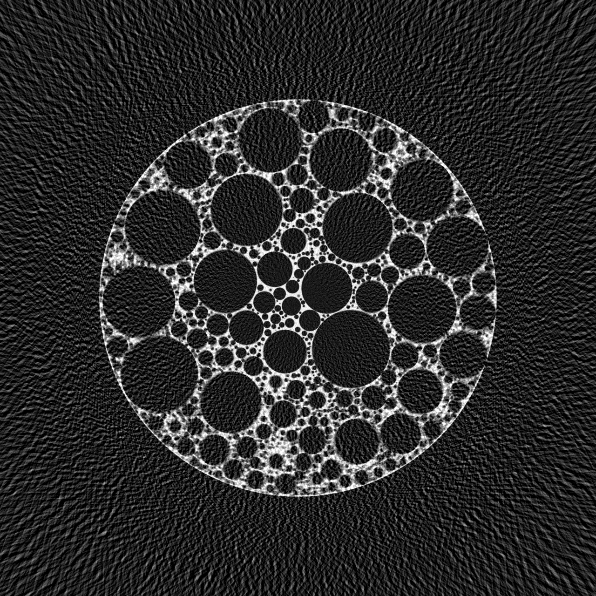

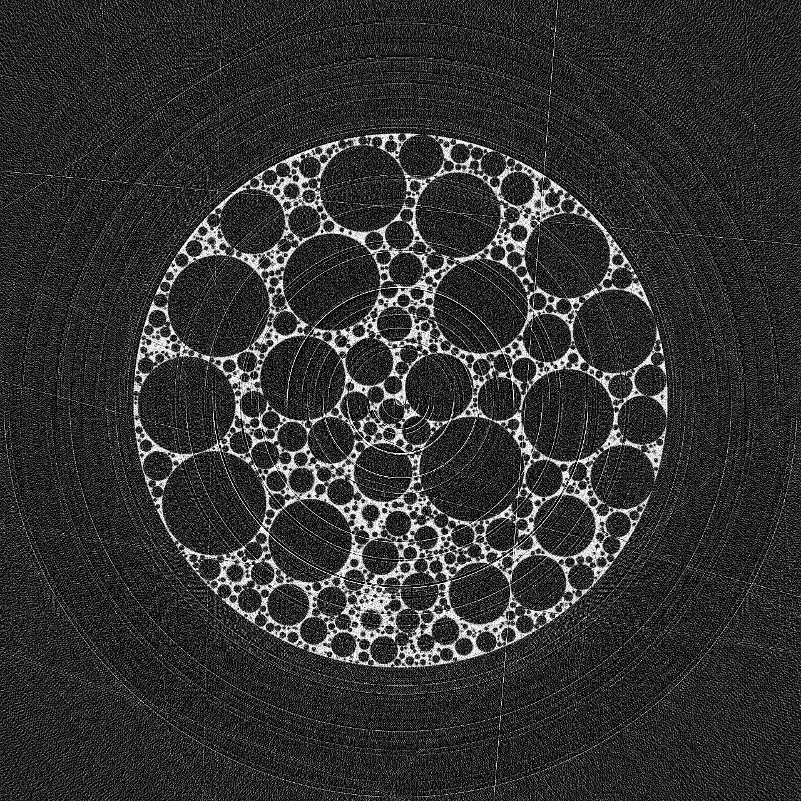

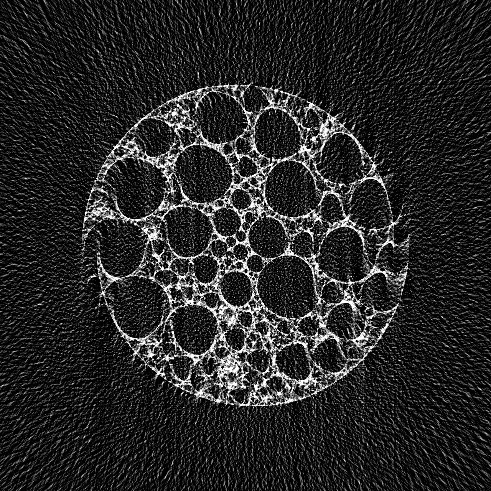

.. _phan_00016: https://app.globus.org/file-manager?destination_id=e133a81a-6d04-11e5-ba46-22000b92c6ec&destination_path=%2Ftomobank%2Fphantom_00016%2F
.. _phan_00017: https://app.globus.org/file-manager?destination_id=e133a81a-6d04-11e5-ba46-22000b92c6ec&destination_path=%2Ftomobank%2Fphantom_00017%2F
.. _phan_00018: https://app.globus.org/file-manager?destination_id=e133a81a-6d04-11e5-ba46-22000b92c6ec&destination_path=%2Ftomobank%2Fphantom_00018%2F
.. _phan_00019: https://app.globus.org/file-manager?destination_id=e133a81a-6d04-11e5-ba46-22000b92c6ec&destination_path=%2Ftomobank%2Fphantom_00019%2F
.. _phan_00020: https://app.globus.org/file-manager?destination_id=e133a81a-6d04-11e5-ba46-22000b92c6ec&destination_path=%2Ftomobank%2Fphantom_00020%2F
.. _phan_00021: https://app.globus.org/file-manager?destination_id=e133a81a-6d04-11e5-ba46-22000b92c6ec&destination_path=%2Ftomobank%2Fphantom_00021%2F
.. _phan_00022: https://app.globus.org/file-manager?destination_id=e133a81a-6d04-11e5-ba46-22000b92c6ec&destination_path=%2Ftomobank%2Fphantom_00022%2F
.. _phan_00023: https://app.globus.org/file-manager?destination_id=e133a81a-6d04-11e5-ba46-22000b92c6ec&destination_path=%2Ftomobank%2Fphantom_00023%2F
.. _phan_00024: https://app.globus.org/file-manager?destination_id=e133a81a-6d04-11e5-ba46-22000b92c6ec&destination_path=%2Ftomobank%2Fphantom_00024%2F
.. _phan_00025: https://app.globus.org/file-manager?destination_id=e133a81a-6d04-11e5-ba46-22000b92c6ec&destination_path=%2Ftomobank%2Fphantom_00025%2F
.. _phan_00026: https://app.globus.org/file-manager?destination_id=e133a81a-6d04-11e5-ba46-22000b92c6ec&destination_path=%2Ftomobank%2Fphantom_00026%2F
.. _phan_00027: https://app.globus.org/file-manager?destination_id=e133a81a-6d04-11e5-ba46-22000b92c6ec&destination_path=%2Ftomobank%2Fphantom_00027%2F
.. _phan_00028: https://app.globus.org/file-manager?destination_id=e133a81a-6d04-11e5-ba46-22000b92c6ec&destination_path=%2Ftomobank%2Fphantom_00028%2F

These phantoms were generated using the `foam_ct_phantom <https://github.com/dmpelt/foam_ct_phantom>`_ 
package, version 1.0.0. Projection data was generated for a virtual PCO.edge 5.5 detector in 2x2 binning mode,
resulting in projections of 1080x1280 pixels. Data is provided for multiple simulated phantoms, with various
types of data limitations. For one sample (Foam 1), data is provided for all data limitations, in addition to
a high-quality dataset with many projections and limited noise. For other samples, only limited data is given.

Each dataset consists of a HDF5 file with two entries: :code:`projs` is the projections data (already flatfielded and
linearized) and :code:`angs` is a list of projection angles in radians. An example script that reconstructs a
dataset with the ASTRA toolbox is available `here <https://github.com/tomochallenge/tomochallenge_utils/blob/master/foam_phantom_reconstruct_astra.py>`_.

Data for the following acquisition modes are included: 

+------------------+-----------------------+-------------+---------------------------------------------------------+---------------------------------------------------------+
| Acquisition mode | Number of projections | Noise level | Image                                                   |   Comments                                              |
+==================+=======================+=============+=========================================================+=========================================================+
| HQ               | 1536                  | Low         |              |foam_phantom_hq|                          |                                                         | 
+------------------+-----------------------+-------------+---------------------------------------------------------+---------------------------------------------------------+
| Limited angle    | 128                   | Low         |              |foam_phantom_lowangle|                    |                                                         | 
+------------------+-----------------------+-------------+---------------------------------------------------------+---------------------------------------------------------+
| Noisy            | 1536                  | High        |              |foam_phantom_noisy|                       |                                                         | 
+------------------+-----------------------+-------------+---------------------------------------------------------+---------------------------------------------------------+
| Missing wedge    | 1024                  | Low         |              |foam_phantom_wedge|                       | Angular range of 120 degrees                            | 
+------------------+-----------------------+-------------+---------------------------------------------------------+---------------------------------------------------------+
| Blur             | 128                   | Low         |              |foam_phantom_blur|                        | Simulates continuous rotation                           | 
+------------------+-----------------------+-------------+---------------------------------------------------------+---------------------------------------------------------+
| Artifacts        | 512                   | Medium      |              |foam_phantom_artifacts|                   | Additional ring artifacts and outliers                  | 
+------------------+-----------------------+-------------+---------------------------------------------------------+---------------------------------------------------------+
| Expanding        | 3072 (24 sets of 128) | Low         |              |foam_phantom_dynamic|                     | Sample expands during acquisition over 24 x 180 degrees | 
+------------------+-----------------------+-------------+---------------------------------------------------------+---------------------------------------------------------+

The following datasets are provided:

+-----------------------------+-------------+------------------+
| Data ID                     | Sample name | Acquisition mode |
+=============================+=============+==================+
| phan_00016_                 | Foam 1      | HQ               |
+-----------------------------+-------------+------------------+
| phan_00017_                 | Foam 1      | Limited angle    |
+-----------------------------+-------------+------------------+
| phan_00018_                 | Foam 1      | Noisy            |
+-----------------------------+-------------+------------------+
| phan_00019_                 | Foam 1      | Missing wedge    |
+-----------------------------+-------------+------------------+
| phan_00020_                 | Foam 1      | Blur             |
+-----------------------------+-------------+------------------+
| phan_00021_                 | Foam 1      | Artifacts        |
+-----------------------------+-------------+------------------+
| phan_00022_                 | Foam 1      | Expanding        |
+-----------------------------+-------------+------------------+
| phan_00023_                 | Foam 2      | Limited angle    | 
+-----------------------------+-------------+------------------+
| phan_00024_                 | Foam 3      | Noisy            | 
+-----------------------------+-------------+------------------+
| phan_00025_                 | Foam 4      | Missing wedge    |
+-----------------------------+-------------+------------------+
| phan_00026_                 | Foam 5      | Blur             | 
+-----------------------------+-------------+------------------+
| phan_00027_                 | Foam 6      | Artifacts        | 
+-----------------------------+-------------+------------------+
| phan_00028_                 | Foam 7      | Expanding        | 
+-----------------------------+-------------+------------------+

Further information about the generation of the various datasets is deliberately not given until the associated
reconstruction challenge has concluded.

XDesign
~~~~~~~

.. |rec00008| image:: ../img/phantom_00008_00000.png
    :width: 20pt
    :height: 20pt

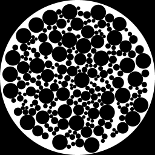

.. |phan_00008| replace:: :download:`gen_script.py <../../../docs/demo/phantom_00008.py>`

.. _phan_00008: https://app.globus.org/file-manager?origin_id=e133a81a-6d04-11e5-ba46-22000b92c6ec&origin_path=%2Ftomobank%2Fphantom_00008%2F

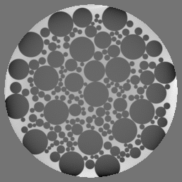

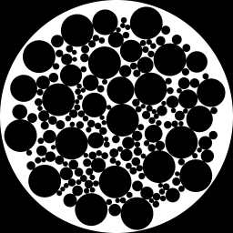

.. |phan_00009| replace:: :download:`gen_script.py <../../../docs/demo/phantom_00009.py>`

.. _phan_00009: https://app.globus.org/file-manager?origin_id=e133a81a-6d04-11e5-ba46-22000b92c6ec&origin_path=%2Ftomobank%2Fphantom_00009%2F

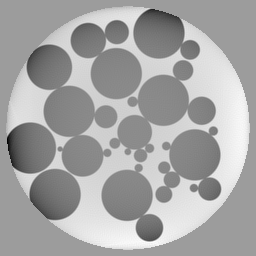

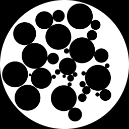

.. |phan_00010| replace:: :download:`gen_script.py <../../../docs/demo/phantom_00010.py>`

.. _phan_00010: https://app.globus.org/file-manager?origin_id=e133a81a-6d04-11e5-ba46-22000b92c6ec&origin_path=%2Ftomobank%2Fphantom_00010%2F

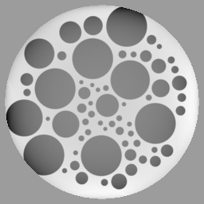

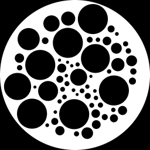

.. |phan_00011| replace:: :download:`gen_script.py <../../../docs/demo/phantom_00011.py>`

.. _phan_00011: https://app.globus.org/file-manager?origin_id=e133a81a-6d04-11e5-ba46-22000b92c6ec&origin_path=%2Ftomobank%2Fphantom_00011%2F

These phantom use `XDesign <http://myxdesign.readthedocs.io/>`_ 
version `0.2.0.dev0+1d67599 <https://github.com/tomography/xdesign/tree/1d67599b8f104ebded86bac98100dbf15e251a66>`_
are generated as follows:     

.. code:: python

    ccd_x = 256 
    ccd_y = 1
    n_proj = 512

    phantom_00008 = xdesign.Foam(size_range=[0.05, 0.01], gap=0, porosity=1)
    phantom_00009 = xdesign.Foam(size_range=[0.07, 0.01], gap=0, porosity=0.75)
    phantom_00010 = xdesign.Foam(size_range=[0.1, 0.01], gap=0, porosity=0.5)
    phantom_00011 = xdesign.Foam(size_range=[0.1, 0.01], gap=0.015, porosity=0.5)
    
The ground truth, sinogram and projection are obtained with:

.. code:: python

    ground_truth = discrete_phantom(phantom, ccd_x, prop='mass_atten')
    
    sino, probe = sinogram(n_proj, ccd_x, phantom)
    proj = np.expand_dims(sino, 1)

To load the phantom data sets and perform a basic reconstruction using `tomopy <https://tomopy.readthedocs.io>`_  use the 
:download:`tomopy_rec.py <../../demo/tomopy_rec.py>` python script:

::

    python tomopy_rec.py phantom_00008.h5

+---------------+----------------+------------------------+--------------+------------+--------------------+
|  Phantom ID   |    Facility    |    Sample              | Ground Truth |  Grirec    |       Downloads    |
+---------------+----------------+------------------------+--------------+------------+--------------------+
|  phan_00008_  |    XDesign     |  Foam 00008            |  |gt00008|   | |rec00008| |      |phan_00008|  |
+---------------+----------------+------------------------+--------------+------------+--------------------+
|  phan_00009_  |    XDesign     |  Foam 00009            |  |gt00009|   | |rec00009| |      |phan_00009|  |
+---------------+----------------+------------------------+--------------+------------+--------------------+
|  phan_00010_  |    XDesign     |  Foam 00010            |  |gt00010|   | |rec00010| |      |phan_00010|  |
+---------------+----------------+------------------------+--------------+------------+--------------------+
|  phan_00011_  |    XDesign     |  Foam 00011            |  |gt00011|   | |rec00011| |      |phan_00011|  |
+---------------+----------------+------------------------+--------------+------------+--------------------+

