Standard
--------

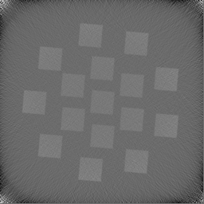

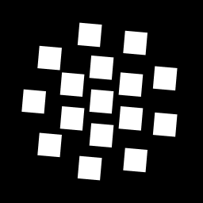

.. |phan_00001| replace:: :download:`gen_script.py <../../../docs/demo/phantom_00001.py>`

.. _phan_00001: https://www.globus.org/app/transfer?origin_id=e133a81a-6d04-11e5-ba46-22000b92c6ec&origin_path=%2Ftomobank%2F/

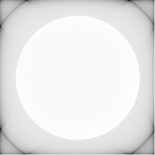

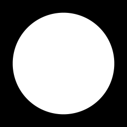

.. |phan_00002| replace:: :download:`gen_script.py <../../../docs/demo/phantom_00002.py>`

.. _phan_00002: https://www.globus.org/app/transfer?origin_id=e133a81a-6d04-11e5-ba46-22000b92c6ec&origin_path=%2Ftomobank%2F/

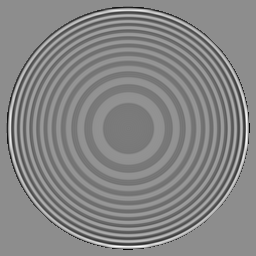

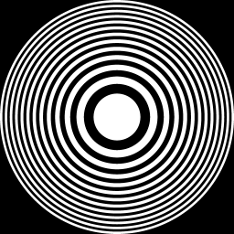

.. |phan_00003| replace:: :download:`gen_script.py <../../../docs/demo/phantom_00003.py>`

.. _phan_00003: https://www.globus.org/app/transfer?origin_id=e133a81a-6d04-11e5-ba46-22000b92c6ec&origin_path=%2Ftomobank%2F/

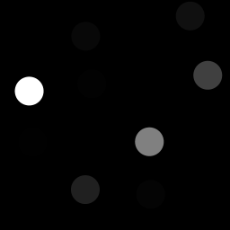

.. |phan_00004| replace:: :download:`gen_script.py <../../../docs/demo/phantom_00004.py>`

.. _phan_00004: https://www.globus.org/app/transfer?origin_id=e133a81a-6d04-11e5-ba46-22000b92c6ec&origin_path=%2Ftomobank%2F/

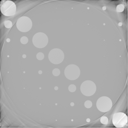

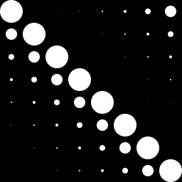

.. |phan_00005| replace:: :download:`gen_script.py <../../../docs/demo/phantom_00005.py>`

.. _phan_00005: https://www.globus.org/app/transfer?origin_id=e133a81a-6d04-11e5-ba46-22000b92c6ec&origin_path=%2Ftomobank%2F/

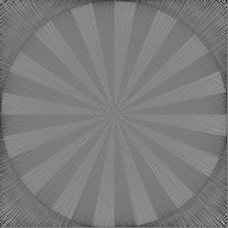

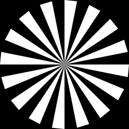

.. |phan_00006| replace:: :download:`gen_script.py <../../../docs/demo/phantom_00006.py>`

.. _phan_00006: https://www.globus.org/app/transfer?origin_id=e133a81a-6d04-11e5-ba46-22000b92c6ec&origin_path=%2Ftomobank%2F/

These phantom use `XDesign <http://myxdesign.readthedocs.io/>`_ 
version `0.2.0.dev0+1d67599 <https://github.com/tomography/xdesign/tree/1d67599b8f104ebded86bac98100dbf15e251a66>`_
are generated as follows:     

.. code:: python

    ccd_x = 256 
    ccd_y = 1
    n_proj = 512

    phantom_00001 = xdesign.SlantedSquares(count=16, angle=5/360*2*np.pi, gap=0.01)
    phantom_00002 = xdesign.UnitCircle(radius=0.4, mass_atten=1)
    phantom_00003 = xdesign.HyperbolicConcentric()
    phantom_00004 = xdesign.DynamicRange(steps=16, jitter=True, shape='square')
    phantom_00005 = xdesign.DogaCircles(n_sizes=8, size_ratio=0.5, n_shuffles=0)
    phantom_00006 = xdesign.SiemensStar(32)

The ground truth, sinogram and projection are obtained with:

.. code:: python

    ground_truth = discrete_phantom(phantom, ccd_x, prop='mass_atten')
    
    sino = sinogram(n_proj, ccd_x, phantom)
    proj = np.expand_dims(sino, 1)

+---------------+----------------+------------------------+--------------+------------+--------------------+
|  Phantom ID   |    Facility    |    Sample              | Ground Truth |  Grirec    |       Downloads    |
+---------------+----------------+------------------------+--------------+------------+--------------------+
|  phan_00001_  |    XDesign     |  Slanted Squares       |  |gt00001|   | |rec00001| |      |phan_00001|  |
+---------------+----------------+------------------------+--------------+------------+--------------------+
|  phan_00002_  |    XDesign     |  Unit Circle           |  |gt00002|   | |rec00002| |      |phan_00002|  |
+---------------+----------------+------------------------+--------------+------------+--------------------+
|  phan_00003_  |    XDesign     |  Hyperbolic Concentric |  |gt00003|   | |rec00003| |      |phan_00003|  |
+---------------+----------------+------------------------+--------------+------------+--------------------+
|  phan_00004_  |    XDesign     |  Dynamic Range         |  |gt00004|   | |rec00004| |      |phan_00004|  |
+---------------+----------------+------------------------+--------------+------------+--------------------+
|  phan_00005_  |    XDesign     |  Doga's Circles        |  |gt00005|   | |rec00005| |      |phan_00005|  |
+---------------+----------------+------------------------+--------------+------------+--------------------+
|  phan_00006_  |    XDesign     |  Siemens Star          |  |gt00006|   | |rec00006| |      |phan_00006|  |
+---------------+----------------+------------------------+--------------+------------+--------------------+

