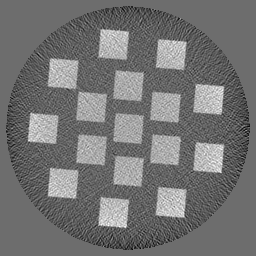

Standard
--------

.. |gt00001| image:: ../img/phantom_00001_ground_truth.png
    :width: 20pt
    :height: 20pt

.. |phan_00001| replace:: :download:`script.py <../../../docs/demo/phantom_00001.py>`

.. _phan_00001: https://www.globus.org/app/transfer?origin_id=e133a81a-6d04-11e5-ba46-22000b92c6ec&origin_path=%2Ftomobank%2F/

This phantom use XDesign Version: 0.2.0.dev0+1d67599b8f104ebded86bac98100dbf15e251a66 
as is generated with:     
    
.. code:: python

    phantom = SlantedSquares(count=16, angle=5/360*2*np.pi, gap=0.01)
    ground_truth = discrete_phantom(phantom, ccd_x, prop='mass_atten')
    
    ccd_x = 256 
    ccd_y = 1
    n_proj = 512

    sino = sinogram(n_proj, ccd_x, phantom)
    proj = np.expand_dims(sino, 1)

+---------------+----------------+------------------+--------------+------------+---------------------------------------------------+
|  Phantom ID   |    Facility    |    Sample        | Ground Truth |  Grirec    |                     Downloads                     |                             
+---------------+----------------+------------------+--------------+------------+-------------------------+-------------------------+
|     00001     |    XDesign     |  SlantedSquares  |  |gt00001|   | |rec00001| |      |phan_00001|       |       phan_00001_       |
+---------------+----------------+------------------+--------------+------------+-------------------------+-------------------------+

