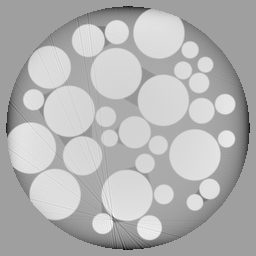
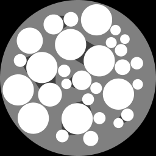

Wet Circles
-----------

.. |phan_00007| replace:: :download:`script.py <../../../docs/demo/phantom_00007.py>`

.. _phan_00007: https://www.globus.org/app/transfer?origin_id=e133a81a-6d04-11e5-ba46-22000b92c6ec&origin_path=%2Ftomobank%2F/

These phantom use `XDesign <http://myxdesign.readthedocs.io/>`_ 
version `0.2.0.dev0+1d67599 <https://github.com/tomography/xdesign/tree/1d67599b8f104ebded86bac98100dbf15e251a66>`_
are generated as follows:     

.. code:: python

    ccd_x = 256 
    ccd_y = 1
    n_proj = 512

    phantom_00007 = xdesign.WetCircles()

The ground truth, sinogram and projection are obtained with:

.. code:: python

    ground_truth = discrete_phantom(phantom, ccd_x, prop='mass_atten')
    
    sino = sinogram(n_proj, ccd_x, phantom)
    proj = np.expand_dims(sino, 1)

+---------------+----------------+------------------------+--------------+------------+-------------------------+-------------------------+
|  Phantom ID   |    Facility    |    Sample              | Ground Truth |  Grirec    |                     Downloads                     |                             
+---------------+----------------+------------------------+--------------+------------+-------------------------+-------------------------+
|     00007     |    XDesign     |  Wet Circles           |  |gt00007|   | |rec00007| |      |phan_00007|       |       phan_00007_       |
+---------------+----------------+------------------------+--------------+------------+-------------------------+-------------------------+

