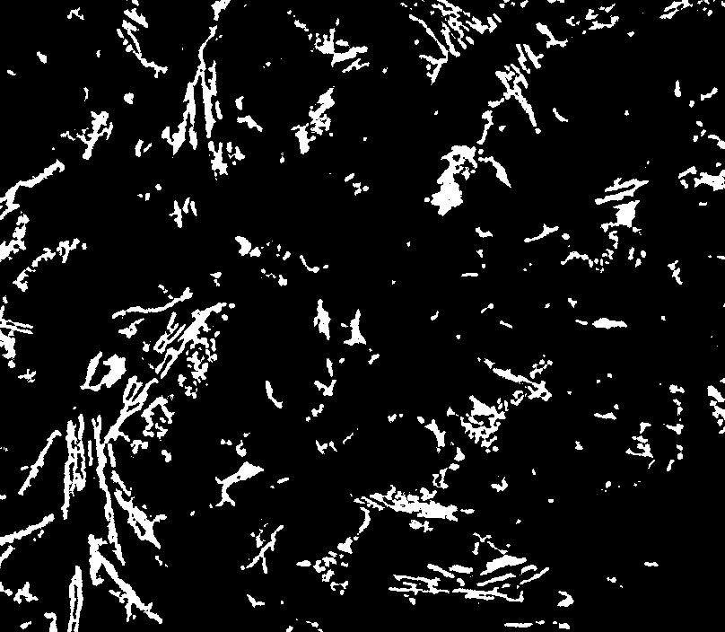

Volumes
=======

This repository contains a series of volumnetric datasets

Dagstuhl
--------

The Dagstuhl datasets was shared during the Dagstuhl Seminar 19151 on Visual Computing in Material Science | April 7-12, 2019

Al-Si alloy 3D networks
~~~~~~~~~~~~~~~~~~~~~~~

**Data collection condition:**

+----------------------------+----------------------------+
| Instrument                 |  APS 2-BM-A fast tomo      |
+----------------------------+----------------------------+
| Energy                     |  19 keV                    |
+----------------------------+----------------------------+
| Scan Range                 |  360 degree                |
+----------------------------+----------------------------+
| Number of Projections      |  1500                      |
+----------------------------+----------------------------+
| Sample Detector Distance   |  60 mm                     |
+----------------------------+----------------------------+
| Detector Name              | FReLoN CCD (2k, E2V)       |
+----------------------------+----------------------------+
| Exposure Time              |  0.03 s                    |
+----------------------------+----------------------------+
| Pixel Size                 |  0.28 µm                   |
+----------------------------+----------------------------+
| Detector Dimension x       |  2048                      |
+----------------------------+----------------------------+
| Detector Dimension y       |  2048                      |
+----------------------------+----------------------------+
| Objective Magnification    |  20x                       |
+----------------------------+----------------------------+

**Volumetric data**

X-ray synchrotron tomography was used to visualize the effect of thermal treatment on the 3D network of Al-Si alloys. 
For this the same sample was measured at the same position before and after heat treatment. The intermetallic phases 
in the reconstructed volumes have been segmented using global grey value thresholding.
The three-dimensional tomography of Al-Si alloys during heat treatment is required to gain information about the 
stability of phases and especially the evolution of interconnectivity of 3D networks of rigid phases embedded in the 
Al-matrix.

The volumentric data consists of two binary tiff volumes of tomographic data sets collected of the same sample 
in different thermal heat treatment conditions.

+---------------+----------------------------------------------------+-----------+-----------------------+ 
| Tomo ID       |         Sample Name                                |   Image   |    Dimentions         |     
+---------------+----------------------------------------------------+-----------+-----------------------+ 
| volume_00001_ |    AlSi_0hST_808x704x1929_Binary_aluminides_rem64  |  |v00001| |  (808 x 704 x 1929)   |
+---------------+----------------------------------------------------+-----------+-----------------------+ 
| volume_00002_ |    AlSi_4hST_808x704x1929_Binary_aluminides_rem64  |  |v00002| |  (808 x 704 x 1929)   |
+---------------+----------------------------------------------------+-----------+-----------------------+ 

.. _volume_00001: https://app.globus.org/file-manager?origin_id=9f00a780-4aee-42a7-b7f4-6a2773c8da30&origin_path=%2F%2Fvolume_00001%2F
.. _volume_00002: https://app.globus.org/file-manager?origin_id=9f00a780-4aee-42a7-b7f4-6a2773c8da30&origin_path=%2F%2Fvolume_00002%2F

